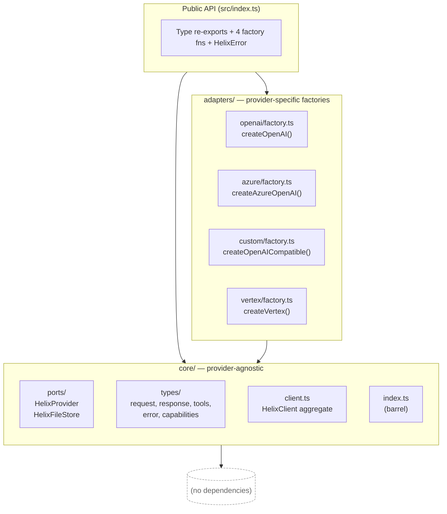
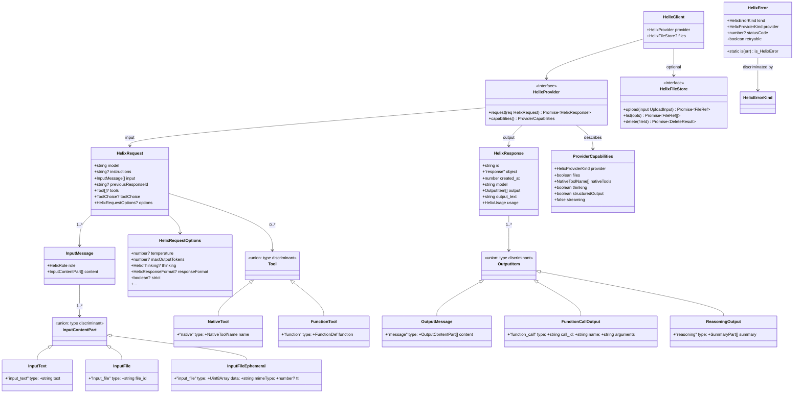
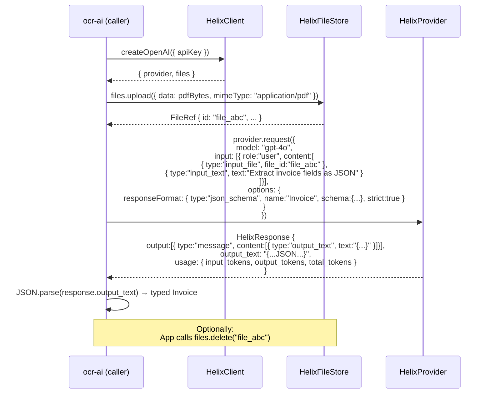
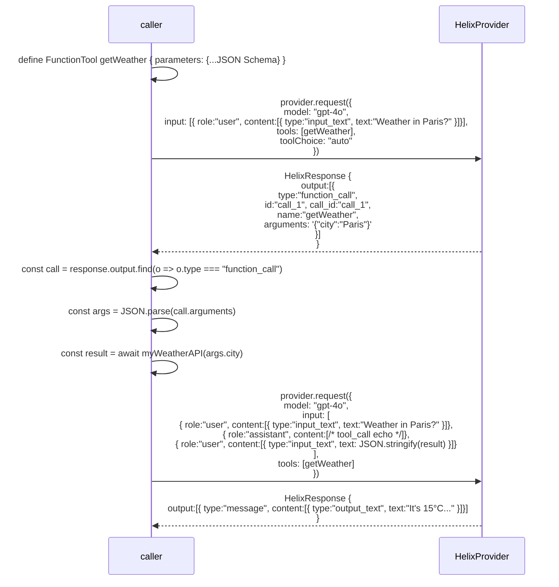

# Design: helix-lib Public Interface Contract

**Change**: `helix-interface-definition`
**Date**: 2026-04-27
**Status**: ready for sdd-tasks
**Phase**: 1 — interfaces only (no implementations)
**Companion**: `proposal.md`, `specs/` (sdd-spec output)

---

## 1. Overview

This change ships the **public surface** of `helix-lib` v0 — TypeScript port interfaces, request/response/error types, capability descriptors, and provider factory signatures — with **zero implementation logic**. The architectural approach is **Hexagonal / Ports & Adapters**: a provider-agnostic `core/` layer defines the contracts every consumer (`ocr-ai` first, others later) imports from, and four `adapters/<provider>/` modules expose factory functions whose bodies will be filled in by the *next* change. Because there is no executable behavior in this deliverable, the design's job is unusual: it must guarantee that the **shape of the interfaces is sufficient, coherent, and forward-compatible** with HX1–HX6 across OpenAI, Azure, OpenAI-compatible custom endpoints, and Google Vertex — and that the file/module boundaries set the implementation phase up to drop in adapter bodies without touching `core/`.

---

## 2. Architectural Approach

### 2.1 Layered Structure



**Dependency direction is enforced**: `adapters/*` import from `core/`; `core/` imports from nothing (not even from sibling adapters). The public barrel (`src/index.ts`) is the only file that is permitted to know about both layers.

### 2.2 Why the boundary is drawn here

- **Hexagonal alignment** (project rule). Ports describe *what helix can do*; adapters describe *how a given provider does it*. The boundary lets us add a provider (e.g., Anthropic via a Responses-shim) without touching `core/` — only a new `adapters/anthropic/` module is added.
- **PR1 / PR5 enforcement.** `HelixResponse` lives in `core/types/response.ts` and mirrors the OpenAI Responses API. Every adapter `request()` is required by the port signature to return `Promise<HelixResponse>`. The TYPE SYSTEM enforces normalization — there is no path to ship a non-normalized response without lying to TypeScript.
- **PR6 enforcement.** `HelixError` lives in `core/types/error.ts`. Adapter code can `throw new HelixError(...)` but cannot define its own error class. PR6's "single error model" is structurally enforced.
- **PR2 enforcement.** Anything imported by `core/` is a **shared dependency** of all four providers. Putting only types and `HelixError` (a tiny class with no third-party deps) here keeps the dependency surface near-zero. Any provider SDK lands in its adapter module, not in `core/`.
- **Testability.** Tests for `core/` (when added) need no network, no API keys, no SDK fakes. Adapter tests are isolated per provider directory. `ocr-ai` and other consumers can ship test doubles by implementing the `HelixProvider` port — they import from `core/`, never from an adapter.

---

## 3. Module Layout and Naming Conventions

### 3.1 File tree (created by this change)

```
src/
├── core/
│   ├── ports/
│   │   ├── provider.port.ts       # HelixProvider interface
│   │   └── file-store.port.ts     # HelixFileStore interface
│   ├── types/
│   │   ├── request.ts             # HelixRequest, HelixRequestOptions, content parts, roles
│   │   ├── response.ts            # HelixResponse, OutputItem union, HelixUsage
│   │   ├── tools.ts               # NativeTool, FunctionTool, ToolChoice, NativeToolName
│   │   ├── error.ts               # HelixError class, HelixErrorKind, HelixProviderKind
│   │   └── capabilities.ts        # ProviderCapabilities
│   ├── client.ts                  # HelixClient aggregate
│   └── index.ts                   # core barrel
├── adapters/
│   ├── openai/
│   │   └── factory.ts             # createOpenAI(); OpenAIConfig
│   ├── azure/
│   │   └── factory.ts             # createAzureOpenAI(); AzureOpenAIConfig
│   ├── custom/
│   │   └── factory.ts             # createOpenAICompatible(); OpenAICompatibleConfig
│   └── vertex/
│       └── factory.ts             # createVertex(); VertexConfig, VertexCredentials
└── index.ts                       # public barrel — what consumers import
```

### 3.2 Naming conventions

| Pattern | Use |
|---|---|
| `*.port.ts` | Port interfaces (Hexagonal "left side"). One port per file. Files end in `.port.ts` to make grep-for-contracts trivial. |
| `factory.ts` | Adapter entry point — exports a `create<Provider>(config)` function and the `<Provider>Config` interface. One per adapter directory. |
| `types/*.ts` | Plain TypeScript type/interface declarations. No runtime exports except `HelixError` (see ADR-2). |
| `index.ts` (barrel) | Re-export only. No declarations of new types in barrels. |
| Type names | `Helix<Concept>` for first-class helix abstractions (`HelixRequest`, `HelixResponse`, `HelixError`, `HelixProvider`). Provider-shape mirrors keep the OpenAI name (`OutputMessage`, `FunctionCallOutput`, `OutputContentPart`). See ADR-1. |
| Discriminant fields | `type` for content/output/tools; `kind` for errors. See ADR-9. |

### 3.3 Barrel strategy

- **`src/core/index.ts`** re-exports every type and port from `core/` so adapters can write `import type { HelixProvider, HelixRequest } from "../../core";` without deep paths. It does NOT re-export adapter symbols.
- **`src/index.ts`** is the public, package-level barrel. It re-exports types from `./core` and runtime values (`HelixError`, `createOpenAI`, `createAzureOpenAI`, `createOpenAICompatible`, `createVertex`) from their respective files. Consumers MUST import only from `helix-lib` (the package root); deep imports into `helix-lib/core/...` are not part of the supported surface.
- Barrels never introduce new types — pure re-export. This keeps `tsc` declaration emission predictable and tree-shaking effective for bundlers.

### 3.4 Per-directory rationale

- **`core/ports/`** — pure contracts. Splitting `HelixProvider` and `HelixFileStore` into separate files (and separate ports) is intentional: file-store-bearing adapters (OpenAI, Azure) compose both; file-store-free adapters (custom, Vertex) compose only the provider. See ADR-4.
- **`core/types/`** — every type that crosses the public boundary lives here. Splitting by concern (request, response, tools, error, capabilities) keeps each file under ~150 lines and lets consumers cherry-pick imports.
- **`core/client.ts`** — the `HelixClient` aggregate is at the root of `core/`, not under `types/`, because conceptually it composes a port and a port — it's the *result* of calling a factory, not a leaf type.
- **`adapters/<provider>/`** — one directory per provider, even though Phase 1 only contains `factory.ts`. The directory shape reserves space for `client.ts`, `normalize.ts`, etc. that the next change will add. Greenfield discipline: get the layout right before any code lands.

---

## 4. Type Relationships

### 4.1 Relationship diagram



### 4.1.1 Helix-owned response types

`src/core/types/response.ts` defines `HelixResponse`, `HelixUsage`, output-item types, and content-part types as plain TypeScript interfaces. Field naming follows ADR-1 — snake_case for fields that mirror the Responses API wire shape (`id`, `created_at`, `output`, `output_text`, `usage.input_tokens`, etc.), camelCase for any helix-original fields. NO `import type { Responses } from "openai/..."`. `core/` is zero-dependency.

When OpenAI adds a new field to the Responses API, helix-lib evaluates whether to surface it. If yes, the field is added to the corresponding helix interface in a minor version bump.

### 4.2 Discriminant field choice

| Union | Discriminant | Values | Rationale |
|---|---|---|---|
| `InputContentPart` | `type` | `"input_text"` \| `"input_file"` | Mirrors OpenAI Responses API field names verbatim (ADR-1). `InputFile` and `InputFileEphemeral` SHARE `type: "input_file"` and are distinguished by structural typing (`file_id` vs `data`) — adapters branch on `"file_id" in part`. |
| `OutputItem` | `type` | `"message"` \| `"function_call"` \| `"reasoning"` | Mirrors Responses API. |
| `OutputContentPart` | `type` | `"output_text"` \| `"refusal"` | Mirrors Responses API. |
| `Tool` (`NativeTool \| FunctionTool`) | `type` | `"native"` \| `"function"` | `"native"` is helix-original (no Responses API equivalent). `"function"` matches OpenAI's tool definition shape. |
| `ToolChoice` | string-or-object | `"auto" \| "none" \| "required" \| { type: "function"; name }` | The object branch's `type` is `"function"`, matching OpenAI's `tool_choice` shape. |
| `HelixThinking` | structural | `{ effort } \| { budget }` | No string discriminant — caller picks the variant. Adapter checks key presence (`"effort" in opts.thinking`). Acceptable because the variants are mutually exclusive provider-side. |
| `HelixResponseFormat` | `type` | `"text"` \| `"json_object"` \| `"json_schema"` | Mirrors OpenAI `response_format` shape. |
| `HelixError.kind` | `kind` | `HelixErrorKind` (11 literals) | DIFFERENT from `type` — see ADR-9. |

---

## 5. Architecture Decisions (ADRs)

### ADR-1: Mirror OpenAI Responses API field naming

**Status**: Accepted

**Context**: Helix's stable wire shape (PR1, PR5) is the OpenAI Responses API. ocr-ai already uses `responses.create()` and reads `output_text`, `usage.input_tokens`, `output[].type`, etc. We must decide whether helix invents its own JS-idiomatic names (`outputText`, `usage.inputTokens`) or mirrors OpenAI's snake_case verbatim for fields that live on the response wire.

**Decision**: Mirror Responses API field naming **verbatim** for any type whose values come back over the wire from a provider — `input_text`, `input_file`, `output_text`, `function_call`, `call_id`, `created_at`, `input_tokens`, `output_tokens`, `total_tokens`. Helix-original types (`HelixRequest`, `HelixRequestOptions`, `HelixThinking`, `ProviderCapabilities`, factory configs, `HelixFileStore` shapes) use camelCase JS-ergonomic names (`maxOutputTokens`, `previousResponseId`, `responseFormat`, `nativeTools`, `apiKey`).

**Consequences**:
- *Easier*: ocr-ai migration is a literal rename of import paths — `client.responses.create({ ... })` becomes `client.provider.request({ ... })` with the same field names on input messages and same field names on the response.
- *Easier*: helix is debuggable against OpenAI's own docs without a translation layer.
- *Harder*: TypeScript codebases pay an inconsistency tax — `output_text` and `maxOutputTokens` coexist on related objects. Linters that enforce camelCase need an exception for wire-shape fields.
- *Accepted*: the inconsistency is a feature, not a bug. The fields with snake_case are exactly the fields a developer would `console.log` and compare against OpenAI's API reference.

**Alternatives considered**:
- *Convert everything to camelCase* — rejected: every adapter would carry a serializer/deserializer for field names, doubling the normalization workload and breaking the "rename, not redesign" migration story.
- *Convert everything to snake_case* — rejected: clashes with TypeScript convention for input options and config objects; `apiKey` in snake_case looks alien.

---

### ADR-2: `HelixError` as runtime class extending `Error`

**Status**: Accepted

**Context**: PR6 mandates a unified error model with discriminant. There are two reasonable shapes:
1. Plain object discriminated union: `type HelixError = { kind: "..."; provider: "..."; ... }` — types-only, zero runtime.
2. Class extending `Error` with a `kind` literal field — runtime constructor + `instanceof` checks + stack traces.

This change is otherwise interface-only, so option 1 would keep the change strictly type-only. Option 2 ships one class declaration as runtime code.

**Decision**: `HelixError extends Error` with:
- A `readonly kind: HelixErrorKind` field (the discriminant).
- `readonly provider`, `readonly statusCode?`, `readonly raw?`, `readonly retryable: boolean`.
- A `static is(err: unknown): err is HelixError` type guard.
- The constructor accepts a `HelixErrorInit` record.

The class is the **one runtime export** in this change. Every other module ships only types.

**Consequences**:
- *Easier*: `instanceof HelixError`, `HelixError.is(err)`, and `try { ... } catch (e) { if (HelixError.is(e)) ... }` all work in consumer code.
- *Easier*: stack traces are preserved through `super(message)` — debugging a thrown `HelixError` shows where the adapter threw it.
- *Easier*: `error.kind` switch-narrows like a discriminated union because the literal type of `kind` is preserved by the class field declaration.
- *Harder*: the change is no longer "100% type-only." We accept this — error class identity is a runtime concept by definition.
- *Accepted*: the runtime cost is one ~30-line class. Tree-shaking won't drop it because consumers throw and catch it.

**Alternatives considered**:
- *Plain object union* — rejected: callers can't `instanceof`-check; cross-module identity becomes nominal-by-shape, which is fragile.
- *Symbol-tagged plain object* — rejected: works but is non-idiomatic in TS, and stack traces are lost.

---

### ADR-3: Stateless multi-turn contract with optional `previousResponseId`

**Status**: Accepted

**Context**: OpenAI Responses API supports server-side state via `previous_response_id` — short follow-up requests can reference a prior response instead of resending the full conversation. Vertex/Gemini has no such concept; conversations are stateless arrays. We must pick a portable contract.

**Decision**: The helix contract is **stateless**. `HelixRequest.input` is ALWAYS the full conversation as an array of `InputMessage`s. `previousResponseId` is exposed as an OPTIONAL field that providers MAY honor (OpenAI Responses, Azure on Responses-supporting deployments) and MUST ignore otherwise (Vertex, custom). When honored, it is a server-side optimization hint, not a semantic shortcut — passing `input` AND `previousResponseId` is legal, with `input` authoritative.

**Consequences**:
- *Easier*: callers have one mental model: pass the full input. Behavior is identical across providers.
- *Easier*: Vertex adapter does NOT synthesize fake response IDs. Adapter code is simpler and more honest.
- *Easier*: `ocr-ai`-style consumers (single-turn structured output) ignore `previousResponseId` entirely.
- *Harder*: OpenAI consumers don't get the "free" server-state efficiency unless they opt in.
- *Accepted*: portability beats per-provider efficiency for v0.

**Alternatives considered**:
- *Synthesize response IDs on Vertex* — rejected: leaks provider-specific semantics into the contract; "valid on this provider" is not a property of `previousResponseId`, it's a footgun.
- *Different request type per provider* — rejected: defeats the entire purpose of helix.

---

### ADR-4: `HelixFileStore` as a separate port from `HelixProvider`

**Status**: Accepted

**Context**: HX2 (files CRUD) and HX1 (text request) are conceptually different capabilities. Two providers (OpenAI, Azure) support both; two (custom, Vertex Phase 1) support only HX1. The capability could be modeled as:
1. Methods on `HelixProvider` (`provider.uploadFile()`, `provider.listFiles()`, ...) with adapters throwing `UnsupportedFeature` when called on Vertex/custom.
2. A separate `HelixFileStore` port; adapters that don't support files don't expose it.

**Decision**: Separate port. `HelixClient = { provider: HelixProvider; files?: HelixFileStore }`. The optional `files` field is the type-level way to communicate "this provider does/does not support file CRUD."

**Consequences**:
- *Easier*: capability presence is checkable at the type level: `if (client.files) { ... }` narrows correctly. No need to call `provider.capabilities()` at runtime to know whether to attempt file upload.
- *Easier*: file-only consumers can ship test doubles for `HelixFileStore` without faking the entire `HelixProvider`.
- *Easier*: future-proof — when Vertex gains file support, we add the implementation, set `client.files = new VertexFileStore(...)`, and consumers don't change.
- *Harder*: two ports to maintain instead of one fat port.
- *Accepted*: separation is the Hexagonal-correct answer. Two narrow ports beat one wide one.

**Alternatives considered**:
- *Methods on `HelixProvider`* — rejected: forces every adapter to implement file methods, even just to throw. Pollutes the port with non-applicable surface.
- *Files as a separate top-level object returned alongside `HelixClient`* — rejected: harder to wire dependency injection; consumers want a single object to pass around.

---

### ADR-5: Per-instance factories over global registry

**Status**: Accepted

**Context**: How are providers constructed? Two patterns:
1. Per-instance factory functions: `const client = createOpenAI({ apiKey })`.
2. Global registry: `Helix.register("openai", { apiKey }); const client = Helix.get("openai")`.

**Decision**: Per-instance factory functions exclusively. Each adapter exports `create<Provider>(config): HelixClient`. There is no global state, no `Helix` namespace object, no `register/get` API.

**Consequences**:
- *Easier*: dependency injection is trivial — pass the `HelixClient` (or its `provider` port) to whichever constructor needs it.
- *Easier*: multiple instances side-by-side (sandbox vs prod keys, two Vertex projects) work without ceremony.
- *Easier*: testing — give the system under test a fake `HelixProvider`; no global state to reset between tests.
- *Easier*: matches how the `openai` SDK itself works (`new OpenAI({ apiKey })`). Migration ergonomics from raw SDK calls.
- *Harder*: callers that wanted a singleton must build it themselves (one `const client = createOpenAI(...)` at module scope is enough).
- *Accepted*: explicit dependency over hidden state, every time.

**Alternatives considered**:
- *Global registry* — rejected: hidden state, hostile to testing, complicates multi-tenancy.
- *Class constructors (`new OpenAIProvider(config)`)* — rejected: factory functions are friendlier for tree-shaking and don't require consumers to know whether the result is a class instance or a plain object.

---

### ADR-6: `responseFormat` lives in `HelixRequestOptions`

**Status**: Accepted

**Context**: Structured Output is a first-class capability of Phase 1 (it's the primary ocr-ai usage pattern). It supports three variants: `text` (default), `json_object`, `json_schema`. Where does it live?
1. New top-level `HelixRequest.responseFormat?` field.
2. New HX-numbered capability (`HX7` or similar).
3. Inside `HelixRequestOptions` alongside `temperature`, `maxOutputTokens`, etc.

**Decision**: Inside `HelixRequestOptions` as `responseFormat?: HelixResponseFormat`. Structured output is a generation-parameter modifier, not a separate axis. It does NOT get its own HX number — it is part of HX6.

**Consequences**:
- *Easier*: matches OpenAI's API shape (`response_format` is a top-level request param — we put it under `options`, but the conceptual home is the same family as `temperature`).
- *Easier*: consumers reach for it where they already configure `temperature` and `maxOutputTokens`.
- *Easier*: avoids HX-number proliferation.
- *Harder*: nothing, really — discoverability is fine because TypeScript autocompletes `options.responseFormat`.
- *Accepted*: per the proposal's Resolved Decisions, this is non-negotiable.

**Alternatives considered**:
- *Top-level `HelixRequest.responseFormat`* — rejected: clutters the request envelope; `responseFormat` is not more important than `temperature` so it doesn't deserve top-level status.
- *Separate HX7* — rejected: HX numbers track *capability families*; structured output is a parameter, not a family.

---

### ADR-7: Native tool ALLOW-LIST literal type

**Status**: Accepted

**Context**: HX4 covers provider-native tools — OpenAI's `web_search`, `file_search`, `code_interpreter`; Vertex's `google_search` grounding. A free-form `name: string` is permissive but unsafe (typos compile, unsupported tools fail at request time). A closed allow-list is rigid but safe.

**Decision**: `NativeToolName` is a TypeScript string-literal union: `"web_search" | "file_search" | "code_interpreter" | "google_search"`. Unknown names FAIL AT TYPE-CHECK. Adding a tool requires a minor version bump of helix-lib that extends the union.

**Consequences**:
- *Easier*: typos and unsupported tools are caught by `tsc`, not at runtime.
- *Easier*: `provider.capabilities().nativeTools` is typed `ReadonlyArray<NativeToolName>`, so consumers can do `if (caps.nativeTools.includes("web_search"))` with full type safety.
- *Easier*: documentation of supported tools is the union itself.
- *Harder*: adding a new tool requires a helix-lib release. Consumers can't stuff arbitrary provider-specific tool names through.
- *Accepted*: this is the desired behavior. Helix is a curated abstraction, not a passthrough. The `config?: Record<string, unknown>` field on `NativeTool` is the escape hatch for provider-passthrough configuration of allowed tools.

**Alternatives considered**:
- *Open `name: string`* — rejected: defeats the type system, makes typo-discovery a runtime concern.
- *Provider-specific union (`OpenAINativeTool | VertexNativeTool`)* — rejected: forces consumers to know the provider at the type level, which contradicts HX1's "single contract" promise.

---

### ADR-8: `strict: boolean` flag for unsupported feature handling

**Status**: Accepted

**Context**: The capability matrix (proposal §6) marks many parameters `DROP/STRICT` — silently dropped on providers that don't support them, unless the caller opts into strict mode. We must define where `strict` lives and what scope it has.

**Decision**: `strict?: boolean` lives in `HelixRequestOptions` and applies **per-request**. Default is `false` (silent drop). When `true`, the adapter MUST throw `HelixError` of `kind: "UnsupportedFeature"` BEFORE making a network call, naming the dropped parameter in `error.message`.

There is **no construction-time `strict`** in this change. Per-call only. (Resolves proposal Q9 by design — the "both per-call and at construction time" question becomes moot because there is no construction-time setting.)

**Consequences**:
- *Easier*: portability by default — code authored for OpenAI mostly Just Works on Vertex even with unsupported params.
- *Easier*: production code paths that rely on a parameter being honored (`seed: 42` for reproducibility, say) opt into strict mode and get a fail-fast error.
- *Easier*: simpler precedence rules — there is exactly one `strict` location.
- *Harder*: callers who want strict-mode-by-default for an entire client must remember to set `strict: true` on every request. A future ADR may add construction-time default; today, no.
- *Accepted*: "everything strict by default" can be added later non-breakingly (`createOpenAI({ ..., defaults: { strict: true } })` or similar). Easier to add than remove.

**Alternatives considered**:
- *Construction-time `strict`* — rejected for this change: we don't have a `defaults` mechanism on factories yet, and adding one without a use case is speculative.
- *Both per-call and per-construction* — rejected: invents a precedence rule (per-call wins? per-construction wins?) that we don't need.
- *Always strict* — rejected: kills portability; one of helix's core selling points.

---

### ADR-9: Discriminant field naming convention — `type` for content/tools, `kind` for errors

**Status**: Accepted

**Context**: TypeScript discriminated unions need a field name. We have multiple unions (`InputContentPart`, `OutputItem`, `Tool`, `HelixError`...). Using the same discriminant name everywhere is consistent; using different names where the surface mirrors a wire format is pragmatic.

**Decision**:
- Use `type` for unions whose shape mirrors the OpenAI wire format: `InputContentPart`, `OutputItem`, `OutputContentPart`, `Tool`, `HelixResponseFormat`, the object branch of `ToolChoice`.
- Use `kind` for `HelixError` (and only there).

**Consequences**:
- *Easier*: every wire-shape union uses `type` — exactly what an OpenAI-savvy reader expects.
- *Easier*: errors stand apart from data — `error.kind === "RateLimit"` is visually distinct from `output.type === "message"` in calling code, reducing pattern-match confusion.
- *Easier*: matches a common ecosystem convention (e.g., Redux Toolkit, ts-pattern docs use `kind` for tagged unions of data; `type` for action-like shapes — we use `type` because our tagged unions ARE action-like wire frames).
- *Harder*: a tiny inconsistency to remember. Mitigated by making the rule "wire-shape → `type`; cross-cutting → `kind`" explicit.
- *Accepted*: consistency with OpenAI wire shape (PR1, PR5) outranks intra-helix discriminant uniformity.

**Alternatives considered**:
- *`type` everywhere* — rejected: errors-as-`type` reads awkwardly (`error.type === "RateLimit"` looks like a content type, not an error class).
- *`kind` everywhere* — rejected: forces helix to deviate from OpenAI Responses API field names, which contradicts ADR-1.

---

### ADR-10: Helix-owned types mirror the Responses API instead of type-aliasing to the `openai` SDK

**Status**: Accepted

**Context**: PR2 favors using parent libraries. The `openai` SDK exports complete TypeScript types for the Responses API, so type-aliasing was the obvious first answer. However, type-aliasing forces `helix-lib` to peer-depend on `openai` even at the type-only `core/` layer, couples `core/` to the SDK's evolution cadence, and makes Vertex's adapter MORE complex (its raw responses must be runtime-coerced to match the SDK's `Response` type — including hidden internal fields that the SDK adds in patch versions). The helix-lib design is interface-only, but the interfaces are the public contract for downstream consumers; the contract should evolve on helix's schedule.

**Decision**: helix-lib defines its OWN types in `src/core/types/response.ts` that mirror the Responses API shape (snake_case wire-shape fields preserved per ADR-1). `core/` has ZERO peer or runtime dependencies. The OpenAI/Azure/Custom adapters (future change) will internally use the `openai` SDK to make calls; their adapter glue translates between the SDK's response shape and helix's owned `HelixResponse` interface. The Vertex adapter normalizes its raw responses to the same helix-owned `HelixResponse` shape — the contract is helix's, not the SDK's.

**Consequences**:
- Positive: `core/` is truly zero-dependency. The public contract evolves on helix's schedule. No coupling to `openai` SDK's internal type changes. Vertex adapter normalization target is well-defined and stable.
- Negative: helix maintains a manual mirror of Responses API types. When OpenAI adds a field, helix must add it too (this is a deliberate cost — the public contract should be the union of what helix decides to expose, not whatever the SDK exposes by accident).
- Accepted: This violates a literal reading of PR2 ("use parent libraries"). The user accepts this consciously to keep `core/` boundary-clean. The PR2 spirit is preserved in the adapter layer where the SDK is used directly without re-wrapping its types.

**Alternatives considered**:
- Type-alias to `openai` SDK exports — rejected: peer-dep on `openai` from `core/` violates hexagonal boundary, and Vertex still needs runtime coercion to the SDK type which is harder than coercing to a helix-owned type.
- Generated types from OpenAI's OpenAPI spec — rejected: tooling overhead for marginal gain.

---

## 6. Cross-cutting Contracts

### 6.1 Capability discovery contract

`HelixProvider.capabilities()` returns a `ProviderCapabilities` record that exposes the proposal §6 matrix at runtime. The shape:

```ts
export interface ProviderCapabilities {
  provider: HelixProviderKind;           // "openai" | "azure" | "custom" | "vertex"
  files: boolean;                        // true if HelixClient.files is present
  nativeTools: ReadonlyArray<NativeToolName>;
  thinking: boolean;
  structuredOutput: boolean;             // true if responseFormat is honored at all
  streaming: false;                      // pinned false in Phase 1
}
```

**Contract rules** (binding for the implementation phase, but defined here):

- `capabilities()` MUST be a synchronous function that returns the same value on every call for the lifetime of the `HelixClient`. It is a static descriptor of the adapter, not a runtime probe.
- `capabilities().files` MUST equal `client.files !== undefined`. The two pieces of information are redundant but both exist — `files` on `ProviderCapabilities` is for runtime branching when only the `provider` port is in scope; `client.files` is for type-level narrowing.
- `capabilities().nativeTools` lists the tools the adapter MAPs to a real provider feature. Tools in `NativeToolName` but not in the array are unsupported by this adapter.
- `capabilities().structuredOutput: true` means at least one `HelixResponseFormat` variant is honored beyond `text`. Per-variant resolution happens via the strict-mode contract below — the descriptor is coarse-grained on purpose.

### 6.2 Strict-mode contract

- `strict` lives at `HelixRequestOptions.strict`. Per-call only (ADR-8).
- Default: `false` → adapter silently drops unsupported parameters and proceeds.
- `true` → adapter MUST throw `new HelixError({ kind: "UnsupportedFeature", provider, message: "<param-name> not supported by <provider>", retryable: false })` BEFORE issuing any network request.
- "Unsupported parameter" is determined per-adapter by comparing the request's options/tools against the adapter's capability descriptor and per-version support knowledge (e.g., Azure 2024-10 vs 2024-06).
- If multiple parameters are unsupported, the adapter throws ONCE and SHOULD list all of them in `message`. (Spec phase will pin "SHOULD" vs "MUST".)
- There is no construction-time `strict`. If an entire codebase wants strict-by-default, it sets `strict: true` on every request, or wraps the provider in a thin proxy.

### 6.3 Error class identity contract

`HelixError` is the **single** runtime export from `core/`. The contract:

```ts
export class HelixError extends Error {
  readonly kind: HelixErrorKind;
  readonly provider: HelixProviderKind;
  readonly statusCode?: number;
  readonly raw?: unknown;
  readonly retryable: boolean;

  constructor(init: HelixErrorInit) {
    super(init.message, { cause: init.cause });
    this.name = "HelixError";
    this.kind = init.kind;
    this.provider = init.provider;
    this.statusCode = init.statusCode;
    this.raw = init.raw;
    this.retryable = init.retryable ?? false;
  }

  static is(err: unknown): err is HelixError {
    return (
      err instanceof HelixError ||
      (typeof err === "object" &&
        err !== null &&
        (err as { name?: unknown }).name === "HelixError" &&
        typeof (err as { kind?: unknown }).kind === "string")
    );
  }
}
```

The `static is()` body is shown above because the **structural fallback** is load-bearing for cross-realm safety: an error thrown from a Worker, an iframe, or a duplicate copy of `helix-lib` (npm dedup failure) would fail `instanceof HelixError` but still match the structural shape. Consumers MUST use `HelixError.is(err)` rather than `err instanceof HelixError` for catch-all error-handling code paths.

This is the only file in the change that ships executable JavaScript. Every other file is type-only.

### 6.4 Wire-shape vs JS-ergonomic-shape

**Decision** (formalizing ADR-1):
- helix-original types use camelCase (TypeScript idiomatic). Wire-shape types — those that mirror the OpenAI Responses API request/response payload — use snake_case (`input_tokens`, `output_text`, `created_at`, `previous_response_id`) verbatim, manually defined per ADR-10. This is a conscious style break for parity with the upstream API. ESLint `naming-convention` rules MUST add an exception list for these snake_case fields in the infra-bootstrap change.
- **Helix-original fields** — fields that helix invents and providers never see — use **camelCase** matching TypeScript convention. These appear in `HelixRequestOptions` (`maxOutputTokens`, `topP`, `topK`, `stopSequences`, `responseFormat`, `frequencyPenalty`, `presencePenalty`), `HelixRequest` (`previousResponseId`), `ProviderCapabilities` (`nativeTools`, `structuredOutput`), factory configs (`apiKey`, `baseUrl`, `apiVersion`, `clientEmail`, `privateKey`, `keyFile`, `projectId`), and `UploadInput` / `FileRef` (`mimeType`, `createdAt`, `expiresAt`).
- **Mixed objects** — `HelixRequest.input` is camelCase as a top-level field, but its elements (`InputMessage`) contain wire-shape `content` whose parts (`InputText`, `InputFile`) use snake_case `type` discriminants. This mirrors how OpenAI's own SDK looks. Accepted inconsistency.

A linter rule (`naming-convention` in `@typescript-eslint`) MUST allow snake_case for properties that match a known allow-list (the wire-shape field names). The exact ESLint config is OUT of scope for this change but flagged for the infra-bootstrap change.

### 6.5 Azure deployment name convention

For the Azure adapter, `HelixRequest.model` is the **Azure deployment name**, not a generic model identifier. This follows the `openai` SDK's `AzureOpenAI` class convention: when the client is constructed without a top-level `deployment` parameter, the SDK uses each request's `model` field as the deployment name. helix-lib does not introduce a separate `AzureOpenAIConfig.deployment` field — `request.model` is the single authoritative source for the deployment name on Azure. For all other providers (OpenAI, custom, Vertex), `request.model` carries the model identifier as expected. This is consistent with how `ocr-ai` already uses the `openai` SDK directly.

---

## 7. Sequence Diagrams

These diagrams use the *interface* (no implementation exists) — they validate that the contracts are usable by walking through three high-value flows.

### Diagram A: ocr-ai-style flow — file upload → structured output



**Key validations**:
- The `HelixFileStore` returns a `FileRef` whose `id` is fed back into a subsequent `request()` via `InputFile.file_id`. The two ports compose without a runtime middleman.
- `responseFormat: json_schema` is set inside `options`; the response carries the JSON in `output_text` (concatenation of all `output_text` parts in `output`). ocr-ai's existing parsing code (`JSON.parse(response.output_text)`) works unchanged.

### Diagram B: HX5 function-tool flow



**Key validations**:
- `FunctionCallOutput.arguments` is typed `string` regardless of provider — Vertex adapter is required to `JSON.stringify(args)` (proposal §8 risk 5). Callers always `JSON.parse()`.
- The "second turn" re-sends the full `input` array (stateless — ADR-3). The exact shape of the assistant tool-call echo is a spec-phase concern; the design here just confirms the contract is sufficient.
- `runToolLoop()` would automate this back-and-forth in Phase 2 — it is NOT in this change. Callers manually loop.

### Diagram C: Capability negotiation

```mermaid
sequenceDiagram
    participant App as caller
    participant Provider as HelixProvider

    App->>Provider: const caps = provider.capabilities()
    Provider-->>App: ProviderCapabilities {<br/>  provider: "vertex",<br/>  files: false,<br/>  nativeTools: ["google_search"],<br/>  thinking: true,<br/>  structuredOutput: true,<br/>  streaming: false<br/>}

    alt caps.nativeTools.includes("web_search")
        App->>App: build request with NativeTool { name: "web_search" }
    else caps.nativeTools.includes("google_search")
        App->>App: build request with NativeTool { name: "google_search" }
    else
        App->>App: skip native search; rely on instructions only
    end

    alt caps.structuredOutput
        App->>App: options.responseFormat = { type:"json_schema", ... }
    else
        App->>App: options.responseFormat = undefined; parse text manually
    end

    App->>Provider: provider.request(req)
```

**Key validations**:
- `capabilities()` is synchronous — no `await`. Cheap to call before every request.
- `nativeTools` is a `ReadonlyArray<NativeToolName>` so `.includes()` is fully type-safe.
- The pattern enables provider-neutral consumers to ship one code path that adapts per provider without `if (provider === "vertex")` strings everywhere.

---

## 8. Risks and Open Architectural Questions

### 8.1 Risks pulled from proposal §8

| # | Risk | Mitigation in this change | Carry-over to next change |
|---|------|----------------------------|---------------------------|
| 1 | Vertex normalization complexity | Output union pinned; `arguments: string` typed | Implementation must serialize Vertex `args` object → JSON string. |
| 2 | Responses-API-only excludes legacy deployments | `apiVersion` REQUIRED on Azure factory | Adapter must surface `InvalidRequest` with actionable message when deployment doesn't speak Responses. |
| 3 | Stateless contract loses server-state efficiency | `previousResponseId` exposed as opt-in | Adapter must pass through to OpenAI Responses; ignore on Vertex. |
| 4 | Vertex auth (ADC vs service account) | Both auth paths in `VertexConfig` | Auth errors must map to `InvalidApiKey` / `PermissionDenied`. |
| 5 | Function-call args object vs string | `arguments: string` in type | Vertex adapter MUST `JSON.stringify(args)`. |
| 6 | Custom endpoint variability | No `HelixFileStore`; capabilities matrix marks most features `DROP/STRICT` | Strict mode lets consumers fail fast on incompatible custom endpoints. |
| 7 | `thinking` shape unification | Discriminated union `{effort} \| {budget}` | Adapter ignores wrong variant via DROP/STRICT. |
| 8 | Native-tool allow-list ages | `NativeToolName` union extended in minor version bumps | Maintain a CHANGELOG note for tool additions. |
| 9 | `previousResponseId` + full `input` ambiguity | Documented: `input` authoritative | Spec phase will write the explicit Given/When/Then. |
| 10 | `HelixError` requires runtime declaration | Inline class declaration (not `declare class`) | None — handled here. |
| 11 | json_schema strict mismatch | `HelixResponseFormat.json_schema.strict?` | Adapter maps to provider-native strict where supported. |

### 8.2 Risks I predict the spec phase will surface (categories)

- **`output_text` derivation rule** — what exactly goes into `output_text` when `output[]` contains refusals, function calls, or reasoning? Concatenate only `output_text` parts? Empty string when none exist? The spec MUST pin this.
- **`instructions` vs `input[].role: "system"` interaction** — both can carry system content. Coexist? Mutually exclusive? Adapter merges? The proposal flags this; spec must resolve.
- **Retry classification table** — which HTTP statuses map to `retryable: true` per provider? Spec must enumerate.
- **`purpose` defaulting on file upload** — `"user_data"` (OpenAI), `"assistants"` (Azure). Enforced by adapter or overridable by caller?
- **TTL semantics on file upload** — provider behavior for `ttl: 0` (delete-after-first-use) varies. Spec must pin the helix contract.
- **Multi-message `instructions`** — what if the caller passes `instructions` AND `previousResponseId`? Are both honored?
- **Empty `output[]`** — is it a valid response? Does it imply `ContentFiltered`?

### 8.3 Open items for the next change (adapter implementation) to resolve

1. Per-provider error classification map (HTTP status → `HelixErrorKind`).
2. Retry policy (or absence — it may be a separate concern entirely; helix may be retry-agnostic).
3. SDK choice per adapter — `openai` SDK vs raw `fetch`? `@google-cloud/vertexai` vs raw `fetch`? PR2 will weigh in.
4. Auth flow for Vertex ADC — `google-auth-library` is the conventional answer; PR2 wants the lightest. To be decided in the implementation change.
5. File-upload streaming vs buffering — `Uint8Array | ArrayBuffer` is the input type; the adapter chooses how to send it.
6. ESLint `naming-convention` exception list for snake_case wire-shape fields (infra-bootstrap change).
7. Whether `createOpenAICompatible()` should expose `defaultHeaders` (it does in the proposal — implementation must validate this is sufficient for known custom-endpoint quirks).

### 8.4 Architectural questions deliberately deferred

- **Streaming** (HX1 streaming, HX5 streaming tool calls) — Phase 2. Will likely require a sibling port `HelixStreamingProvider` or a method `requestStream(req): AsyncIterable<StreamDelta>`.
- **`runToolLoop` helper** — Phase 2. Will live outside `core/` (helix as a *helper*, not a port) — `src/helpers/run-tool-loop.ts`.
- **`n > 1` candidate generation** — deferred indefinitely until a real consumer needs it.
- **Multi-modal output** (images, audio in `OutputItem`) — Phase 2+. The `OutputItem` union is open for extension via TypeScript declaration merging if needed without breaking changes; new variants are non-breaking additions.
- **Construction-time defaults for `HelixRequestOptions`** — speculative until a consumer asks.

---

## 9. Forward Path

The next change is **adapter implementation**. It MUST NOT touch `core/` types or ports — if it needs to, this design is wrong and we restart Phase 1.

### 9.1 Files the next change will create

```
src/
├── core/
│   └── normalize/                   # NEW — internal, not exported
│       ├── response.ts              # normalizeResponse(raw, provider): HelixResponse
│       └── error.ts                 # normalizeError(err, provider): HelixError
├── adapters/
│   ├── openai/
│   │   ├── client.ts                # internal OpenAI HTTP client wrapper
│   │   ├── provider.ts              # OpenAIProvider implements HelixProvider
│   │   ├── file-store.ts            # OpenAIFileStore implements HelixFileStore
│   │   └── factory.ts               # NOW with body — composes provider + file-store
│   ├── azure/
│   │   ├── client.ts
│   │   ├── provider.ts
│   │   ├── file-store.ts
│   │   └── factory.ts
│   ├── custom/
│   │   ├── client.ts
│   │   ├── provider.ts              # no file-store
│   │   └── factory.ts
│   └── vertex/
│       ├── client.ts                # google-auth + REST client
│       ├── provider.ts              # MAP: messages→contents, args:object→JSON string
│       └── factory.ts               # no file-store (Phase 1)
```

### 9.2 What must hold across the boundary

- Every `provider.request()` body MUST end with `return normalizeResponse(rawResponse, providerKind)` (PR1).
- Every `catch` in adapter code MUST end with `throw normalizeError(err, providerKind)` (PR6).
- No adapter file may export a type that consumers import. Consumer-facing types come from `core/` only. Adapter directories export only the factory function and its config interface.
- `capabilities()` returns are constants per adapter — declared once at module scope, not constructed per call.

### 9.3 What `sdd-tasks` (this change's tasks phase) must enumerate

- One task per type file (`request.ts`, `response.ts`, `tools.ts`, `error.ts`, `capabilities.ts`).
- One task per port file (`provider.port.ts`, `file-store.port.ts`).
- One task for `client.ts`.
- One task per factory signature (×4).
- One task each for `core/index.ts` and `src/index.ts` barrel exports.
- One task to verify `tsc --noEmit` passes once a minimal `tsconfig.json` is in place — even though tooling setup is OUT of scope, the design requires that the type-only deliverable AT LEAST type-checks. The tasks phase will decide whether to depend on the infra-bootstrap change or to scaffold a minimal `tsconfig.json` inline.
- Zero implementation tasks, zero test tasks, zero infra tasks (those live in other changes).

---

## 10. Traceability Summary

| PR / HX | Where it lives in this design |
|---|---|
| PR1 (responses → OpenAI Response format) | `HelixResponse` type in `core/types/response.ts`; `HelixProvider.request(): Promise<HelixResponse>` signature in `core/ports/provider.port.ts`; ADR-1; Diagram A. |
| PR2 (lightest libraries) | `core/` has zero third-party dependencies; only one runtime class (`HelixError`); ADR-2; §9 (forward path defers SDK choice). |
| PR3 (mandatory tests, 4 providers) | OUT of scope this change; `sdd-tasks` and the next change carry it. |
| PR4 (Phase 1: openai/azure/custom-no-files/vertex-no-files) | `HelixFileStore` is optional on `HelixClient`; custom and Vertex factories return `HelixClient` without `files`. ADR-4. |
| PR5 (OpenAI Responses for requests) | `HelixRequest.input` mirrors Responses API input shape; ADR-1; ADR-3. |
| PR6 (unified error model) | `HelixError` class + `HelixErrorKind` union in `core/types/error.ts`; ADR-2; §6.3 contract. |
| HX1 (text request) | `HelixProvider.request()`; Diagram A, B, C. |
| HX2 (file CRUD) | `HelixFileStore` port; ADR-4; Diagram A. |
| HX3 (ephemeral inline files) | `InputFileEphemeral` content part; Diagram A (variant). |
| HX4 (native tools) | `NativeTool`, `NativeToolName` literal union; ADR-7; Diagram C. |
| HX5 (custom function tools) | `FunctionTool`, `ToolChoice`, `FunctionCallOutput`; Diagram B. |
| HX6 (optional generation params) | `HelixRequestOptions` including `responseFormat`, `thinking`, `strict`; ADR-6; ADR-8. |

---

**End of design.**
