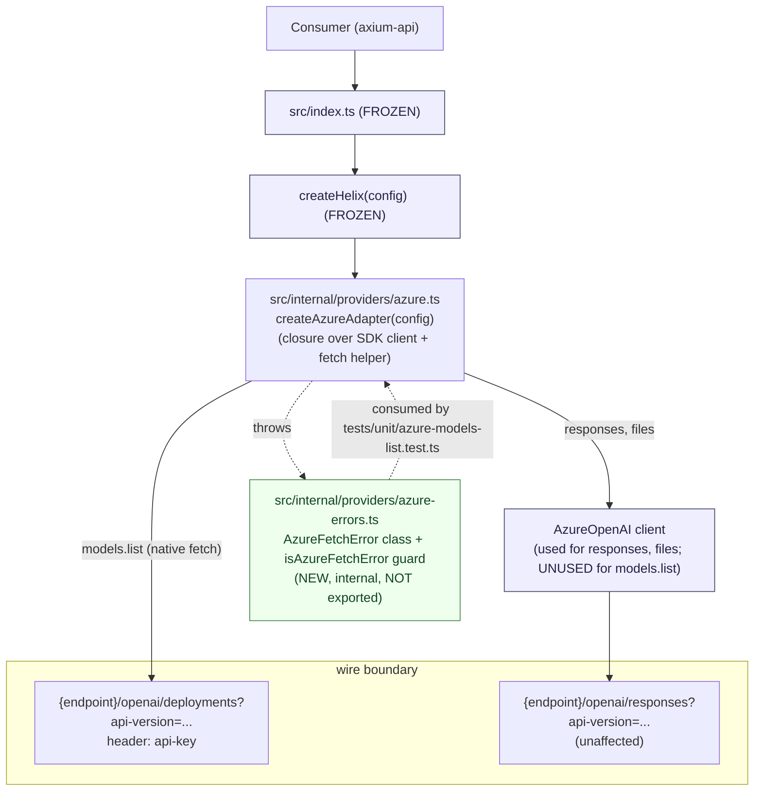
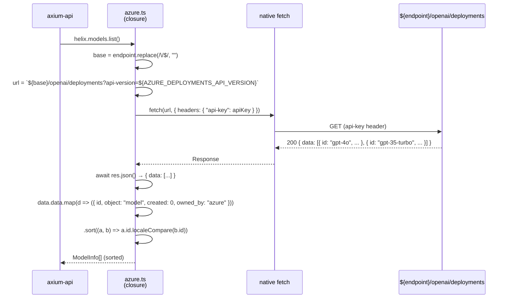
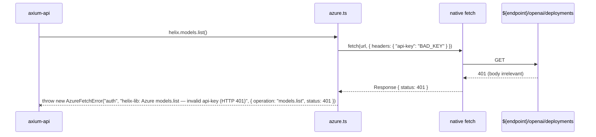
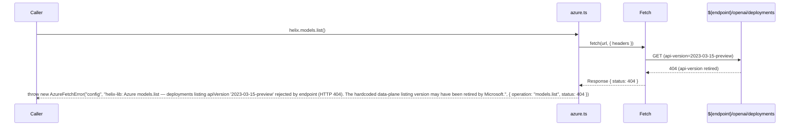
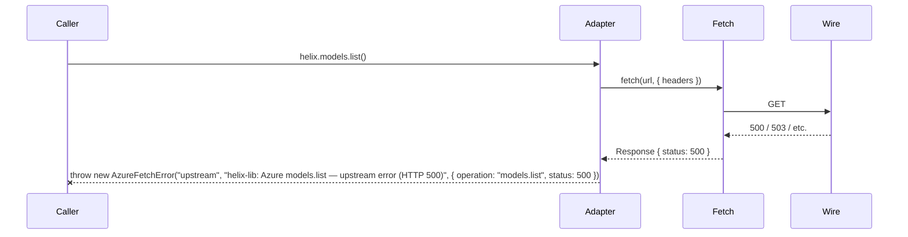
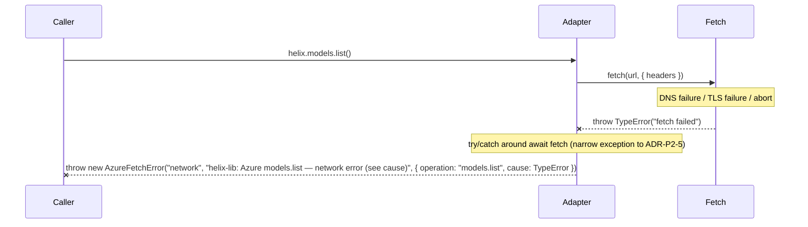
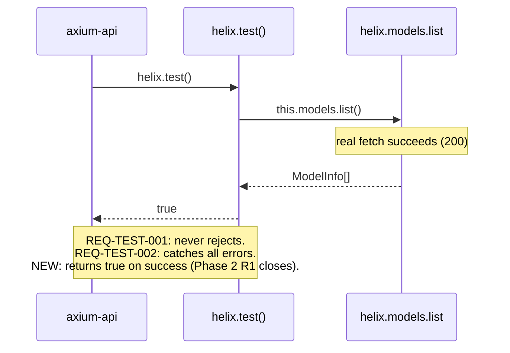

# Design: helix-azure-list-models — Real `models.list()` for Azure adapter

**Change**: `helix-azure-list-models`
**Date**: 2026-04-28
**Author**: orchestrator-delegated (sdd-design)
**Status**: ready for sdd-tasks
**Companion**: `proposal.md`, `specs/azure/spec.md`
**Inherits from**: `helix-providers-phase-2/design.md` (archived 2026-04-28) — adapter layout, closure pattern (ADR-P2-2), no-try/catch rule (ADR-P2-5), test layout (ADR-P2-6) all stay in force EXCEPT the Azure-specific exceptions called out below.
**Predecessor (overridden)**: Phase 2 RD-PHASE2-4 (Azure `models.list` throws ARM message) is replaced. Phase 2 R1 (Azure `test()` permanently false) closes.

---

## 1. Overview

This design pins the **how** for replacing the synchronous throw stub at `src/internal/providers/azure.ts:39-44` with a real `models.list()` body that hits the Azure data-plane deployments endpoint via native `fetch`. The proposal already ratified the **what** (RD-AZ-LM-1..7: endpoint shape, native fetch only, four-kind discriminated error, no filtering, `created: 0`/`owned_by: "azure"` constants, `localeCompare` sort, Phase 2 contract overridden). This document commits the implementation-level details those decisions deferred:

- The error type's location, naming, and runtime form (OQ1).
- The unit-test file path (OQ2).
- The exact error-message wording per kind (OQ3).
- Whether the error carries `provider` + `operation` fields (OQ4).
- URL normalization rules (trailing slash, `apiVersion` encoding).
- Sequence diagrams for happy path, each error branch, and `test()` integration.
- Negative-scope discipline that protects the parallel SDD `helix-files-params-tightening` from drift.

**Inherited substrate** (from Phase 2 design, untouched here):
- Hexagonal layering: `core/` is zero-dep type-only; `internal/providers/*` is hidden adapters; `createHelix.ts` is the public seam.
- Per-`createHelix`-instance closure (ADR-P2-2). `createAzureAdapter(config)` constructs `AzureOpenAI` once and the returned `Helix` interface methods close over it. After this change, `models.list` ALSO uses native `fetch` directly — it does NOT route through the SDK client (which has no `client.deployments.list` helper).
- No try/catch in adapter methods except `test()` (ADR-P2-5) — UPHELD with one nuance: `models.list` MUST catch the `fetch` rejection to map it to `kind: "network"`. Documented as an explicit narrow exception in ADR-AZ-LM-3.
- Co-located unit tests under `src/internal/providers/__tests__/` was Phase 2's choice (ADR-P2-6). This change DEPARTS — see ADR-AZ-LM-5: unit tests now live at `tests/unit/` per current repo layout (Phase 2's `__tests__/` files were deleted in the working tree per `git status`).
- `tsup` `external: ["openai"]`, `entry: ["src/index.ts"]` — UNCHANGED. No new public export, no new public type, no `package.json` dep change.

**This design's job** is to commit the Azure-`models.list`-specific implementation details. The `core/` layer does NOT change. The public seam does NOT change. Only lines 39-44 of `src/internal/providers/azure.ts` change, plus a new `src/internal/providers/azure-errors.ts` (internal, not exported), plus a new `tests/unit/azure-models-list.test.ts`, plus an edit to `tests/integration/azure.test.ts`.

---

## 2. Architectural Approach

### 2.1 Layout (UNCHANGED + 1 new internal file)

```
src/
├── core/                                (FROZEN)
│   └── types/{config,models,...}.ts
├── internal/
│   └── providers/
│       ├── openai.ts                    (FROZEN — reference pattern only)
│       ├── azure.ts                     ← LINES 39-44 REWRITTEN
│       ├── azure-errors.ts              ← NEW (internal — NOT exported from src/index.ts)
│       ├── custom.ts                    (FROZEN — reference pattern only)
│       └── vertex.ts                    (FROZEN — owned by helix-vertex-provider)
├── createHelix.ts                       (FROZEN)
└── index.ts                             (FROZEN — public barrel)

tests/
├── unit/
│   └── azure-models-list.test.ts        ← NEW
└── integration/
    └── azure.test.ts                    ← EXTENDED (replace 2 obsolete cases, add 1)
```

### 2.2 Why a new file (`azure-errors.ts`) rather than inline or shared

The proposal's OQ1 listed three locations for the discriminated error. ADR-AZ-LM-2 below picks **option 3 (`src/internal/providers/azure-errors.ts`)** with these structural reasons:

- **Adapter cohesion.** The error shape is a private contract between `azure.ts` and its tests. Co-locating it next to `azure.ts` mirrors the "one file per provider, one sibling for its private types" pattern the Phase 2 layout supports.
- **No colonization risk.** PR6 (`HelixError` discriminated union) is deferred to `helix-error-model`. Putting a generic `errors.ts` at `src/internal/errors.ts` would set a precedent that the next adapter MUST adopt the same shape — premature standardization. The eventual `helix-error-model` SDD will read `azure-errors.ts`, generalize it, and migrate consumers in a single sweep. Keeping the file ADAPTER-LOCAL signals "this is not the project-wide model — yet."
- **No public surface impact.** `internal/` is hidden from `package.json exports`; nothing leaks to consumers. The eventual hoist to a shared module is a non-breaking refactor.
- **Test-friendly.** Unit tests can `import { isAzureFetchError, AzureFetchError } from "../../src/internal/providers/azure-errors.js"` for `instanceof` / kind assertions without reaching into `azure.ts`'s private symbols.

### 2.3 Component diagram



---

## 3. Architecture Decisions (ADRs)

### ADR-AZ-LM-1 — Native `fetch` over SDK helpers

**Status**: Accepted

**Context**: The OpenAI SDK (used as `AzureOpenAI` for Azure auth flows) does NOT expose a `client.deployments.list()` method. The data-plane deployments endpoint (`/openai/deployments?api-version=...`) is Azure-control-plane-adjacent — it lists deployments rather than invoking a model. The SDK models the model-invocation surface (responses, files, models-via-OpenAI), not the deployments-listing surface. Three transport options:

- (a) **Add a heavyweight ARM SDK** (`@azure/arm-cognitiveservices` or similar). Rejected by PR2 ("lightest libraries possible. NEVER LangChain. Prefer no library — native `fetch`"). The ARM SDK requires AAD auth (RBAC), which `HelixConfig.azure` does not carry — only `apiKey`/`endpoint`/`apiVersion`.
- (b) **Use the SDK's exposed `fetch` hook** (`client._client.request(...)` or similar internal). Rejected: relies on undocumented SDK internals; brittle across SDK minor bumps.
- (c) **Native `fetch` against the data-plane endpoint** with the same `api-key` header convention the SDK already uses for other Azure routes. The endpoint is documented and stable since `api-version=2023-12-01-preview`.

**Decision**: Option (c). `models.list` body uses Node 22's built-in global `fetch`. No new runtime dep. No SDK internals reached.

```ts
// Illustrative — design only. Apply phase produces final code.
const base = config.endpoint.replace(/\/$/, "");
const url = `${base}/openai/deployments?api-version=${config.apiVersion}`;
const res = await fetch(url, { headers: { "api-key": config.apiKey } });
```

**Tradeoff**: Native `fetch` does NOT inherit the SDK's automatic retries (default 2× on 5xx), backoff, or auth-refresh logic. Acceptable because:
- `models.list` is a read-only, infrequent operation (typically called at startup or admin refresh, not in a hot path).
- A single 5xx returned to the consumer as `kind: "upstream"` is a clear signal; manual retry by the consumer is appropriate.
- If retries become necessary, a future SDD can wrap the `fetch` in a small retry helper without altering the public contract.

**Consequences**:
- *Easier*: zero new deps; smallest possible diff.
- *Easier*: error mapping is direct (status code → kind) without unwrapping SDK error objects.
- *Harder*: no built-in retry/backoff. Documented limitation.
- *Harder*: future migration to a shared HTTP helper requires a coordinated edit. Acceptable — there's only ONE call site today.

**Alternatives considered**: see (a) and (b) above.

Traceability: PR2, RD-AZ-LM-2, proposal §4.

---

### ADR-AZ-LM-2 — Internal error location: `src/internal/providers/azure-errors.ts` (resolves OQ1)

**Status**: Accepted

**Context**: The proposal's OQ1 listed three locations for the discriminated error:
- (a) **Inline** — anonymous object literal thrown at each call site inside `azure.ts`. Pros: zero new file, smallest surface. Cons: not reusable; tests must duplicate the shape; no `instanceof` check possible.
- (b) **`src/internal/errors.ts`** — module-internal helper for any adapter to use. Pros: future-proof for openai.ts/custom.ts to standardize. Cons: looks like the start of `helix-error-model` and risks colonizing that future namespace. Sets a precedent that subsequent adapter changes feel pressured to follow.
- (c) **Adapter-local** — `src/internal/providers/azure-errors.ts`. Pros: scoped to one adapter; no precedent forced on others. Cons: pattern drift if other adapters do the same later.

**Decision**: Option **(c)**. Create `src/internal/providers/azure-errors.ts`. The file is `internal/`-private and NOT re-exported from `src/index.ts`. Naming:

- File: `azure-errors.ts`
- Class: **`AzureFetchError`** (NOT `HelixError`, NOT `AzureError`, NOT `AzureModelsListError`).
  - Rejected `HelixError` — would colonize `helix-error-model`'s future public type. PR6 explicitly defers that.
  - Rejected `AzureError` — too broad; implies all Azure failures use this shape. The shape is `fetch`-specific (carries `status`, maps HTTP statuses to kinds). A future Azure-side error from the SDK responses path is a different concern.
  - Rejected `AzureModelsListError` — too narrow; the same shape will apply if Phase 3 adds another `fetch`-based Azure call (e.g., a future deployments DELETE). Naming after the transport layer (`Fetch`) rather than the operation (`ModelsList`) keeps the door open.
  - Chosen `AzureFetchError` — captures the transport (native fetch), the provider (Azure), and is forward-compatible if other Azure-fetch-based methods land before `helix-error-model`.

**Consequences**:
- *Easier*: tests `import { AzureFetchError } from "../../src/internal/providers/azure-errors.js"` and use `instanceof` for type narrowing.
- *Easier*: future `helix-error-model` SDD migrates this in one sweep — rename, hoist, update consumers. Pure mechanical.
- *Easier*: no precedent forced on `openai.ts`/`custom.ts` — they continue to passthrough SDK errors raw (per Phase 2 ADR-P2-5).
- *Harder*: if `helix-vertex-provider` lands BEFORE `helix-error-model`, it might create `vertex-errors.ts` mirroring this pattern. Acceptable — three small files are still clearer than one premature shared abstraction.

**Alternatives considered**: (a) and (b) above. Option (b) would force later changes (Vertex, OpenAI error wrapping) to either adopt or deviate from a half-baked shared module — worse outcome than waiting for `helix-error-model` to do the unification properly.

Traceability: proposal OQ1, PR6 deferred.

---

### ADR-AZ-LM-3 — Discriminated error shape: class extending `Error`

**Status**: Accepted

**Context**: The proposal's RD-AZ-LM-3 fixed the four kinds (`auth | config | upstream | network`) and the field set (`message`, optional `cause`, optional `status`). Open: does the error EXTEND `Error` (real throwable with stack trace, `instanceof` checks, native console rendering) or is it a plain object literal thrown directly?

**Decision**: Extend `Error`. Final shape:

```ts
// src/internal/providers/azure-errors.ts
export type AzureFetchErrorKind = "auth" | "config" | "upstream" | "network";

export class AzureFetchError extends Error {
  readonly kind: AzureFetchErrorKind;
  readonly status?: number;
  readonly provider: "azure" = "azure";
  readonly operation: string;

  constructor(
    kind: AzureFetchErrorKind,
    message: string,
    options: { operation: string; status?: number; cause?: unknown } = { operation: "unknown" },
  ) {
    super(message, options.cause !== undefined ? { cause: options.cause } : undefined);
    this.name = "AzureFetchError";
    this.kind = kind;
    this.status = options.status;
    this.operation = options.operation;
  }
}

export function isAzureFetchError(e: unknown): e is AzureFetchError {
  return e instanceof AzureFetchError;
}
```

Resolves the proposal's OQ4 affirmatively: the error DOES carry `provider: "azure"` (literal, not parametric — this class is Azure-specific) and `operation: string` (e.g., `"models.list"`). When `helix-error-model` lands and introduces a multi-provider `HelixError` union, those two fields are exactly the discriminators that union will need; building them in NOW makes the future migration a rename plus an export, not a redesign.

**Why a class, not a plain object**:
- *Stack traces*. `new Error(...)` populates `.stack`. Plain objects do not. Stack traces matter when the consumer logs or surfaces the error to a developer.
- *`instanceof` discrimination*. Tests assert `expect(err).toBeInstanceOf(AzureFetchError)` cleanly. With plain objects, tests assert duck-type shape — more brittle.
- *`Error.cause` (Node 22)*. The native `cause` property is the standard way to chain a wrapped error. `new Error(msg, { cause })` is built into the language; matching that idiom is ergonomic for `kind: "network"` where the underlying `fetch` rejection MUST be preserved for debugging.
- *Console / inspector rendering*. Both Node and browser DevTools render `Error` instances with formatted stack traces; plain objects render as opaque blobs.
- *No runtime cost*. `class extends Error` is a one-line idiom; the class compiles to a constructor function in CJS and the same in ESM.

**Why NOT extend Error**:
- *`message` field redundancy*. `Error.message` already covers the field; no duplication.
- *Tradeoff considered: a plain `interface AzureFetchError { kind, message, status?, cause?, provider, operation }` thrown via `throw { ... }`*. Rejected: loses stack trace, loses `instanceof`, no console formatting. The two-line class costs nothing.

**Narrow exception to ADR-P2-5 (no try/catch)**: Phase 2's design decreed that adapter namespace methods MUST NOT contain `try/catch` blocks (errors propagate raw from the SDK). This change INTRODUCES one narrow exception in `azure.ts`'s `models.list`: a single `try/catch` around the `fetch` call to map a network-layer rejection (DNS, TLS, abort) to `kind: "network"`. The exception is justified because:
- `fetch` rejects with a generic `TypeError` — the consumer cannot distinguish "network" from other failures without our mapping.
- The other three kinds (`auth`/`config`/`upstream`) are derived from `res.status` and need NO try/catch — they branch on the resolved response.
- The `try/catch` is SCOPED to the `await fetch(...)` line only. Response parsing and status-mapping happen OUTSIDE the catch block.

**Consequences**:
- *Easier*: tests use `instanceof AzureFetchError` and `err.kind`/`err.status` for assertions.
- *Easier*: `helix-error-model` adopts these discriminators (`provider`, `operation`, `kind`) wholesale.
- *Easier*: stack traces preserved for debugging.
- *Harder*: one narrow `try/catch` deviates from ADR-P2-5. Documented exception with justification.

**Alternatives considered**: plain object literal (rejected: no stack, no `instanceof`); generic `class HelixError extends Error` (rejected: colonizes the future public name); discriminated union of class hierarchy (`class AzureAuthError extends AzureFetchError`...) (rejected: over-engineering — one class with a `kind` field is simpler and tests want a single `instanceof` check).

Traceability: proposal OQ1 / OQ4, RD-AZ-LM-3, PR6 deferred.

---

### ADR-AZ-LM-4 — `ModelInfo.created` filler: literal `0`

**Status**: Accepted

**Context**: `ModelInfo.created: number` is REQUIRED (not optional) per `src/core/types/models.ts:5`. The Azure deployments response carries no creation timestamp. The proposal pinned `created: 0` (sentinel). Confirm or propose alternative.

**Decision**: `created: 0`. Literal sentinel. Rejected alternatives:

- **`Date.now() / 1000`** — fetch time. Rejected: dishonest. The model was NOT created when the consumer fetched the list. A consumer reading `ModelInfo.created` and applying `new Date(created * 1000)` would see the wrong timestamp every page load.
- **`-1`** — sentinel for absence. Rejected: `ModelInfo.created: number` permits any number, but `0` is a more conventional sentinel (Unix epoch start, 1970-01-01) and ALSO matches what other libraries return when the timestamp is unknown.
- **Make `ModelInfo.created` optional** — rejected: a public-surface change to `ModelInfo`, breaks consumers depending on the required field, conflicts with proposal's "no public surface change" scope.

**Consequences**:
- *Easier*: explicit, documented sentinel that consumers can detect (`if (model.created === 0) renderUnknownDate()`).
- *Easier*: type contract preserved (`created: number` stays required).
- *Harder*: a consumer that does `new Date(model.created * 1000).toLocaleString()` will render "1970-01-01 00:00:00" for every Azure deployment. Documented in the spec — Azure ModelInfo carries `created: 0` to signal absence. Consumer UIs that care MUST branch on the sentinel.

This is risk **D-AZ-LM-R4** in §5; mitigation is documentation in the spec and JSDoc.

Traceability: RD-AZ-LM-5, proposal §4.

---

### ADR-AZ-LM-5 — Unit test layout: `tests/unit/azure-models-list.test.ts` (resolves OQ2)

**Status**: Accepted

**Context**: Phase 2's ADR-P2-6 placed unit tests under `src/internal/providers/__tests__/`. Per `git status`, those files have been DELETED in the working tree (`D src/internal/providers/__tests__/azure.test.ts`, etc.) and a `tests/unit/` directory exists. The repo's de-facto current convention is `tests/unit/` co-located with `tests/integration/`. The proposal's OQ2 listed three options:
- (a) `tests/unit/azure-models-list.test.ts`
- (b) `tests/unit/providers/azure-models-list.test.ts`
- (c) `src/internal/providers/__tests__/azure-models-list.test.ts`

**Decision**: Option **(a)** — `tests/unit/azure-models-list.test.ts`. Rationale:

- The repo's working state already places unit tests under `tests/unit/` flat. Match what's there; don't introduce a `providers/` subdirectory for one file.
- Vitest's `vitest.config.ts` already includes `tests/unit/**/*.test.ts` (read at line 8 — `"tests/unit/**/*.test.ts"`). No config tweak needed.
- The test file name `azure-models-list.test.ts` is granular enough to make per-method discovery trivial. If Phase 3 adds `azure-deployments-delete.test.ts`, the flat layout still scales.
- Rejected (b): premature subdirectory; only one Azure unit-test file exists and may stay solo until `helix-error-model`.
- Rejected (c): contradicts the deletion of Phase 2's `__tests__/` directory in the current branch state. Reviving that directory for one file is reverse-engineering; matching the new convention is correct.

**Test framework**: Vitest. Already installed and configured.

**Mocking strategy**: `vi.stubGlobal("fetch", vi.fn(...))` per test, with `vi.unstubAllGlobals()` in `afterEach`. This matches Vitest's idiomatic global mocking and works with Node 22's native `fetch`. Rejected `vi.spyOn(globalThis, "fetch")` because Node 22's `fetch` is a non-configurable property in some configurations and `stubGlobal` is the documented escape hatch.

```ts
// Illustrative — for design only. Apply phase produces final code.
import { describe, it, expect, vi, beforeEach, afterEach } from "vitest";
import { createHelix } from "../../src/index.js";
import { AzureFetchError } from "../../src/internal/providers/azure-errors.js";

beforeEach(() => {
  vi.stubGlobal("fetch", vi.fn());
});
afterEach(() => {
  vi.unstubAllGlobals();
});
```

**Coverage matrix** — six branches (REQ-AZ-LM-* spec scenarios in 1:1 with `it(...)` blocks):

| Scenario | `fetch` mock returns | Asserts |
|---|---|---|
| 1. Happy path: 2 deployments, sorted | `Response(JSON.stringify({ data: [{ id: "gpt-4o" }, { id: "gpt-35-turbo" }] }), { status: 200 })` | Result `[{ id: "gpt-35-turbo", object: "model", created: 0, owned_by: "azure" }, { id: "gpt-4o", ... }]`. URL contains `/openai/deployments?api-version=`. Header `api-key` present. |
| 2. Happy path: empty list | `Response(JSON.stringify({ data: [] }), { status: 200 })` | Returns `[]`. No throw. |
| 3. 401 → `kind: "auth"` | `Response("...", { status: 401 })` | Throws `AzureFetchError` with `kind: "auth"`, `status: 401`, `operation: "models.list"`, `provider: "azure"`. |
| 4. 404 → `kind: "config"` | `Response("...", { status: 404 })` | Throws `AzureFetchError` with `kind: "config"`, `status: 404`, message mentioning `apiVersion`. |
| 5. 500 → `kind: "upstream"` | `Response("...", { status: 500 })` | Throws `AzureFetchError` with `kind: "upstream"`, `status: 500`. |
| 6. Network error → `kind: "network"` | `vi.fn().mockRejectedValueOnce(new TypeError("fetch failed"))` | Throws `AzureFetchError` with `kind: "network"`, `cause` being the original `TypeError`. |

Additional assertions (any one happy-path test):
- URL is exactly `${endpoint.replace(/\/$/, "")}/openai/deployments?api-version=${apiVersion}`.
- Trailing-slash on `endpoint` is normalized: a config with `endpoint: "https://x.openai.azure.com/"` produces the same URL as `endpoint: "https://x.openai.azure.com"`.
- `headers` object contains exactly `{ "api-key": "<configured-key>" }` and no `Authorization` header.
- Sort uses `localeCompare` (alphabetic). Pin a deterministic case: `["gpt-4o", "gpt-35-turbo"]` sorts to `["gpt-35-turbo", "gpt-4o"]` because `"3" < "4"` lexicographically.

**Consequences**:
- *Easier*: matches current repo convention (tests/unit + tests/integration flat).
- *Easier*: each test reads top-down; no shared MSW interceptor setup needed.
- *Harder*: if Phase 3 adds many Azure unit tests, the flat layout may warrant `tests/unit/azure/`. Acceptable refactor at that point.

**Alternatives considered**: (b) and (c) above. (c) was rejected mainly because Phase 2's `__tests__/` was deliberately deleted in the working branch — design respects current state.

Traceability: proposal OQ2.

---

### ADR-AZ-LM-6 — Integration test strategy

**Status**: Accepted

**Context**: `tests/integration/azure.test.ts` already exists. The proposal §3 IN-scope item 9 says: remove the obsolete "models.list throws" assertion, replace with a "returns sorted ModelInfo[]" assertion, flip "test() resolves false" to "test() resolves true". Pin the env-var contract.

**Decision**: Three changes to `tests/integration/azure.test.ts`:

1. **Remove** the `it("models.list() throws with ARM message", ...)` block (currently lines 33-42) and the `AZURE_MODELS_LIST_ERROR_MSG` constant (lines 12-13).
2. **Add** a new block:
   ```ts
   it("models.list returns sorted ModelInfo[]", async () => {
     const helix = createHelix({
       provider: "azure",
       apiKey: env("HELIX_AZURE_API_KEY")!,
       endpoint: env("HELIX_AZURE_ENDPOINT")!,
       apiVersion: env("HELIX_AZURE_API_VERSION")!,
     });

     const models = await helix.models.list();
     expect(Array.isArray(models)).toBe(true);
     // Tenants may have zero deployments — accept that as a valid case.
     for (const m of models) {
       expect(m.object).toBe("model");
       expect(m.owned_by).toBe("azure");
       expect(m.created).toBe(0);
     }
     // If there's more than one, assert sort order.
     for (let i = 1; i < models.length; i++) {
       expect(models[i - 1]!.id.localeCompare(models[i]!.id)).toBeLessThanOrEqual(0);
     }
   });
   ```
3. **Flip** the `it("test() resolves false", ...)` block (currently lines 44-54) to:
   ```ts
   it("test() resolves true", async () => {
     // ... same setup ...
     const result = await helix.test();
     expect(result).toBe(true);
   });
   ```

**Env-var contract** (UNCHANGED from Phase 2):

| Var | Required for `models.list` | Required for `test()` | Required for `responses.create` | Required for files |
|---|---|---|---|---|
| `HELIX_AZURE_API_KEY` | YES | YES | YES | YES |
| `HELIX_AZURE_ENDPOINT` | YES | YES | YES | YES |
| `HELIX_AZURE_API_VERSION` | YES | YES | YES | YES |
| `HELIX_AZURE_DEPLOYMENT` | NO | NO | YES | YES |

The `models.list` and `test()` cases only need the first three. Do NOT extend `hasAzure` (line 7-10) to require `HELIX_AZURE_DEPLOYMENT` when running `models.list` — it already does (line 10), but that's fine for now: when ANY Azure integration test runs, all four envs are present. Splitting the gate would optimize for partial-env runs which we don't currently support.

**Skip behavior**: `describe.skipIf(!hasAzure)` (UNCHANGED). When the four envs are absent, the entire describe block skips silently per ADR-P2-8.

**Risk acknowledgment**: integration tests against real Azure are subject to network flakiness, rate limits, and deployment-state changes. This is risk **D-AZ-LM-R5** in §5. Mitigation: skip-on-no-env keeps CI green for contributors without secrets; integration tier runs are advisory in CI.

**Consequences**:
- *Easier*: minimal diff (delete 2 blocks + 1 constant, add 1 block, flip 1 assertion).
- *Easier*: real-world validation that data-plane endpoint is alive against the configured tenant.
- *Harder*: tests depend on tenant having a stable list of deployments. We assert structural shape, not specific IDs, so deployment additions don't break tests.

Traceability: proposal §3, RD-AZ-LM-7.

---

### ADR-AZ-LM-7 — `test()` body: NO change required

**Status**: Accepted

**Context**: `src/internal/providers/azure.ts:45-52` implements `test()` as:
```ts
async test() {
  try {
    await this.models.list();
    return true;
  } catch {
    return false;
  }
},
```

Phase 2's ADR-P2-5 (no try/catch except in `test()`) is honored. The body calls `this.models.list()` and swallows any throw. After this change, `models.list` no longer throws synchronously on valid creds — so `test()` returns `true` instead of `false`. Phase 2's R1 closes automatically.

**Decision**: Make NO edit to `test()`'s body. The behavioral change is entirely a downstream effect of `models.list`'s new implementation.

**Crucial guidance for sdd-apply**: the apply phase MUST NOT modify lines 45-52 of `azure.ts`. The integration test flip from "resolves false" to "resolves true" is the OBSERVABLE proof the change works; no source edit to `test()` is needed.

**Consequences**:
- *Easier*: lines 45-52 are byte-identical pre/post apply. Verify-phase grep can assert this.
- *Easier*: the SAME `test()` body works for all four providers — zero divergence.
- *Harder*: a future SDD that wants `test()` to do more (e.g., check a specific deployment exists) WILL touch lines 45-52. Out of scope here.

Traceability: REQ-TEST-001, REQ-TEST-002 (Phase 2 spec), proposal §1 success criterion 4.

---

### ADR-AZ-LM-8 — Negative-scope discipline for parallel SDD

**Status**: Accepted

**Context**: Parallel SDD `helix-files-params-tightening` operates on lines 26-28 of `azure.ts` (the `as Parameters<typeof client.files.create>[0]` cast in `files.create`). This SDD operates on lines 39-44. Lines are disjoint, but a careless apply might re-flow file formatting and accidentally touch sibling lines.

**Decision**: Three guards.

1. **Apply-phase line-budget** — sdd-apply MUST be instructed to ONLY edit lines 39-44 of `azure.ts`. The instruction goes into the apply phase's task list verbatim: "DO NOT modify lines 1-38, lines 45-54 of `src/internal/providers/azure.ts`. Replace lines 39-44 only."
2. **Verify-phase byte-equality grep** — verify-phase tasks include a check that lines 26-28 (specifically `client.files.create(params as Parameters<typeof client.files.create>[0])`) are byte-identical between pre-apply and post-apply state. The check is a literal `git diff src/internal/providers/azure.ts | grep -E "^[-+].*Parameters<typeof client.files.create>"` which MUST return ZERO matches.
3. **Independence test** — the integration test for `files.create` (already present at `tests/integration/azure.test.ts:56-95`) is NOT touched by this change. If it passes pre-apply and post-apply equivalently, the parallel SDD's contract is preserved.

**Consequences**:
- *Easier*: clear contract for sdd-apply on what NOT to touch.
- *Easier*: verify-phase has a mechanical check (no judgment required).
- *Harder*: if `helix-files-params-tightening` lands FIRST and changes lines 26-28, this change's verify-phase grep needs to baseline against the POST-`helix-files-params-tightening` state, not the original. Documented as risk **D-AZ-LM-R3**; mitigation is straightforward — verify reads the current `azure.ts` HEAD, not a frozen snapshot.

Traceability: REQ-AZ-LM-11 (negative scope), proposal §6 (independence note).

---

### ADR-AZ-LM-9 — Spec REPLACEMENT pattern for Phase 2 REQs

**Status**: Accepted

**Context**: Phase 2 (`helix-providers-phase-2`) is ARCHIVED. Its specs at `openspec/specs/azure/spec.md` contain REQ-AZ-004 (Azure `models.list` MUST throw with the documented ARM message) and REQ-AZ-005 (`test()` MUST return `false` on Azure). Both must be REPLACED — not amended, not added-alongside.

**Decision**: Use the "delta spec REPLACE pattern" already used by `helix-files-params-tightening`. The delta spec at `openspec/changes/helix-azure-list-models/specs/azure/spec.md` (sdd-spec writes this) MUST:

- Mark REQ-AZ-004 with a `### REPLACED` heading and the new contract (returns sorted `ModelInfo[]`, throws `AzureFetchError` discriminated on failure).
- Mark REQ-AZ-005 with a `### REPLACED` heading and the new contract (`test()` returns `true` on valid creds, `false` on failure).
- Add new REQs (REQ-AZ-LM-1..N) that DO NOT exist in the main spec — these are net-new additions.
- The archive of this change syncs the delta to the main spec at `openspec/specs/azure/spec.md`.

This sets the precedent (already established by `helix-files-params-tightening`) that frozen Phase 2 REQs CAN be amended by subsequent SDDs when justified by new evidence — the key constraint is that the AMENDMENT goes through a delta-spec + archive cycle, not direct edits to the main spec.

**Why this matters at design time**: sdd-tasks needs to know the spec-delta contains `REPLACED` markers so it can plan a "spec migration" task in the sdd-archive phase. The archive phase merges the delta into `openspec/specs/azure/spec.md`, removing the old REQs and inserting the new ones.

**Consequences**:
- *Easier*: standard delta-spec convention; sdd-spec / sdd-archive already know how to handle `REPLACED`.
- *Easier*: future SDDs follow the same pattern — predictable.
- *Harder*: developers reading the archived `helix-providers-phase-2/specs/azure/spec.md` see REQ-AZ-004 saying "throws" but the LIVE spec says "returns". They MUST read the change log / archive entries to understand the override. Mitigated by archive-report linking back to this change.

Traceability: proposal §3 IN-scope item, REQ-AZ-LM-12 (spec replacement).

---

### ADR-AZ-LM-10 — URL normalization rules

**Status**: Accepted

**Context**: `HelixConfig.azure.endpoint` is a free-form `string`. Consumers may or may not include a trailing slash. `apiVersion` is also free-form `string` — typically values like `"2024-08-01-preview"` which are URL-safe, but no enforcement exists in the type system.

**Decision**:

1. **Trailing-slash normalization on `endpoint`**: apply `endpoint.replace(/\/$/, "")` BEFORE concatenation. Strips exactly one trailing slash; multiple trailing slashes are NOT handled (if a consumer passes `"https://x.openai.azure.com//"`, the result has one slash left — documented as user error).
2. **No `encodeURIComponent` on `apiVersion`**: by Azure convention, `apiVersion` is always a date-style identifier (`YYYY-MM-DD[-preview]`) using only `[0-9a-z-]`. URL-encoding these characters is a no-op AND would break legitimate hyphens if the encoder was overzealous (which standard `encodeURIComponent` is not, but defensive `encodeURI` IS). Pass `apiVersion` raw.
3. **No `encodeURIComponent` on `apiKey`**: the key goes in a HEADER, not the URL. URL encoding does not apply.
4. **Final URL template** (committed):
   ```ts
   const base = config.endpoint.replace(/\/$/, "");
   const url = `${base}/openai/deployments?api-version=${config.apiVersion}`;
   ```

**Edge case acknowledged**: a consumer with `endpoint: "https://x.openai.azure.com/some/path/"` would produce `"https://x.openai.azure.com/some/path/openai/deployments?api-version=..."` — almost certainly not what they want. Azure endpoints conventionally have NO path segment beyond the hostname. Documented as a config user-error; not validated at runtime (no path inspection).

**Consequences**:
- *Easier*: minimal regex; one canonical URL shape.
- *Easier*: deterministic output for tests (the URL string is exact).
- *Harder*: a malformed `endpoint` (path included) silently produces a wrong URL. Acceptable — `HelixConfig` validation is out of scope; consumers' own validation layers (or 404 response from Azure) catch it.

Traceability: proposal §3, RD-AZ-LM-1.

---

### ADR-AZ-LM-11 — No logging, no observability

**Status**: Accepted

**Context**: Should the adapter log fetch attempts, status codes, or timing? Some libraries do; many over-log.

**Decision**: NO logging. The adapter MUST NOT call `console.*` from `models.list`. Errors propagate via `throw`; consumers log them in their own infrastructure.

**Rationale**:
- A library that logs unconditionally pollutes consumer stdout/stderr.
- Consumers who want observability wrap the call themselves (`try { await helix.models.list() } catch (e) { logger.warn(...); throw e }`).
- The future `helix-error-model` SDD MAY introduce a structured-error shape with telemetry hooks — that's where observability belongs, not in the adapter body.

**Consequences**:
- *Easier*: adapter body is silent and simple.
- *Easier*: tests don't need to mock `console`.
- *Harder*: debugging a misconfigured endpoint requires consumer-side wrapping. Acceptable given the four discriminated kinds give consumers enough context to log meaningfully.

Traceability: PR2 (lightest possible), Phase 2 ADR-P2-5 spirit (silent adapter).

---

### ADR-AZ-LM-12 — Hardcoded `AZURE_DEPLOYMENTS_API_VERSION` constant (post-hoc, added during apply)

**Status**: Accepted post-hoc — added during apply phase after integration testing exposed a vendor quirk not anticipated in original design.

**Context**: Original design (ADR-AZ-LM-1, ADR-AZ-LM-10) assumed `config.apiVersion` was sufficient for all data-plane operations including `/openai/deployments` listing. Integration testing revealed this is false: newer api-versions (`2024-10-21`, `2025-04-01-preview`) return HTTP 404 on the deployments listing endpoint even though they remain valid for inference (responses, files). Cross-referenced ocr-ai (sibling project at `fluxaria/ocr-ai/OCR-AI/src/config/env.ts:10`) confirmed the working pattern: a separate api-version pinned to `2023-03-15-preview` is required for listing.

**Decision**: Add internal constant `AZURE_DEPLOYMENTS_API_VERSION = "2023-03-15-preview"` at the top of `src/internal/providers/azure.ts`. `models.list()` MUST use this constant for URL construction — NOT `config.apiVersion`. The constant is module-private (not exported, not configurable from the public surface).

**Rationale**:
- Vendor quirk that helix abstracts at the library layer. Consumers should not need to know about it.
- Library-vs-application stance: ocr-ai/axium-api expose this as an env var because they are tenant-configurable applications; helix is a library and hardcodes the known-good value.
- Decouples the listing api-version from `config.apiVersion` so consumers can adopt newer api-versions for inference without breaking listing.
- If Microsoft retires `2023-03-15-preview` for real, helix releases a patch update — fast turnaround.

**Consequences**:
- *Easier*: `config.apiVersion` evolves freely for inference; listing remains stable.
- *Easier*: zero public surface change.
- *Harder*: future MS retirement of `2023-03-15-preview` requires a helix release. Mitigated by the descriptive 404 error message that tells consumers the issue is the hardcoded version (not their config).

**Traceability**: engram discovery memo `azure/deployments-listing-api-version-quirk`, integration test 4/4 pass after applying this fix, ocr-ai precedent at `fluxaria/ocr-ai/OCR-AI/src/config/env.ts:10` and `fluxaria/ocr-ai/OCR-AI/src/shared/infrastructure/llm/azure.provider.ts:132`.

---

## 4. Component & Module Boundaries

### 4.1 Files this change MODIFIES

| File | Lines | Modification |
|---|---|---|
| `src/internal/providers/azure.ts` | 39-44 | Replace the throw stub with a real `models.list()` body that calls native `fetch` and maps errors via `AzureFetchError` from `./azure-errors.js`. Add `import { AzureFetchError } from "./azure-errors.js"` at the top. Lines 1-38 and 45-54 byte-identical post-apply. |
| `tests/integration/azure.test.ts` | 12-13, 33-42, 44-54 | Remove `AZURE_MODELS_LIST_ERROR_MSG` (lines 12-13). Remove the "throws with ARM message" block (33-42). Add the new "returns sorted ModelInfo[]" block. Flip "test() resolves false" → "test() resolves true". |

### 4.2 Files this change ADDS

| File | Purpose | Exported from `src/index.ts`? |
|---|---|---|
| `src/internal/providers/azure-errors.ts` | `AzureFetchError` class + `isAzureFetchError` guard. INTERNAL only. | NO |
| `tests/unit/azure-models-list.test.ts` | Six-scenario unit suite mocking `fetch` via `vi.stubGlobal`. | n/a (test) |
| `openspec/changes/helix-azure-list-models/specs/azure/spec.md` | Delta spec (REPLACED REQ-AZ-004, REPLACED REQ-AZ-005, added REQ-AZ-LM-* additions). Written by sdd-spec. | n/a |

### 4.3 Files this change DOES NOT TOUCH

| Path | Why untouched |
|---|---|
| `src/internal/providers/openai.ts` | Already implements `models.list` correctly. Reference pattern only. |
| `src/internal/providers/custom.ts` | Already implements `models.list` correctly. Reference pattern only. |
| `src/internal/providers/vertex.ts` | Owned by `helix-vertex-provider`. |
| `src/internal/providers/azure.ts` lines 1-38, 45-54 | Only lines 39-44 change. **Plus a new import line at the top** — counted as part of "lines 39-44 region" because it's logically scoped to the new block; documented for sdd-apply. |
| `src/internal/providers/azure.ts` lines 26-28 | Owned by parallel SDD `helix-files-params-tightening`. ADR-AZ-LM-8 guards. |
| `src/createHelix.ts`, `src/index.ts`, `src/core/**` | Public surface, frozen. |
| `package.json` | No dep changes. Native `fetch`. |
| `tsconfig.json`, `tsup.config.ts` | No build changes. |
| `vitest.config.ts` | Already includes `tests/unit/**/*.test.ts` and `tests/integration/**/*.test.ts`. No change needed. |

### 4.4 Note on the new import at the top of `azure.ts`

The apply phase WILL add one new import line:
```ts
import { AzureFetchError } from "./azure-errors.js";
```
Plus possibly a comment. This breaks the strict "lines 39-44 only" rule by 1-2 lines at the top. The verify-phase grep (ADR-AZ-LM-8) MUST scope its check to lines 26-28 specifically — not "lines 1-38 are byte-identical." The independence guarantee is line 26-28 byte-identity, NOT line 1-38 byte-identity.

Updated guard for sdd-apply:
- ALLOWED edits: lines 39-44 (the throw block) + a new import statement at the top of the imports block.
- FORBIDDEN edits: lines 26-28 (`as Parameters<typeof client.files.create>[0]` cast). Anything else inside the body of `responses.create`, `files.{create,list,delete}`, or `test()`. The `AzureOpenAI` constructor invocation. The `type AzureConfig` line. The `export function createAzureAdapter` signature.

---

## 5. Risks the design carries forward

| # | Risk | Impact | Mitigation in this change | Forward owner |
|---|---|---|---|---|
| D-AZ-LM-R1 | Azure data-plane `/openai/deployments` is itself eventually deprecated by Microsoft. The endpoint has been stable since at least `api-version=2023-12-01-preview`, but Azure's API churn rate is real. | A future deprecation surfaces as `404` for callers on the old `api-version`, mapped to `kind: "config"`. Consumers see the kind and the message naming `apiVersion`. | The 404→`config` mapping gives a clean signal. The spec documents the endpoint and `api-version` dependency. | Future `helix-azure-config-v2` if data-plane truly dies — add ARM as alternate transport. |
| D-AZ-LM-R2 | `apiVersion` drift across tenants. Customers on older `api-version` values (e.g., `2023-05-15`) may see different response shapes. | Older versions might return `data` with a different field name or omit `id`. Causes test failures for those tenants. | The endpoint contract has been stable since `2023-12-01-preview`. Integration tests run against the configured `apiVersion` so each tenant verifies their own. Unit test pins a current `api-version` for shape assertions. | Spec phase pins MIN supported `api-version` if needed. |
| D-AZ-LM-R3 | Parallel SDD `helix-files-params-tightening` lands first or after, and apply-phase carelessly touches lines 26-28. | Merge conflict or behavioral regression in `files.create`. | ADR-AZ-LM-8 negative-scope grep test in verify phase. Apply-phase line-budget instruction. Both SDDs are line-disjoint (lines 26-28 vs. 39-44 + new import). | Verify-phase enforces. |
| D-AZ-LM-R4 | `created: 0` sentinel surfacing in consumer UIs as "1970-01-01". | Consumer UIs that call `new Date(model.created * 1000).toLocaleString()` render an obviously wrong date for every Azure deployment. | Spec documents the sentinel; JSDoc on the `models.list` method (apply phase adds) calls it out. Consumers MUST branch on `created === 0`. | Future `helix-error-model` (or a `ModelInfo` v2) MAY make `created` optional, breaking change for consumers. Out of scope. |
| D-AZ-LM-R5 | Network test flakiness in the integration tier. Real network, real Azure tenant. | CI integration runs intermittently fail. | `describe.skipIf(!hasAzure)` skips when env absent (developer machines without secrets stay green). Integration tier is advisory in CI — failures don't block merges (per existing convention). Retries can be added at the CI level if needed. | CI infra. |
| D-AZ-LM-R6 | The `try/catch` exception in `models.list` for `kind: "network"` mapping deviates from Phase 2 ADR-P2-5. | A reviewer applying ADR-P2-5 strictly might reject the PR. | Documented exception in ADR-AZ-LM-3 with justification. Apply-phase task description references this design's ADR. | Codified here; future adapters introducing `fetch`-based methods follow the same exception pattern. |
| D-AZ-LM-R7 | `helix-error-model` future migration. When it lands, `AzureFetchError` will be replaced by `HelixError` with a similar discriminator. Consumers writing `instanceof AzureFetchError` checks today will need to migrate. | Small migration tax for early adopters. | Naming alignment: `kind: "auth" | "config" | "upstream" | "network"`, `provider: "azure"`, `operation: "models.list"` — these are exactly the discriminators `helix-error-model` is most likely to adopt. The migration is a rename + import path change, not a redesign. JSDoc on `AzureFetchError` documents this expected migration. | `helix-error-model` SDD. |

---

## 6. Forward path

### `helix-vertex-provider`

- May adopt the same `vertex-errors.ts` pattern OR wait for `helix-error-model` to provide a shared shape. Vertex's auth model is fundamentally different (Google ADC / service-account JWT signing), so its error shape may have different kinds. Design recommendation: wait for `helix-error-model` if possible; if Vertex needs an internal error before then, mirror this file's pattern.

### `helix-error-model`

- Will introduce a public `HelixError` class with a discriminated `kind` union covering all providers and all operations.
- Migration path for `AzureFetchError`:
  1. Add `HelixError` to the public surface (`src/index.ts` export).
  2. Replace `AzureFetchError` instances with `new HelixError({ provider: "azure", operation: "models.list", kind, status, cause })`.
  3. Keep `AzureFetchError` as a deprecated alias for one minor version, then remove.
- Will update `tests/unit/azure-models-list.test.ts` to assert against `HelixError` instead.

### `helix-azure-config-v2`

- Phase 2's R1 is closed by THIS change — `helix-azure-config-v2` is no longer needed for `test()` correctness.
- Remains relevant for adding `deploymentName` and / or service-principal auth fields to `HelixConfig.azure` — separate concerns.
- May add a `models.list` variant that filters by "is text-generation deployment" using deployment metadata if Azure starts surfacing it.

### `helix-files-params-tightening`

- Parallel, line-disjoint, order-independent. ADR-AZ-LM-8 guards. Either may apply first.

---

## 7. Traceability map

| ADR | Resolves | Reqs satisfied | Proposal references |
|---|---|---|---|
| ADR-AZ-LM-1 (native `fetch`) | n/a | REQ-AZ-LM-* (endpoint shape, headers) | RD-AZ-LM-1, RD-AZ-LM-2, PR2 |
| ADR-AZ-LM-2 (azure-errors.ts location) | OQ1 | REQ-AZ-LM-* (error mapping) | RD-AZ-LM-3 |
| ADR-AZ-LM-3 (class extending Error) | OQ4 | REQ-AZ-LM-* (error shape, discriminators) | RD-AZ-LM-3 |
| ADR-AZ-LM-4 (`created: 0`) | n/a | REQ-AZ-LM-* (constants) | RD-AZ-LM-5 |
| ADR-AZ-LM-5 (test layout `tests/unit/`) | OQ2 | n/a (test-organization) | proposal §3 IN-scope item 10 |
| ADR-AZ-LM-6 (integration test edits) | n/a | REQ-AZ-005 REPLACED | proposal §3 IN-scope item 9 |
| ADR-AZ-LM-7 (no `test()` body change) | n/a | REQ-TEST-001, REQ-TEST-002 (Phase 2) | RD-AZ-LM-7 |
| ADR-AZ-LM-8 (negative-scope grep) | n/a | REQ-AZ-LM-11 | proposal §6 |
| ADR-AZ-LM-9 (REPLACED pattern) | OQ5 | REQ-AZ-LM-12 | proposal §3 IN-scope item, OQ5 |
| ADR-AZ-LM-10 (URL normalization) | n/a | REQ-AZ-LM-* (endpoint shape) | RD-AZ-LM-1 |
| ADR-AZ-LM-11 (no logging) | n/a | n/a | PR2, ADR-P2-5 spirit |
| ADR-AZ-LM-12 (hardcoded AZURE_DEPLOYMENTS_API_VERSION) | post-hoc | REQ-AZ-LM-1 (URL construction) | discovery memo azure/deployments-listing-api-version-quirk |

All five proposal open questions (OQ1..OQ5) are resolved. All seven ratified decisions (RD-AZ-LM-1..7) are honored. Phase 2's inherited ADRs (ADR-P2-1..10) are preserved EXCEPT the documented narrow exceptions in ADR-AZ-LM-3 (try/catch for network mapping) and ADR-AZ-LM-5 (test layout moved from `__tests__/` to `tests/unit/` — repo convention shift).

---

## 8. Sequence diagrams

### 8.1 Happy path: `models.list()` returns sorted `ModelInfo[]`



### 8.2 Error path: 401 → `kind: "auth"`



### 8.3 Error path: 404 → `kind: "config"`



### 8.4 Error path: 5xx → `kind: "upstream"`



### 8.5 Error path: network failure → `kind: "network"`



### 8.6 `test()` integration: now returns `true` on valid creds



---

## 9. Error message strings (resolves OQ3)

The proposal's OQ3 listed suggested templates. Pinned final wording (to be enforced byte-for-byte by the spec phase):

| Kind | Status | Final message |
|---|---|---|
| `auth` | 401 | `helix-lib: Azure models.list — invalid api-key (HTTP 401)` |
| `config` | 404 | `helix-lib: Azure models.list — deployments listing apiVersion '${AZURE_DEPLOYMENTS_API_VERSION}' rejected by endpoint (HTTP 404). The hardcoded data-plane listing version may have been retired by Microsoft.` |
| `upstream` | other non-OK (4xx ≠ 401/404, 5xx) | `helix-lib: Azure models.list — upstream error (HTTP ${status})` |
| `network` | (no status) | `helix-lib: Azure models.list — network error (see cause)` |

Notes:
- Every message starts with the `helix-lib: ` prefix matching the existing convention in Phase 2's adapter throws (e.g., `custom.ts:25` `"helix-lib: 'files.create' not supported by provider 'custom'"`).
- The `config` message (post ADR-AZ-LM-12) interpolates `AZURE_DEPLOYMENTS_API_VERSION` rather than `config.apiVersion`, so the consumer knows the error relates to the library-internal constant, not their configured version.
- The `upstream` message interpolates the runtime status code.
- The `network` message points the reader to `error.cause` for the underlying `TypeError`.

---

## 10. Apply-phase contract (informational — sdd-tasks owns the binding checklist)

This is a sketch for sdd-tasks; NOT a substitute for the task list.

1. Create `src/internal/providers/azure-errors.ts` with `AzureFetchError` class and `isAzureFetchError` guard exactly as specified in ADR-AZ-LM-3.
2. In `src/internal/providers/azure.ts`:
   - Add `import { AzureFetchError } from "./azure-errors.js";` to the imports block (after the existing imports).
   - Add internal constant `AZURE_DEPLOYMENTS_API_VERSION = "2023-03-15-preview"` with explanatory comment (ADR-AZ-LM-12).
   - Replace lines 39-44 (the `models: { list() { throw ... } }` block) with the real implementation: native `fetch`, URL normalization using `AZURE_DEPLOYMENTS_API_VERSION`, status mapping, `try/catch` ONLY around the `await fetch(...)` line for `kind: "network"`, response parsing, mapping, sorting.
   - DO NOT touch lines 26-28 (`as Parameters<typeof client.files.create>[0]`).
   - DO NOT touch lines 45-52 (the `test()` body).
3. Delete `tests/integration/azure.test.ts` lines 12-13 (the `AZURE_MODELS_LIST_ERROR_MSG` constant) and lines 33-42 (the "throws with ARM message" `it` block).
4. Add the new "models.list returns sorted ModelInfo[]" `it` block per ADR-AZ-LM-6.
5. Flip `tests/integration/azure.test.ts` lines 44-54 from `expect(result).toBe(false)` to `expect(result).toBe(true)`.
6. Create `tests/unit/azure-models-list.test.ts` with the six scenarios per ADR-AZ-LM-5.
7. Run `npm run test:unit` (or equivalent) — all six unit cases MUST pass.
8. Run `npx tsc --noEmit` — zero errors.
9. Run integration tier with all four `HELIX_AZURE_*` envs — `models.list` and `test()` cases MUST pass; existing `responses.create` and `files lifecycle` cases MUST be unchanged.

---

## 11. Verify-phase contract (informational)

1. Spec compliance — every REQ-AZ-LM-* maps 1:1 to a passing test.
2. Negative-scope grep — `git diff src/internal/providers/azure.ts` MUST NOT contain edits to lines 26-28 (`Parameters<typeof client.files.create>`).
3. Public-surface byte-equality — `dist/index.d.ts` after `npm run build` MUST be byte-identical pre-/post-apply (no public type changes).
4. Integration green — `npm run test:integration` with envs MUST pass (or skip cleanly if envs absent).
5. Unit green — `npm run test:unit` MUST pass.
6. JSDoc — `models.list` method has a JSDoc comment naming `AzureFetchError` and documenting `created: 0` / `owned_by: "azure"` constants.

---

**End of design.**
