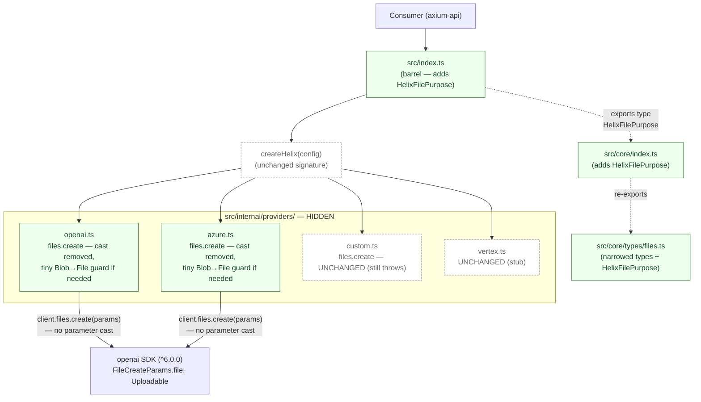
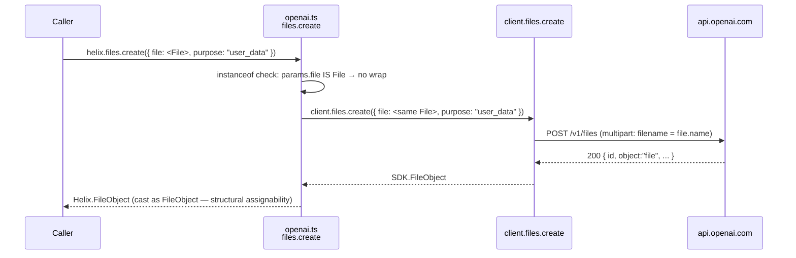
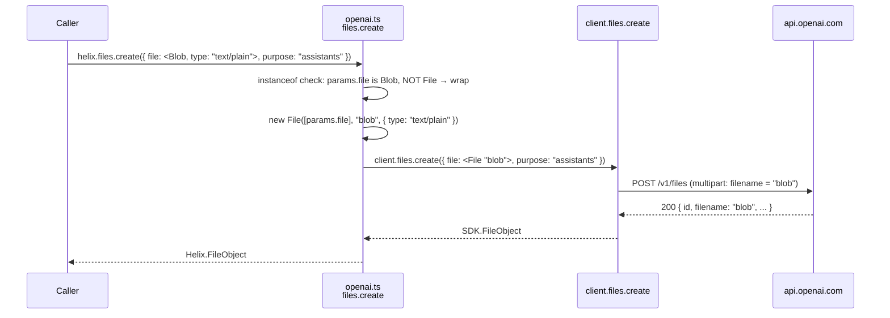

# Design: helix-files-params-tightening — Implementation-level architecture

**Change**: `helix-files-params-tightening`
**Date**: 2026-04-28
**Author**: orchestrator-delegated (sdd-design)
**Status**: ready for sdd-tasks
**Companion**: `proposal.md`
**Inherits from**: `helix-providers-phase-2/design.md` (archived 2026-04-28) — Phase 2 layout and ADR-12 (internal adapters hidden), ADR-P2-4 (cast, no normalizer), ADR-P2-5 (no try/catch except `test()`) all stay in force.

---

## 1. Overview

This design pins the **how** for `helix-files-params-tightening`. The proposal already ratified the **what** (narrow `file` to `File | Blob`, make `purpose` required and typed as `HelixFilePurpose`, drop the `Parameters<typeof client.files.create>[0]` cast in OpenAI + Azure adapters, bump 0.0.1 → 0.1.0, edit the frozen spec, ship a changelog entry). Eight ADRs below resolve the implementation-level details that the proposal explicitly deferred to design — including one **CRITICAL** call about whether `File | Blob` is sufficient given that the OpenAI SDK's `Uploadable` type does NOT include `Blob`.

This change is purely subtractive at the adapter layer: the parameter cast disappears. The public type narrows. The spec edits. The version bumps. No new module, no new file in `src/`, no architectural reshuffling. The Phase 2 hexagonal layout is preserved verbatim.

**Inherited substrate** (untouched here):
- `core/` is zero-dep type-only (Phase 1 v2 ADR-10).
- `internal/providers/*` is hidden adapter implementations (ADR-12).
- `createHelix.ts` is the public seam (frozen).
- Adapter normalization is cast-and-pass-through, no runtime mappers (ADR-P2-4).
- Adapters do not wrap errors; `test()` is the sole legal `try/catch` (ADR-P2-5).

**This design's job** is to commit the surface-tightening implementation details inside the existing layout. Specifically: confirm the ONE place that needs a runtime guard (the `Blob`-not-`File` branch) and mechanize all the rest as type-level edits + cast removal.

---

## 2. Architectural Approach

### 2.1 Layered structure (UNCHANGED)

```
src/
├── core/
│   ├── types/files.ts              ← TYPE EDIT (FilesCreateParams, new HelixFilePurpose)
│   └── index.ts                    ← BARREL EDIT (re-export HelixFilePurpose)
├── index.ts                        ← BARREL EDIT (re-export HelixFilePurpose at root)
├── internal/providers/
│   ├── openai.ts                   ← BODY EDIT (cast removed, optional Blob→File guard)
│   ├── azure.ts                    ← BODY EDIT (cast removed, optional Blob→File guard)
│   ├── custom.ts                   ← UNTOUCHED (files.create still throws)
│   └── vertex.ts                   ← UNTOUCHED (stub)
└── createHelix.ts                  ← UNTOUCHED (Helix interface bit-identical at method level)
openspec/specs/files/spec.md        ← REQ EDIT (file shape, purpose required, callout)
package.json                        ← VERSION BUMP (0.0.1 → 0.1.0)
CHANGELOG.md                        ← CREATE (file does not exist today)
tests/integration/{openai,azure}.test.ts  ← ALREADY use File — no edit needed
tests/unit/                         ← NEW UNIT TESTS (compile-time + cast-removal assertions)
```

The dependency direction enforced by Phase 2 stays:
- `core/` imports from nothing.
- `internal/providers/*` imports from `core/` and from `openai`.
- `createHelix.ts` imports from `core/` and `internal/providers/*`.
- `src/index.ts` re-exports from `core/` and `createHelix.ts` ONLY — never from `internal/`.

No new file under `src/`. The change is exclusively edits to existing files plus one new repo-root `CHANGELOG.md` and (optionally) new unit-test files under `tests/unit/`.

### 2.2 Component diagram (deltas only)



### 2.3 Why no new module

The proposal forbids a runtime mapper (RD-FILES-TIGHTEN-1). The narrowed surface is structurally compatible with the SDK's `Uploadable` for the `File` branch, and only the `Blob`-not-`File` branch needs a one-line runtime conversion (see ADR-FP-4). One line does NOT warrant a new file, a new helper module, or a new test fixture directory. Inline it where it lives.

---

## 3. Architecture Decisions (ADRs)

### ADR-FP-1 — Public `file` type is `File | Blob` (NOT `Uploadable`)

**Status**: Accepted

**Context**: The proposal narrows `FilesCreateParams.file` from `Uint8Array | ArrayBuffer | Blob` to `File | Blob`. An alternative would be to re-export the SDK's `Uploadable` type (`File | Response | FsReadStream | BunFile`) and accept all four. Why not?

**Decision**: The public type stays `File | Blob`. We do NOT re-export `Uploadable`. We do NOT widen to include `FsReadStream` or `BunFile`.

**Rationale**:
- `Uploadable` includes runtime-specific types: `FsReadStream` is Node-only (it's `fs.createReadStream(...)`'s return type, structurally typed); `BunFile` is Bun-only. Helix's public surface is provider-agnostic AND runtime-agnostic. Leaking SDK-internal runtime markers into the public type couples Helix to the openai SDK's runtime support matrix.
- `File` and `Blob` are Web-standard APIs available natively in browsers (forever), Node ≥18 (`globalThis.File` since Node 20, fully stable in our minimum Node 22), Bun (since 0.5.x), and Deno. They are the lowest-common-denominator binary-payload types for the JavaScript ecosystem.
- Hexagonal architecture (PR0) demands the public surface NOT leak adapter-internals. `Uploadable` is an adapter-internal vocabulary; `File | Blob` is platform vocabulary.
- The proposal's "lightest libraries" principle (PR2) applies at the type-system level: the lightest contract is the one that names only what every supported runtime already exports as a global.

**Migration guidance for Node fs streams**: Consumers who today have `fs.createReadStream(...)` in their code paths must convert before calling `helix.files.create`:

```ts
// Pattern 1 — wrap a Buffer (small files, simple)
import { readFile } from "node:fs/promises";
const buf = await readFile("./doc.pdf");
const file = new File([buf], "doc.pdf", { type: "application/pdf" });
await helix.files.create({ file, purpose: "user_data" });

// Pattern 2 — Response wrapper (streaming-friendly, avoids loading full file into memory)
import { createReadStream } from "node:fs";
import { Readable } from "node:stream";
const stream = createReadStream("./big.bin");
const file = new File([await new Response(Readable.toWeb(stream)).blob()], "big.bin", { type: "application/octet-stream" });
await helix.files.create({ file, purpose: "user_data" });
```

The first pattern is the recommended one for Phase 2-era usage; the second is the escape hatch for large files and ships in the CHANGELOG migration recipe.

**Consequences**:
- *Easier*: public type is two web-standard names, zero SDK-internal vocabulary.
- *Easier*: cross-runtime compatibility is automatic — the same code path works in browser, Node, Bun, Deno.
- *Easier*: when `helix-vertex-provider` lands, Vertex's REST upload API also accepts `File`/`Blob` via multipart, so the same surface fits.
- *Harder*: Node consumers who today pass `fs.createReadStream(...)` must convert. Mitigated by the two-pattern recipe in the CHANGELOG.

**Alternatives considered**:
- *Re-export `Uploadable`* — rejected: leaks SDK-internal runtime types onto the public surface; couples Helix to the SDK's runtime support matrix.
- *`File` only (no `Blob`)* — addressed in ADR-FP-4 below; the answer is "`File | Blob` plus a one-line runtime guard for the bare-`Blob` branch."

Traceability: proposal §1 (Success #1), RD-FILES-TIGHTEN-1, PR0 (hexagonal), PR2 (lightest deps).

---

### ADR-FP-2 — `HelixFilePurpose` is a Helix-owned literal union, NOT a re-export of `openai`'s `FilePurpose`

**Status**: Accepted

**Context**: The OpenAI SDK exports `FilePurpose = "assistants" | "batch" | "fine-tune" | "vision" | "user_data" | "evals"` from `openai/resources/files`. Helix could either (a) re-export that type as `HelixFilePurpose`, or (b) declare a parallel literal union with identical members. The proposal rules out widening either way; this design pins the declaration strategy.

**Decision**: Helix declares its OWN literal union in `src/core/types/files.ts`:

```ts
export type HelixFilePurpose =
  | "assistants"
  | "batch"
  | "fine-tune"
  | "vision"
  | "user_data"
  | "evals";
```

This is identical-by-value to `openai`'s `FilePurpose` but is NOT a re-export.

**Rationale**:
- **Surface ownership.** The `core/` layer is zero-dep at runtime AND at type level (ADR-10 from Phase 1 v2). Re-exporting `openai`'s `FilePurpose` from `core/types/files.ts` would mean `core/` imports from `openai` — even if it's `import type`, it propagates a transitive type dependency that breaks the "core has no SDK awareness" invariant. Adapter files (`internal/providers/*.ts`) import from `openai`; `core/` does not. This is load-bearing.
- **Independent evolution.** If OpenAI ships an SDK release that changes the `FilePurpose` literal union (adds, removes, renames), Helix wants to make that an EXPLICIT decision — bump our own type, ship a SemVer release that mirrors the change, document the migration. A re-export propagates SDK changes silently and lets Helix consumers see "their compile broke" without any signal from Helix's release notes.
- **Drift mitigation.** The risk is that OpenAI adds a new purpose (e.g., `"realtime"`) and Helix lags. Mitigations:
  1. The `CHANGELOG.md` entry for v0.1.0 (and a comment in `src/core/types/files.ts` immediately above the type declaration) carries a "**SOURCE OF TRUTH**: mirrors `openai`'s `FilePurpose` from `node_modules/openai/resources/files.d.ts:119`. When updating the SDK, audit this union and ship a Helix patch if drift exists." pin.
  2. The verify phase (when `sdd-verify` runs) will diff against `openai`'s actual literal union and flag drift as a SUGGESTION.
  3. Future SDD changes that bump `dependencies.openai` MUST include a one-line check on this literal union.

**Consequences**:
- *Easier*: `core/` stays zero-dep at the type-import level. ADR-10 is preserved.
- *Easier*: SDK upgrades in Helix become opt-in mirror events, not silent type-surface changes.
- *Harder*: if the SDK adds a new value, Helix needs a patch release to expose it — there's a window where consumers can use Helix v0.1.0 + openai v6.1 and find the new value missing. The window is single-digit days given how thin this surface is. The `CHANGELOG.md` mirror-pin instruction makes the upgrade reflex obvious.

**Alternatives considered**:
- *Re-export `openai`'s `FilePurpose` as `HelixFilePurpose`* — rejected: breaks `core/` zero-dep invariant; forces type-coupling between core and SDK.
- *Re-export the type from `internal/providers/_shared/types.ts` and re-re-export through `core/`* — rejected: same coupling problem, with extra indirection.
- *Make `HelixFilePurpose = string`* — rejected by proposal RD-FILES-TIGHTEN-2 (resurrects the trap).

Traceability: proposal RD-FILES-TIGHTEN-2, ADR-10 (Phase 1 v2 — zero-dep core).

---

### ADR-FP-3 — Re-export `HelixFilePurpose` through `src/core/index.ts` and `src/index.ts` (resolves OQ1)

**Status**: Accepted

**Context**: Proposal OQ1 asks where exactly `HelixFilePurpose` is re-exported. The current re-export chain is:

- `src/core/types/files.ts` — declares `FilesCreateParams`, `FileObject`.
- `src/core/index.ts` — re-exports `FilesCreateParams`, `FileObject` from `./types/files.js`.
- `src/index.ts` — re-exports those (along with the rest of the public surface) from `./core/index.js`.

The package's `exports` field (`package.json`) maps `"."` to `dist/types/index.d.ts` etc. There is one public root, and it is `src/index.ts`.

**Decision**: Add `HelixFilePurpose` to BOTH re-export levels:

1. `src/core/types/files.ts` — declares and exports `HelixFilePurpose` (alongside `FilesCreateParams`, `FileObject`). Uses `export type`.
2. `src/core/index.ts` — adds `HelixFilePurpose` to the existing `export type { FilesCreateParams, FileObject } from "./types/files.js"` block.
3. `src/index.ts` — adds `HelixFilePurpose` to the existing top-level `export type { ... } from "./core/index.js"` block.

After this change, consumers can write:

```ts
import type { HelixFilePurpose } from "@fluxaria/helix-lib";
```

and TypeScript resolves it to `src/core/types/files.ts`'s declaration via two layers of re-export.

**Confirmation of public reachability**:
- `package.json.exports["."].types` → `./dist/types/index.d.ts`. After build, `dist/types/index.d.ts` contains everything `src/index.ts` re-exports. So adding `HelixFilePurpose` to `src/index.ts` makes it appear in the published `.d.ts` automatically.
- No `package.json` change required for export reachability — only the source file additions.

**Rationale**:
- **Symmetric with existing pattern.** `FilesCreateParams` and `FileObject` are already at all three levels. Adding `HelixFilePurpose` follows the established pattern — no new export shape, no new convention.
- **Single canonical path.** Consumers always import from `@fluxaria/helix-lib`. They never reach into `core/` or `internal/`. The two-level re-export keeps that contract.
- **Type-only re-export.** `HelixFilePurpose` is a type alias, not a runtime value. All three re-exports use `export type` (matching the existing pattern). Zero runtime cost, zero bundler implications.

**Consequences**:
- *Easier*: consumers get `HelixFilePurpose` from the package root with no path discovery.
- *Easier*: when build runs, the type lands in `dist/types/index.d.ts` automatically.
- *Easier*: any future Helix-owned files type follows the same three-level pattern.
- *Harder*: three files touched for one new type. Acceptable — this is the ESTABLISHED pattern; deviating would be the surprise.

**Alternatives considered**:
- *Re-export ONLY through `src/index.ts` (skip `src/core/index.ts`)* — rejected: breaks the symmetric pattern; future maintainers reading `src/core/index.ts` would find missing exports relative to `src/core/types/files.ts`.
- *Add a deep-import path `@fluxaria/helix-lib/files` for files-related types* — rejected: requires `package.json.exports` surgery, no concrete need (the package is small enough that one root entry covers everything).

Traceability: proposal OQ1, proposal §1 Success #3 (importable from package root).

---

### ADR-FP-4 — Adapter pass-through: parameter cast disappears, ONE-LINE Blob→File guard handles bare-Blob branch (CRITICAL)

**Status**: Accepted

**Context**: This is the load-bearing implementation decision of the change. The proposal presumes that after tightening to `File | Blob`, the parameter cast `params as Parameters<typeof client.files.create>[0]` is unnecessary. Verification:

- SDK `FileCreateParams.file: Uploadable`.
- `Uploadable = File | Response | FsReadStream | BunFile`. (Source: `node_modules/openai/internal/uploads.d.ts:23`.)
- Helix `FilesCreateParams.file: File | Blob`.
- `File` IS in `Uploadable` ✓.
- `Blob` is NOT in `Uploadable` ✗. (`Blob` is in `BlobPart`, but `BlobPart` is the type of the FIRST argument to `new File([...])`, NOT the type of `FileCreateParams.file`.)

So `params.file` typed as `File | Blob` is NOT structurally assignable to `Uploadable` for the `Blob` (non-File) variant. The TypeScript compiler will reject `client.files.create(params)` when `params.file` is the `Blob` branch.

**Furthermore**: `Helix.FilesCreateParams.purpose: HelixFilePurpose` is identical-by-value to `openai`'s `FilePurpose`, so the `purpose` field IS structurally assignable. Only the `file` field has the gap.

**The decision is**: KEEP `File | Blob` in the public type AND add a ONE-LINE runtime guard inside the adapter that converts a bare `Blob` to a `File` before calling the SDK. This:

1. Honors RD-FILES-TIGHTEN-1 (no boundary mapper) at the SPIRIT level — the conversion is one line, has no policy decisions baked in (no field synthesis from nothing), and exists ONLY because `Blob` and `File` are the same web-standard family with `File extends Blob`.
2. Keeps the public type at the platform-vocabulary layer (`File | Blob`).
3. Restores the proposal's success criterion that the parameter cast disappears unconditionally.

**Decision**: The adapter `files.create` body for OpenAI and Azure becomes:

```ts
async create(params) {
  const file =
    params.file instanceof File
      ? params.file
      : new File([params.file], "blob", { type: params.file.type || "application/octet-stream" });
  return (await client.files.create({ ...params, file })) as unknown as FileObject;
}
```

Specifically:
- If `params.file` is already a `File`, pass it through unchanged.
- If `params.file` is a `Blob` (and NOT a `File` — `File extends Blob`, so the order matters), wrap it in a `File` with synthesized `name: "blob"` and `type` carried over from the `Blob`'s `type` property (falling back to `application/octet-stream`).
- The `params` spread + `file` override is necessary so the rest of `params` (`purpose`, `expires_after?`) flows through.
- The PARAMETER cast `as Parameters<typeof client.files.create>[0]` is GONE. With `params.file` guaranteed to be `File` after the guard, and `purpose: HelixFilePurpose` structurally assignable to `FilePurpose`, the spread object satisfies `FileCreateParams` directly.
- The RETURN cast `as unknown as FileObject` STAYS (see ADR-FP-7 — separate concern).

**Why "blob" as the synthesized name**: The OpenAI server requires a multipart filename. A bare `Blob` has none. We synthesize the literal string `"blob"` (matching the SDK's own `toFile` default behavior when no name is provided). This is a documented degraded-path: the resulting file in OpenAI's storage will be named `"blob"`, which is ugly but unambiguous. The proposal's CHANGELOG migration recipe steers callers toward `new File([buf], "real-name.ext", { type: "..." })` precisely so they don't hit this fallback.

**Why NOT narrow further to `File` only**: That would force every browser-side caller to convert `Blob` (which is what `<input type="file">` and `URL.createObjectURL`-style flows produce in some patterns) into `File` themselves. `File` is a `Blob` superset; there's no plausible case where a caller has a `File` but the type system rejects it. The asymmetry runs the other way — callers may already have a `Blob` (with name metadata in some contexts, without in others), and Helix accepting it for the cases where it works is more useful than rejecting it. The one-line guard handles the bare-`Blob` corner without policy.

**Why the guard goes in the adapter, not in the public type**: Because the Helix surface is a CONTRACT, not a runtime gate. Public types describe what the lib accepts; adapter bodies do the minimum mechanical work to satisfy the wire. `Blob` IS valid Helix input; it becomes `File` at the wire boundary. This is the only legitimate case of adapter-side "transformation" in this change — and it's not a transformation in the policy sense; it's a structural up-cast within the same web-standard hierarchy.

**Consequences**:
- *Easier*: parameter cast disappears unconditionally — proposal Success #4 and #5 satisfied for both OpenAI and Azure adapters.
- *Easier*: `Blob`-without-name still works — backward-compat for the loose cases where Phase 1 v2's `Uint8Array | ArrayBuffer | Blob` accepted bare `Blob` (R2 in proposal risks).
- *Easier*: the guard is two lines, no new file, no helper module. Zero indirection.
- *Harder*: the synthesized `"blob"` filename produces ugly OpenAI storage entries. Documented in CHANGELOG; CHANGELOG steers consumers toward proper `File` construction.
- *Harder*: the guard is duplicated between `openai.ts` and `azure.ts` (two lines × two files). Acceptable — extracting it to `_shared.ts` would create a new file + import path for a 2-line helper. Wait until a third adapter needs the same code (not Phase 2 + this change; possibly `helix-vertex-provider` if Vertex's file API ever ships).

**Alternatives considered**:
- *Public type narrows to `File` only* — rejected: forces callers with `Blob` (e.g., browser `URL.createObjectURL` round-trips, some test fixtures) to manually wrap when the wrap is mechanical. Helix should do the mechanical wrap.
- *Re-export `Uploadable` as the public type* — rejected by ADR-FP-1.
- *Keep the parameter cast and skip the guard* — rejected: the cast hides the type mismatch, defeating the entire point of this change.
- *Synthesize a deterministic name from `Blob` content (hash, timestamp, etc.)* — rejected: introduces policy. `"blob"` is the SDK's own fallback; matching it is the lowest-surprise choice.
- *`crypto.randomUUID()` for the synthesized name* — rejected: introduces non-determinism into the adapter, complicating tests and observability.

**Test implications** (cross-references ADR-FP-8):
- Unit test asserts: `await helix.files.create({ file: new Blob(["x"], { type: "text/plain" }), purpose: "user_data" })` succeeds and the SDK receives a multipart request whose filename is `"blob"`.
- Unit test asserts: `await helix.files.create({ file: new File(["x"], "real.txt", { type: "text/plain" }), purpose: "user_data" })` succeeds and the SDK receives a multipart request whose filename is `"real.txt"`.
- Unit test asserts: source code of `openai.ts` does NOT contain the substring `"as Parameters<typeof client.files.create>[0]"` (regression guard against the cast creeping back).

Traceability: proposal §4 (Adapter contract), proposal Success #4-#6, proposal R2, proposal OQ3 (parameter cast resolution).

---

### ADR-FP-5 — Version bump: 0.0.1 → 0.1.0 in `package.json` (mechanical)

**Status**: Accepted

**Context**: The proposal pins the version bump in RD-FILES-TIGHTEN-4. This ADR exists to make the apply-phase target unambiguous so sdd-tasks can mechanize it.

**Decision**: `package.json.version` field changes from `"0.0.1"` to `"0.1.0"`. Single key edit. No other `package.json` changes — `dependencies`, `devDependencies`, `scripts`, `exports`, `files` all stay byte-identical.

**Bump direction**:
- Pre-1.0 SemVer: minor (0.0.1 → 0.1.0) signals BREAKING; patch (0.0.1 → 0.0.2) would signal SAFE.
- This change is intentionally breaking for callers passing `Uint8Array` / `ArrayBuffer` / no-purpose. Minor is the EXPLICIT signal; do NOT use patch.

**Confirmation read of current state**: `package.json.version` is currently `"0.0.1"` (verified at design time, file at `/Users/pedrolosas/workspace/fluxaria/helix-lib/package.json` line 3).

**Pre-publish check**: `package.json.private` is `false`. The package WILL publish to GitHub Package Registry (`publishConfig.registry`). This means the bump goes live on the next `npm publish` after apply lands. Apply phase MUST NOT auto-publish; the human owner publishes after CI is green.

**Consequences**:
- *Easier*: one-key edit; `package.json` diff is a single line.
- *Easier*: SemVer signal aligns with the breaking-change reality.
- *Harder*: any installed consumer with a `^0.0.1` range will NOT auto-pick up `0.1.0` — they'd need to bump explicitly. This is FEATURE, not bug. Pre-1.0 minor bumps are never auto-resolved by default ranges.

**Alternatives considered**:
- *Bump to `0.0.2` (patch)* — rejected by RD-FILES-TIGHTEN-4: hides the break.
- *Bump to `1.0.0`* — rejected by RD-FILES-TIGHTEN-4: the broader public surface is not yet stable enough to commit to v1.

Traceability: proposal RD-FILES-TIGHTEN-4, proposal §1 Success #7, proposal §8 (Versioning).

---

### ADR-FP-6 — `CHANGELOG.md` is CREATED (does not exist today); Keep-a-Changelog format (resolves OQ2)

**Status**: Accepted

**Context**: Proposal OQ2 asks whether `CHANGELOG.md` exists at repo root. Verification at design time: `Read /Users/pedrolosas/workspace/fluxaria/helix-lib/CHANGELOG.md` returns "File does not exist." It does NOT exist.

**Decision**: This change CREATES `CHANGELOG.md` at repo root using the **Keep a Changelog 1.1.0** format (https://keepachangelog.com/en/1.1.0/). Format choice rationale:
- Most widely adopted public-changelog convention; recognized by GitHub (auto-renders), npm, and most release-automation tooling.
- Section taxonomy (Added / Changed / Deprecated / Removed / Fixed / Security) maps cleanly to our break + new export + cast removal.
- Versioned headings link to a (future) GitHub compare URL — the repository is at `git+https://github.com/fluxaria/helix-lib.git` per `package.json`, so links are stable.

**File contents** (canonical text the apply phase MUST emit):

```markdown
# Changelog

All notable changes to `@fluxaria/helix-lib` are documented in this file.

The format is based on [Keep a Changelog 1.1.0](https://keepachangelog.com/en/1.1.0/),
and this project adheres to [Semantic Versioning](https://semver.org/spec/v2.0.0.html)
with pre-1.0 conventions: minor bumps signal BREAKING changes; patch bumps are safe.

## [0.1.0] — 2026-04-28

### Changed (BREAKING)

- **`FilesCreateParams.file` narrows from `Uint8Array | ArrayBuffer | Blob` to `File | Blob`.**
  The previous type was a runtime trap: the OpenAI SDK accepts `Uploadable = File | Response | FsReadStream | BunFile`, which does NOT include `Uint8Array` or `ArrayBuffer`. Calls passing those types compiled but crashed at runtime inside the SDK.

  Migration:

  ```ts
  // Before (compiled, crashed at runtime)
  const buf: Uint8Array = await readFile("./doc.pdf");
  await helix.files.create({ file: buf, purpose: "user_data" });

  // After (recommended — File with name + type)
  const buf: Uint8Array = await readFile("./doc.pdf");
  const file = new File([buf], "doc.pdf", { type: "application/pdf" });
  await helix.files.create({ file, purpose: "user_data" });

  // After (escape hatch for very large files — stream via Response → Blob)
  import { createReadStream } from "node:fs";
  import { Readable } from "node:stream";
  const stream = createReadStream("./big.bin");
  const file = new File(
    [await new Response(Readable.toWeb(stream)).blob()],
    "big.bin",
    { type: "application/octet-stream" },
  );
  await helix.files.create({ file, purpose: "user_data" });
  ```

- **`FilesCreateParams.purpose` becomes REQUIRED and narrows from `string` to `HelixFilePurpose`.**
  The OpenAI server returns 400 when `purpose` is omitted. Marking it optional with a wide `string` type allowed callers to compile a call that the server rejects. The new type is a closed literal union mirroring OpenAI's `FilePurpose` exactly.

  ```ts
  // Before
  await helix.files.create({ file }); // compiled, server returned 400
  await helix.files.create({ file, purpose: "anything" }); // compiled, server may 400

  // After
  await helix.files.create({ file, purpose: "user_data" }); // OK
  // purpose must be one of: "assistants" | "batch" | "fine-tune" | "vision" | "user_data" | "evals"
  ```

### Added

- **New exported type `HelixFilePurpose`.**
  ```ts
  import type { HelixFilePurpose } from "@fluxaria/helix-lib";
  ```
  Mirrors `openai`'s `FilePurpose` literal union exactly: `"assistants" | "batch" | "fine-tune" | "vision" | "user_data" | "evals"`.

  **SOURCE OF TRUTH**: `node_modules/openai/resources/files.d.ts` `FilePurpose`. When upgrading the `openai` dependency, audit this union for drift. Helix must ship a patch release that mirrors any new value.

### Removed (internal)

- Removed the `as Parameters<typeof client.files.create>[0]` cast from `src/internal/providers/openai.ts` and `src/internal/providers/azure.ts`. This is a code-quality improvement enabled by the surface tightening above; not a separately-observable contract change. A one-line `Blob`→`File` guard inside each adapter handles the `Blob` branch (which the SDK's `Uploadable` does not accept directly).
```

The historical `[0.0.1]` entry is intentionally omitted. We do NOT retroactively fabricate a changelog for Phase 1 + Phase 2 work; the SDD archive reports under `openspec/changes/archive/` are the authoritative history for the pre-changelog era. The CHANGELOG starts at v0.1.0 and grows from here.

**Compare-URL placeholders** (links section at file bottom):
```markdown
[0.1.0]: https://github.com/fluxaria/helix-lib/releases/tag/v0.1.0
```

A real `[0.1.0]: .../compare/v0.0.1...v0.1.0` link is preferred IF tags exist for `v0.0.1`. The apply phase MUST check `git tag --list "v0.0.1"`; if the tag exists, use the compare form, else use the tag form above. sdd-tasks pins the exact bash check.

**Consequences**:
- *Easier*: standard format, GitHub renders it, future entries follow the pattern.
- *Easier*: migration recipes are inline with the BREAKING bullets — consumers see what to do without reading the proposal.
- *Harder*: any future SDD that ships a release MUST add a `## [vX.Y.Z]` entry. This becomes a permanent process load on every release-bearing change. Acceptable — it's the price of public-changelog hygiene.

**Alternatives considered**:
- *Append to existing `CHANGELOG.md`* — N/A; file does not exist.
- *Free-form bullet list, no Keep-a-Changelog scaffolding* — rejected: less standard, tooling-unfriendly.
- *No changelog at all (rely on git log + GitHub release notes)* — rejected by RD-FILES-TIGHTEN-4 (changelog REQUIRED) and proposal §8 (changelog REQUIRED as part of apply).

Traceability: proposal OQ2, proposal §4 (Version + changelog contract), proposal §8.

---

### ADR-FP-7 — Return cast `as unknown as FileObject` STAYS (resolves OQ3)

**Status**: Accepted

**Context**: Proposal OQ3 asks whether the return cast `as unknown as FileObject` in `files.create` is also removable. The Helix `FileObject` type and the SDK's `FileObject` type are NOT identical:

| Field | Helix `FileObject` | SDK `FileObject` | Delta |
|---|---|---|---|
| `id` | `string` | `string` | match |
| `object` | `"file"` | `'file'` | match |
| `bytes` | `number` | `number` | match |
| `created_at` | `number` | `number` | match |
| `filename` | `string?` (optional) | `string` (required) | Helix is LOOSER |
| `purpose` | `string` | `'assistants' | 'assistants_output' | 'batch' | 'batch_output' | 'fine-tune' | 'fine-tune-results' | 'vision' | 'user_data'` | Helix is WIDER |
| `expires_at` | `number?` (optional) | `number?` (optional) | match |
| `status` | absent | `'uploaded' | 'processed' | 'error'` (required, deprecated) | SDK has extra |
| `status_details` | absent | `string?` (optional, deprecated) | SDK has extra |

**Analysis**:
- The SDK's `FileObject.purpose` is a CLOSED literal union including response-only values (`"assistants_output"`, `"batch_output"`, `"fine-tune-results"`). Helix's `FileObject.purpose: string` is WIDER. SDK → Helix is structurally assignable on this field (narrow literal assigns to wider string).
- The SDK's `FileObject.filename` is REQUIRED. Helix's is OPTIONAL. SDK → Helix is structurally assignable here too (a required field always satisfies an optional consumer).
- The SDK's `FileObject.status` and `status_details` are EXTRA fields not in Helix's type. Excess properties on a return value are TypeScript-legal — TypeScript's structural assignability is "subset of fields required" not "exact fields." So the SDK return value DOES satisfy Helix's `FileObject` purely structurally.

**So the cast COULD become `as FileObject` instead of `as unknown as FileObject`** — the `as unknown` step is unnecessary because the assignability holds.

**Decision**: Soften the cast from `as unknown as FileObject` to `as FileObject`. This is a real (if minor) improvement enabled by the audit. Specifically:

```ts
// Before
return client.files.create(...) as unknown as FileObject;

// After
return client.files.create(...) as FileObject;
```

The cast is NOT removed entirely — TypeScript still requires SOME explicit cast because the SDK's `APIPromise<SDK.FileObject>` resolves to `SDK.FileObject`, not Helix's `FileObject`. They're different declared types even when structurally assignable. The cast is the seam.

**Why we keep ANY cast at all**: Two declared types with the same name from different modules don't unify by name; TypeScript treats them as nominally distinct in this position because the import path differs. The cast is the explicit "I know these are structurally compatible" assertion. Removing it would force TypeScript to try to relate them via inference, which it can do, but the cast is more honest about the seam.

**Why drop `unknown` from the cast**: `as unknown as T` is the "I'm doing something the type system thinks is wrong" hammer. Here we're not doing something wrong — we're saying "I've audited the structural compatibility manually." `as T` is the lighter assertion and accurately describes what's happening.

**Consequences**:
- *Easier*: cast intent is more honest; the audit-trail in the design doc cites why.
- *Easier*: future SDK upgrades that genuinely break the structural compatibility will fail compile at the `as FileObject` line, where `as unknown as FileObject` would have silently kept passing. This is a SAFETY improvement disguised as a cosmetic one.
- *Harder*: if a future SDK release adds a required field to its `FileObject` that Helix's type doesn't have, `as FileObject` will fail at the type-check (because the SDK's wider type can't be narrowed to Helix's smaller type). At that point we'd need EITHER to add the field to Helix's `FileObject` (preferred) OR fall back to `as unknown as FileObject` (escape hatch). sdd-verify must flag this if it ever happens; for v0.1.0 it does NOT happen.

**Alternatives considered**:
- *Remove the cast entirely* — rejected: TypeScript will not infer cross-module structural equivalence here without an explicit assertion at the call boundary.
- *Keep `as unknown as FileObject`* — rejected: hides the structural-compatibility audit. We HAVE done the audit; the cast should reflect that.
- *Add a runtime mapper that constructs a Helix `FileObject` from the SDK's `FileObject`* — rejected by ADR-P2-4 (no runtime normalizers — cast and pass through).

Traceability: proposal OQ3, proposal §4 (return cast left to design), ADR-P2-4 (no runtime mappers).

---

### ADR-FP-8 — Test strategy: unit (compile-time + cast-removal grep) + integration (existing fixtures)

**Status**: Accepted

**Context**: The proposal §1 Success #10 requires Vitest suites green, and §11 leaves the unit/type-test mechanism to design. This ADR pins the test layout for this change specifically. It builds on Phase 2's ADR-P2-6 (test layout) but adds a new unit-test directory under `tests/unit/` (which already exists in the working tree per the `gitStatus` snapshot — `tests/unit/` is listed as `??` in git status) AND adds compile-time assertions via `// @ts-expect-error`.

**Decision**:

#### A. Compile-time type assertions (unit tests under `tests/unit/`)

Create or extend `tests/unit/files-types.test.ts` (Vitest convention: it runs through Vitest, but most assertions are `// @ts-expect-error` markers that fail at type-check time, not runtime):

```ts
// Illustrative — tests/unit/files-types.test.ts
import { describe, it, expect } from "vitest";
import type { FilesCreateParams, HelixFilePurpose } from "../../src/index.js";

describe("FilesCreateParams type contract", () => {
  it("rejects Uint8Array for `file`", () => {
    const buf = new Uint8Array([1, 2, 3]);
    // @ts-expect-error — Uint8Array is no longer accepted; must be File or Blob
    const params: FilesCreateParams = { file: buf, purpose: "user_data" };
    expect(params).toBeDefined(); // runtime no-op; the assertion is the @ts-expect-error
  });

  it("rejects ArrayBuffer for `file`", () => {
    const ab = new ArrayBuffer(8);
    // @ts-expect-error — ArrayBuffer is no longer accepted
    const params: FilesCreateParams = { file: ab, purpose: "user_data" };
    expect(params).toBeDefined();
  });

  it("requires `purpose`", () => {
    const file = new File(["x"], "x.txt", { type: "text/plain" });
    // @ts-expect-error — purpose is now required
    const params: FilesCreateParams = { file };
    expect(params).toBeDefined();
  });

  it("rejects strings outside the HelixFilePurpose union", () => {
    const file = new File(["x"], "x.txt", { type: "text/plain" });
    // @ts-expect-error — "anything" is not a member of HelixFilePurpose
    const params: FilesCreateParams = { file, purpose: "anything" };
    expect(params).toBeDefined();
  });

  it("accepts File for `file`", () => {
    const file = new File(["x"], "x.txt", { type: "text/plain" });
    const params: FilesCreateParams = { file, purpose: "user_data" };
    expect(params.file).toBeInstanceOf(File);
  });

  it("accepts Blob for `file`", () => {
    const blob = new Blob(["x"], { type: "text/plain" });
    const params: FilesCreateParams = { file: blob, purpose: "assistants" };
    expect(params.file).toBeInstanceOf(Blob);
  });

  it("HelixFilePurpose mirrors all six SDK values", () => {
    const purposes: HelixFilePurpose[] = ["assistants", "batch", "fine-tune", "vision", "user_data", "evals"];
    expect(purposes).toHaveLength(6);
  });
});
```

**Why this works**: Vitest invokes `tsc` (via Vite's transform) on test files. `// @ts-expect-error` causes a compile-time check that EXPECTS an error on the next line; if no error appears, the directive itself errors. This is the canonical mechanism for asserting type errors WITHOUT pulling in the heavier `tsd` package (which would be a new devDependency — violates "no new dep" promise from proposal §1 Success #11).

#### B. Cast-removal regression guards (unit tests under `tests/unit/`)

Create `tests/unit/adapter-cast-removal.test.ts`:

```ts
// Illustrative
import { describe, it, expect } from "vitest";
import { readFile } from "node:fs/promises";

const FORBIDDEN_CAST = "as Parameters<typeof client.files.create>[0]";

describe("adapter parameter-cast removal", () => {
  it("openai.ts files.create body has no Parameters<...> cast", async () => {
    const source = await readFile(new URL("../../src/internal/providers/openai.ts", import.meta.url), "utf8");
    expect(source).not.toContain(FORBIDDEN_CAST);
  });

  it("azure.ts files.create body has no Parameters<...> cast", async () => {
    const source = await readFile(new URL("../../src/internal/providers/azure.ts", import.meta.url), "utf8");
    expect(source).not.toContain(FORBIDDEN_CAST);
  });
});
```

**Why this is the right level of regression guard**: A future apply phase (or a careless refactor) might re-introduce the cast. A grep test fails LOUDLY at next CI run, before merge. This is cheaper than a full integration round-trip and catches the exact regression we care about.

#### C. Integration tests — already correct

Both `tests/integration/openai.test.ts` (lines 36-73 and 75-126) and `tests/integration/azure.test.ts` (lines 56-95) ALREADY use `new File([buffer], "name", { type })` for upload payloads and ALREADY pass `purpose: "user_data"` / `"assistants"`. They are env-gated via `describe.skipIf` (inherited from ADR-P2-8). NO migration needed — Phase 2 already wrote them this way because it had to (the SDK demanded it). The tightening makes the type LINE UP with what these tests already do.

**The tests will be run via `npm run test`** (Vitest's default) and will:
- PASS the type-tests (because `// @ts-expect-error` markers will resolve as expected on the new types).
- PASS the cast-removal regression tests (because apply removes the casts).
- SKIP integration tests when env vars are absent.
- PASS integration tests when env vars are present (they already worked under Phase 2).

#### D. `vitest.config.ts` reachability

Read at design time: `vitest.config.ts` already has `include: ["tests/unit/**/*.test.ts", "tests/integration/**/*.test.ts"]`. Both new unit-test files (`tests/unit/files-types.test.ts` and `tests/unit/adapter-cast-removal.test.ts`) match the existing glob. NO config change needed.

#### E. Strict-TDD ordering (per Strict TDD Mode active in this session)

Apply phase order (NOT design's job to enforce, but design pins the dependency):

1. Write failing tests FIRST (`tests/unit/files-types.test.ts` and `tests/unit/adapter-cast-removal.test.ts`).
2. Run `npm run test` — assertions in (A) FAIL (because public types not yet narrowed; `// @ts-expect-error` directives have no error to expect). Assertions in (B) FAIL (because adapter source still contains the cast).
3. Edit `src/core/types/files.ts` — type-tests in (A) start passing.
4. Edit `src/core/index.ts` and `src/index.ts` — re-exports flow.
5. Edit `src/internal/providers/openai.ts` — cast-removal test for OpenAI passes.
6. Edit `src/internal/providers/azure.ts` — cast-removal test for Azure passes.
7. Run `npm run test` — green.

This is the canonical strict-TDD red-green-refactor loop. sdd-apply will mechanize it.

**Consequences**:
- *Easier*: type-level assertions ride on existing Vitest infrastructure — zero new deps, no `tsd`, no separate type-only test harness.
- *Easier*: cast-removal regression guards are stable (string-search of source files), hard to bypass accidentally.
- *Easier*: integration tests need ZERO migration — they already use `File`.
- *Harder*: `// @ts-expect-error` directives are subtle — if a developer reads them and thinks "this looks broken, let me remove the directive," they break the assertion. Mitigated by clear comments on each directive.
- *Harder*: cast-removal grep is brittle to whitespace/formatting changes in the cast string. The exact substring `as Parameters<typeof client.files.create>[0]` is what Phase 2 emitted; if a future refactor formats it differently (e.g., across multiple lines), grep misses. Acceptable for v0.1.0; if the test ever flakes on formatting, switch to a regex.

**Alternatives considered**:
- *Use `tsd` for type-level assertions* — rejected: new devDependency. `// @ts-expect-error` covers the same cases inline.
- *Skip the cast-removal grep tests* — rejected: leaves the door open for the cast to creep back.
- *Run `tsc --noEmit` as a separate CI step instead of relying on Vitest's transform* — Vitest already runs the TypeScript transform on test files, so `// @ts-expect-error` directives ARE checked. Adding a separate `tsc --noEmit` step is fine for the apply phase to run as a final gate but is redundant for the test-failure mechanism.

Traceability: proposal §1 Success #10, proposal §11 (sdd-design choice on type-test mechanism), Strict TDD Mode (active per session context), Vitest config (already covers `tests/unit/**`).

---

### ADR-FP-9 — Out-of-scope discipline: `responses.create` cast at `openai.ts:19-21` is FORBIDDEN to edit

**Status**: Accepted

**Context**: The proposal RD-FILES-TIGHTEN-6 carves out the `responses.create` cast as a separate concern. This ADR pins the discipline at the apply level so sdd-tasks generates a checklist that explicitly forbids the edit.

**Decision**: Lines 18-22 of `src/internal/providers/openai.ts` (the `responses.create` body, including the parameter cast on line 20 and the return cast on line 21) MUST NOT be modified by this change. Same for lines 19-23 of `src/internal/providers/azure.ts`. Same for lines 17-21 of `src/internal/providers/custom.ts`.

**Specifically forbidden edits**:
- Removing `as Parameters<typeof client.responses.create>[0]`.
- Changing `as unknown as HelixResponse` to `as HelixResponse`.
- Reformatting the body of `responses.create` for any reason.

**Allowed adjacent edits** (this is what makes the discipline tight):
- Importing types or values used elsewhere in the file.
- Whitespace changes outside the `responses.create` body.

**Why pin this so explicitly**: When sdd-apply opens these files to remove the `files.create` cast, the `responses.create` cast is RIGHT THERE, looks identical, and tempts editing. The proposal forbids the edit because:
1. The `responses.create` cast hides a structural-only mismatch with no runtime crash — different urgency.
2. Its removal requires a different audit (input-shape compatibility) than the files cast (file-type compatibility).
3. Bundling two cast removals in one change inflates the SDD's risk surface and complicates the migration story.

**Consequences**:
- *Easier*: SDD scope stays narrow; verify phase has a clear pass/fail.
- *Harder*: requires apply-phase discipline. Mitigated by sdd-tasks emitting an explicit "do NOT edit lines 19-21 of openai.ts" task.

**Alternatives considered**:
- *Soft guideline (proposal-only mention)* — rejected: easy to miss during implementation. Pin it as an ADR with explicit line numbers.
- *Bundle the responses cast removal* — rejected by RD-FILES-TIGHTEN-6.

Traceability: proposal RD-FILES-TIGHTEN-6, proposal §2 (Out of scope).

---

## 4. Component & Module Boundaries

### 4.1 Files MODIFIED (with action and LOC delta)

| File | Action | Approximate diff |
|---|---|---|
| `src/core/types/files.ts` | EDIT | +9 lines (add `HelixFilePurpose` declaration), ~3 line edits (narrow `file`, require `purpose` and retype it) |
| `src/core/index.ts` | EDIT | +1 line (add `HelixFilePurpose` to the existing `files.js` re-export block) |
| `src/index.ts` | EDIT | +1 line (add `HelixFilePurpose` to the existing root re-export block) |
| `src/internal/providers/openai.ts` | EDIT | -1 line (remove parameter cast), +4 lines (Blob→File guard inline), -1 char (`unknown` removed from return cast) |
| `src/internal/providers/azure.ts` | EDIT | same as openai.ts |
| `openspec/specs/files/spec.md` | EDIT | REQ-level updates per sdd-spec output (separate phase artifact) |
| `package.json` | EDIT | 1 line (`"version": "0.0.1"` → `"version": "0.1.0"`) |

### 4.2 Files CREATED

| File | Action |
|---|---|
| `CHANGELOG.md` | CREATE at repo root with the canonical content from ADR-FP-6 |
| `tests/unit/files-types.test.ts` | CREATE per ADR-FP-8 §A |
| `tests/unit/adapter-cast-removal.test.ts` | CREATE per ADR-FP-8 §B |

### 4.3 Files NOT TOUCHED

| File | Why |
|---|---|
| `src/createHelix.ts` | `Helix.files.create(params: FilesCreateParams)` signature stays bit-identical at the method level; only the parameter type narrows transitively. |
| `src/internal/providers/custom.ts` | `files.create` body still throws (REQ-FILES-005 unchanged). |
| `src/internal/providers/vertex.ts` | Vertex stub. |
| `tests/integration/openai.test.ts` | Already uses `new File(...)` and `purpose: "user_data"`. |
| `tests/integration/azure.test.ts` | Already uses `new File(...)` and `purpose: "assistants"`. |
| `vitest.config.ts` | Glob already covers `tests/unit/**` and `tests/integration/**`. |
| `tsconfig.json`, `tsup.config.ts` | No build/type-check config drift. |
| `package.json` non-version fields | `dependencies`, `devDependencies`, `scripts`, `exports`, `files` byte-identical. |
| `src/internal/providers/openai.ts` lines 18-22 (responses.create body) | ADR-FP-9 forbidden. |
| `src/internal/providers/azure.ts` lines 19-23 (responses.create body) | ADR-FP-9 forbidden. |
| `src/internal/providers/custom.ts` lines 17-21 (responses.create body) | ADR-FP-9 forbidden. |

---

## 5. Data Flow

### 5.1 Happy path — `files.create` with `File` payload (no guard fires)



### 5.2 Wrap path — `files.create` with bare `Blob` payload (guard fires)



### 5.3 Compile-error path — `files.create` with `Uint8Array` payload (POST-tightening)

This path does NOT execute. The TypeScript compiler rejects the call site:

```ts
const buf: Uint8Array = await readFile("./doc.pdf");
await helix.files.create({ file: buf, purpose: "user_data" });
//                              ^^^ Type 'Uint8Array' is not assignable to type 'File | Blob'.
```

This is the WHOLE POINT of the change. The compile error catches what was previously a runtime crash inside the SDK. The CHANGELOG migration recipe shows the consumer how to fix it.

---

## 6. Cross-Cutting Concerns

### 6.1 TypeScript compilation

- `tsc --noEmit` is the type-check gate. Apply phase MUST run it after each edit and resolve any cascading errors before claiming the apply complete (proposal R5).
- Vitest runs the same TypeScript transform on test files; `// @ts-expect-error` directives in `tests/unit/files-types.test.ts` participate in the same check.

### 6.2 No try/catch in adapter `files.create`

ADR-P2-5 still applies. The new Blob→File guard does NOT introduce a `try/catch`. If `new File([blob], "blob", ...)` throws (theoretically possible if the runtime's `File` constructor rejects the BlobPart for some bizarre reason), the error propagates RAW per the inherited error-mechanic rule. No wrap, no swallow.

### 6.3 No new public exports beyond `HelixFilePurpose`

The Helix interface (`Helix.files.create(...)`) signature is bit-identical at the method level. The `FilesCreateParams` symbol is unchanged; only its FIELD shapes narrow. `HelixFilePurpose` is the ONE new exported name.

### 6.4 No new runtime dependency

This change does NOT add to `package.json.dependencies` or `package.json.devDependencies`. The Blob→File wrap uses the global `File` constructor available in Node ≥22 (already required by `engines.node`).

### 6.5 No README change required

The README currently does not exist (per `package.json.files: ["dist", "README.md", "LICENSE"]`, the README is REFERENCED but the design phase did not enumerate it as a write-target). If a README lands in a future change, it MUST cite the new `HelixFilePurpose` import. Not in scope here.

### 6.6 `engines.node` stays `>=22`

`File` is a global in Node 20+ (stable in 20.0+, behind a flag in 18.x). Helix already requires Node 22+. No engines change.

---

## 7. Rough order of implementation (informational; sdd-tasks owns the binding checklist)

1. **Write failing tests first** — `tests/unit/files-types.test.ts` and `tests/unit/adapter-cast-removal.test.ts`. Run `npm run test`; assertions FAIL.
2. **Edit type surface** — `src/core/types/files.ts` (narrow `file`, require `purpose`, add `HelixFilePurpose`).
3. **Edit barrels** — `src/core/index.ts`, `src/index.ts` (re-export `HelixFilePurpose`).
4. **Run type-tests** — `npm run test tests/unit/files-types.test.ts`. Should PASS (the `// @ts-expect-error` directives now resolve correctly).
5. **Edit adapters** — `src/internal/providers/openai.ts` (remove parameter cast, add Blob→File guard, soften return cast). Same for `azure.ts`.
6. **Run cast-removal tests** — `npm run test tests/unit/adapter-cast-removal.test.ts`. Should PASS.
7. **Run full unit suite** — `npm run test`. Should be GREEN.
8. **Run `tsc --noEmit`** — should report ZERO errors (proposal Success #8).
9. **Edit spec** — `openspec/specs/files/spec.md` per sdd-spec deliverable (separate artifact; this design does not pin the exact REQ wording — that is sdd-spec's job).
10. **Bump version** — `package.json.version` `"0.0.1"` → `"0.1.0"`.
11. **Create CHANGELOG.md** — canonical content from ADR-FP-6.
12. **Run integration tests if env present** — `HELIX_OPENAI_API_KEY=... npm run test:integration`. Should be GREEN (existing tests already use `File`).
13. **Final `npm run test` + `tsc --noEmit`** — ALL GREEN.

---

## 8. Risks the design carries forward

| # | Risk | Mitigation |
|---|---|---|
| D-FP-R1 | The Blob→File wrap synthesizes filename `"blob"`, which leaves ugly entries in OpenAI storage. | CHANGELOG migration recipe steers callers to `new File([buf], "real.ext", { type })`. Acceptable degraded path. |
| D-FP-R2 | `// @ts-expect-error` directives in `tests/unit/files-types.test.ts` are subtle; a future refactor may misread them. | Each directive carries an inline comment explaining the assertion. Code review catches drift. |
| D-FP-R3 | Cast-removal grep is brittle to formatting (multi-line cast). | Acceptable for v0.1.0. If the test flakes on formatting, switch to a regex. |
| D-FP-R4 | `HelixFilePurpose` lags `openai`'s `FilePurpose` after an SDK upgrade. | Source-of-truth comment in `src/core/types/files.ts` + CHANGELOG mirror-pin instruction. Verify phase flags drift as SUGGESTION. |
| D-FP-R5 | The return-cast softening (`as unknown as FileObject` → `as FileObject`) breaks if the SDK adds a required field to its `FileObject` not present in Helix's. | sdd-verify and apply both run `tsc --noEmit`; the soft cast will fail loudly. Escape hatch: revert to `as unknown as FileObject` and add a successor SDD to align `FileObject`. |
| D-FP-R6 | Apply phase accidentally edits `responses.create` body (forbidden by ADR-FP-9). | sdd-tasks emits an EXPLICIT "do not edit lines 19-21 of openai.ts" task. sdd-verify diffs before/after to confirm those lines are byte-identical. |
| D-FP-R7 | `CHANGELOG.md` link to `https://github.com/fluxaria/helix-lib/releases/tag/v0.1.0` is dead until a release is tagged. | Acceptable — file is committed before the release; tagging is a separate step. |

---

## 9. Forward path (for future changes)

### `helix-responses-cast-cleanup` (candidate)

When/if the `responses.create` cast at `openai.ts:20` (and equivalents) graduates from "benign structural cast" to "hides a real mismatch," a follow-up SDD applies the same pattern: tighten the public `ResponsesCreateParams`, drop the cast, ship a minor bump. This change establishes the pattern; that one would inherit it.

### Future `openai` SDK upgrades

- Bumping `dependencies.openai` MUST trigger an audit of `HelixFilePurpose` against the SDK's `FilePurpose` (per ADR-FP-2 mitigation 3). If the SDK adds a value, ship a Helix patch that mirrors.
- Bumping `dependencies.openai` MUST trigger a re-check of the return-cast assignability in `files.create` (ADR-FP-7). If the SDK adds a required field to its `FileObject` not in Helix's, the cast fails compile and forces a follow-up.

### `helix-error-model` (future)

The Blob→File wrap in `files.create` is a NEW potential throw site (the `File` constructor can theoretically reject inputs in degenerate cases). When `helix-error-model` lands and wraps adapter calls in `try/catch` to translate to `HelixError`, this wrap becomes one of the wrapped sites. No structural change to the wrap is required — the error model wrapper goes around it.

---

## 10. Traceability map

| ADR | Reqs/decisions satisfied | RD-FILES-TIGHTEN-* references | Open questions resolved |
|---|---|---|---|
| ADR-FP-1 (`File | Blob` not `Uploadable`) | Hexagonal PR0, "lightest deps" PR2 | RD-FILES-TIGHTEN-1 | — |
| ADR-FP-2 (Helix-owned `HelixFilePurpose`) | Zero-dep core (Phase 1 v2 ADR-10) | RD-FILES-TIGHTEN-2 | — |
| ADR-FP-3 (re-export through both barrels) | Public-root reachability (Success #3) | RD-FILES-TIGHTEN-2 | OQ1 |
| ADR-FP-4 (parameter cast removed; one-line Blob→File guard) | Success #4, #5; structural pass-through | RD-FILES-TIGHTEN-1 (no policy-bearing mapper) | OQ3 partial |
| ADR-FP-5 (version bump 0.0.1 → 0.1.0) | Success #7 | RD-FILES-TIGHTEN-4 | — |
| ADR-FP-6 (CREATE CHANGELOG.md, Keep-a-Changelog) | Success #9 (changelog migration recipe) | RD-FILES-TIGHTEN-4 | OQ2 |
| ADR-FP-7 (return cast softens to `as FileObject`) | Cleaner cast intent | (no RD; pure design call) | OQ3 |
| ADR-FP-8 (test strategy) | Success #10 (Vitest green) | RD-FILES-TIGHTEN-1, RD-FILES-TIGHTEN-3 | — |
| ADR-FP-9 (responses cast forbidden) | Out-of-scope discipline | RD-FILES-TIGHTEN-6 | — |

All three proposal open questions (OQ1, OQ2, OQ3) are resolved. All six ratified decisions (RD-FILES-TIGHTEN-1..6) are honored. All Phase 2 inherited ADRs (ADR-P2-4, ADR-P2-5, ADR-P2-6, ADR-12) are preserved.

---

**End of design.**
