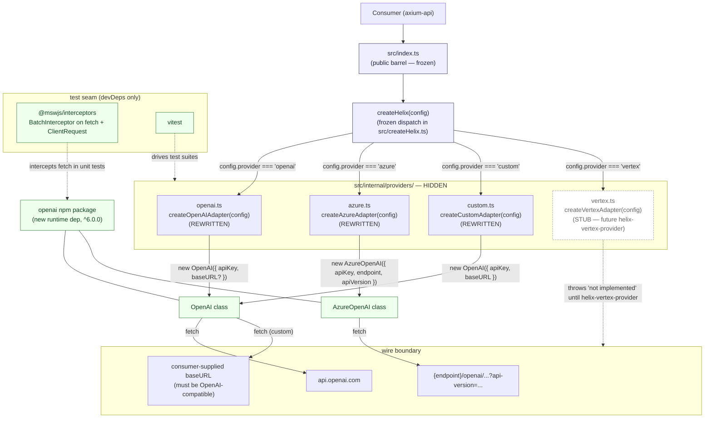
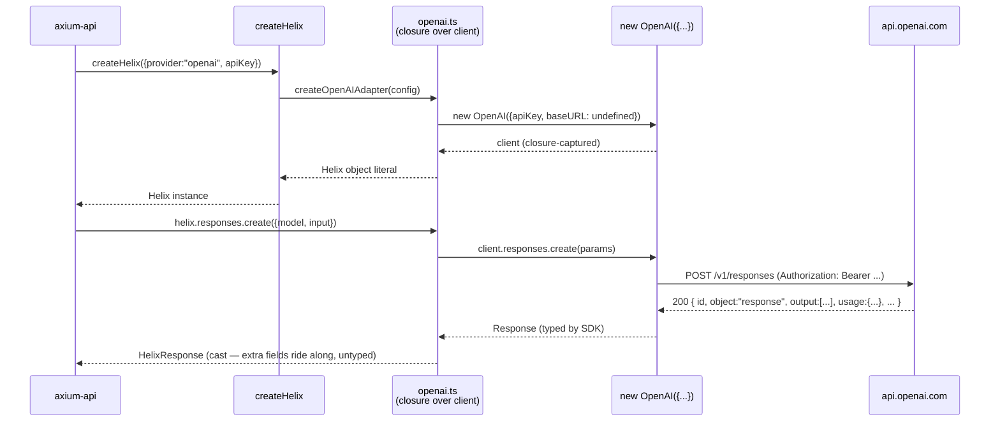
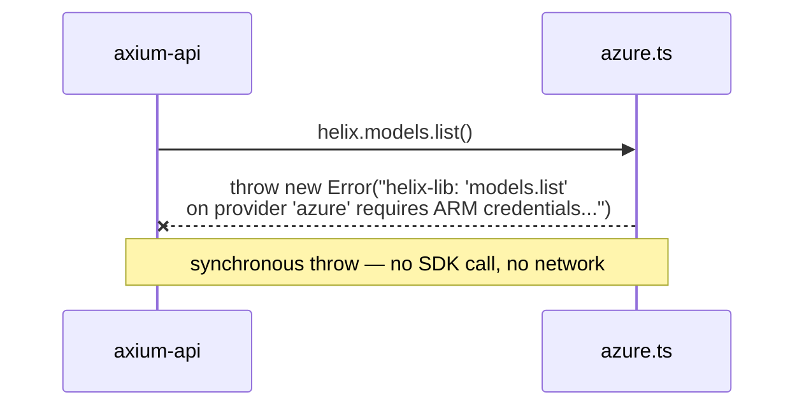
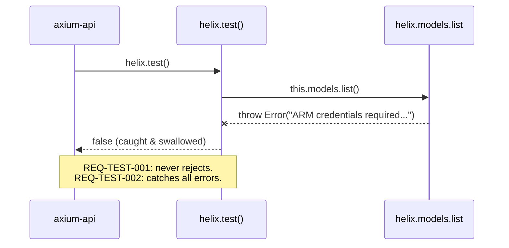
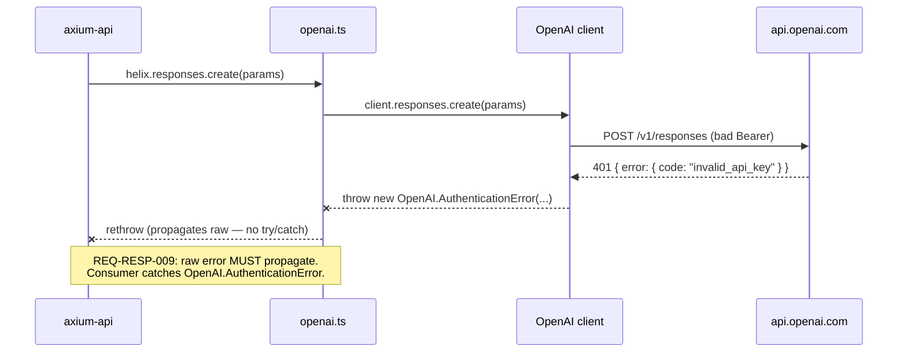

# Design: helix-providers-phase-2 — Real HTTP for OpenAI, Azure, Custom

**Change**: `helix-providers-phase-2`
**Date**: 2026-04-28
**Author**: orchestrator-delegated (sdd-design)
**Status**: ready for sdd-tasks
**Phase**: 2 — implementations for `openai`, `azure`, `custom`
**Companion**: `proposal.md`, `exploration.md`, `specs/`
**Inherits from**: `helix-public-api-redesign/design.md` (archived 2026-04-28) — Phase 1 v2 architecture is the substrate this design fills in

---

## 1. Overview

This design pins the **how** for Phase 2: how the three in-scope adapters (`openai`, `azure`, `custom`) construct their SDK clients, where normalization lives (or doesn't), how errors propagate, where tests live, and how the build treats the new runtime dependency. The proposal already ratified the **what** (`openai@^6.0.0` SDK for all three; raw error passthrough; Vitest + MSW; Vertex carved out). This document does NOT relitigate any RD-PHASE2-* decision; it commits to the implementation-level details that those decisions deferred.

**Inherited substrate** (from Phase 1 v2 design, ARCHIVED, untouched here):
- Hexagonal layering — `core/` is zero-dep type-only; `internal/providers/*` is hidden adapter implementations; `createHelix.ts` is the public seam.
- Public surface — `createHelix` + `Helix` + ~14 types, BIT-IDENTICAL after this change.
- ADR-1 (snake_case wire-shape, camelCase helix-original), ADR-10 (zero-dep core), ADR-12 (internal adapters not exported), ADR-13 (errors raw passthrough in v0) — ALL still in force.

**This design's job** is to commit the Phase 2 implementation details inside the existing layout. The `core/` layer does NOT change. The public seam does NOT change. Only the bodies of three adapter files change, plus `package.json`, plus a new `vitest.config.ts`, plus new test files.

---

## 2. Architectural Approach

### 2.1 Inherited layered structure (UNCHANGED)

The Phase 1 v2 hexagonal layout is preserved verbatim. No new layers, no port reintroduction, no DI container.

```
src/
├── core/                            (FROZEN — zero-dep types only)
│   ├── types/{config,request,response,files,models}.ts
│   └── index.ts
├── internal/
│   └── providers/
│       ├── openai.ts                ← BODY REWRITTEN this change
│       ├── azure.ts                 ← BODY REWRITTEN this change
│       ├── custom.ts                ← BODY REWRITTEN this change
│       └── vertex.ts                ← STUB UNCHANGED (see ADR-P2-3)
├── createHelix.ts                   (FROZEN — public factory + Helix interface)
└── index.ts                         (FROZEN — barrel)
```

The dependency direction enforced by Phase 1 v2 stays in force:
- `core/` imports from nothing.
- `internal/providers/*.ts` imports from `core/` only — and now ALSO from the `openai` npm package (NEW in Phase 2).
- `createHelix.ts` imports from `core/` and from `internal/providers/*` — UNCHANGED.
- `src/index.ts` re-exports from `core/` and `createHelix.ts` only — never from `internal/`. UNCHANGED.

### 2.2 Phase 2 component diagram



### 2.3 Why the architecture stays flat

The proposal opens the door to splitting an adapter into a `<provider>/{index,client,normalize}.ts` folder if complexity warrants. Re-evaluation now that real implementations land:

- **OpenAI adapter** — direct SDK passthrough. `responses.create`, `files.{create,list,delete}`, `models.list` each become two-line calls (`return client.responses.create(params) as HelixResponse`). One file. ~80 LOC.
- **Custom adapter** — same as OpenAI plus a `baseURL` argument and three `throw` stubs for `files.*`. The `throw` stubs are already in the current file and stay verbatim. One file. ~70 LOC.
- **Azure adapter** — `AzureOpenAI` instead of `OpenAI`, plus the `models.list` throw, plus the deployment-name-as-`model` field convention (which the SDK handles natively — no bridging code needed; the Phase 1 v2 spec already commits to this and the SDK accepts the deployment string in the `model` field). One file. ~75 LOC.

**Decision**: stay FLAT — one file per provider — for Phase 2. See ADR-P2-1.

`vertex.ts` keeps its current stub. When `helix-vertex-provider` lands it MAY split into a folder (`vertex/{index,auth,normalize}.ts`) because the JWT signer + Gemini normalization will push it past the file-fits-on-one-screen threshold. That split is a non-breaking refactor — `internal/` is hidden behind `package.json exports`.

---

## 3. Architecture Decisions (ADRs)

### ADR-P2-1 — Adapter file structure: stay FLAT for Phase 2

**Status**: Accepted

**Context**: Phase 1 v2 design §3.2 declared "FLAT file per provider, folder later if needed." Phase 2 is "later" — should we split now?

**Decision**: Keep one flat file per in-scope provider:
- `src/internal/providers/openai.ts`
- `src/internal/providers/azure.ts`
- `src/internal/providers/custom.ts`
- `src/internal/providers/vertex.ts` (stub, untouched)

No `<provider>/{index,client,normalize}.ts` subdirectories in this change. No shared `_helpers.ts` either — see ADR-P2-4.

**Consequences**:
- *Easier*: minimal change surface — three function bodies, no new directories, no new exports.
- *Easier*: each adapter file is end-to-end readable in one screen — config narrowing → SDK construction → namespace methods → return.
- *Easier*: `helix-vertex-provider` can split `vertex.ts` into a folder later WITHOUT touching the three Phase 2 adapters; `internal/` privacy means folder-vs-file is invisible to consumers.
- *Harder*: if Phase 3 adds a fifth provider that shares normalization with one of these three, we'll either inline the duplicated code or split at that point. Acceptable — the duplication risk in Phase 2 is zero (see ADR-P2-4).

**Alternatives considered**:
- *Split `azure.ts` into `azure/{index,client}.ts`* — rejected: AzureOpenAI is a single SDK instantiation; splitting adds zero value.
- *Introduce `_shared.ts` for cross-provider helpers* — rejected: there are no Phase 2 cross-provider helpers (see ADR-P2-4).

Traceability: Phase 1 v2 design §3.2 ("flat by default, folder when complexity warrants").

---

### ADR-P2-2 — SDK lifecycle: per-`createHelix`-instance closure (option C)

**Status**: Accepted

**Context**: The SDK client (`new OpenAI({...})` or `new AzureOpenAI({...})`) needs a lifetime. Three options:
- (a) **Per-call**: `function responses_create(...) { const client = new OpenAI(...); return client.responses.create(...) }`. Wasteful — re-instantiates on every call, defeats SDK-internal connection reuse, complicates testability (no shared instance to spy on).
- (b) **Module-level singleton**: `const client = new OpenAI({ apiKey: getConfig().apiKey })` at the top of `openai.ts`. Requires global config access, prevents two `Helix` instances with different keys, makes test isolation hard (singleton survives across tests).
- (c) **Per-`createHelix`-instance closure**: `createOpenAIAdapter(config)` constructs the SDK client once and the returned `Helix` interface methods are closures over that client.

**Decision**: Option **(c)**. Each `createOpenAIAdapter(config)` / `createAzureAdapter(config)` / `createCustomAdapter(config)` invocation constructs its SDK client EAGERLY in the function body. The returned object literal's namespace methods close over that client. The shape is:

```ts
// Illustrative — for design only, NOT shipped code.
import OpenAI from "openai";
import type { HelixConfig } from "../../core/types/config.js";
import type { Helix } from "../../createHelix.js";
import type { HelixResponse } from "../../core/types/response.js";

type OpenAIConfig = Extract<HelixConfig, { provider: "openai" }>;

export function createOpenAIAdapter(config: OpenAIConfig): Helix {
  const client = new OpenAI({ apiKey: config.apiKey, baseURL: config.baseUrl });

  return {
    responses: {
      async create(params): Promise<HelixResponse> {
        const res = await client.responses.create(params as Parameters<typeof client.responses.create>[0]);
        return res as unknown as HelixResponse;
      },
    },
    files: {
      async create(params) { /* ... */ },
      async list() { /* ... */ },
      async delete(id) { /* ... */ },
    },
    models: {
      async list() { /* ... */ },
    },
    async test() {
      try { await this.models.list(); return true; } catch { return false; }
    },
  };
}
```

Custom mirrors this with `new OpenAI({ apiKey, baseURL: config.baseUrl })`. Azure mirrors this with `new AzureOpenAI({ apiKey, endpoint, apiVersion })`.

**Eager vs lazy construction**: EAGER — the SDK client is constructed inside `createOpenAIAdapter` synchronously, BEFORE the first method call. This matches the SDK's own contract (`new OpenAI({...})` is synchronous and cheap), keeps the adapter closure trivially testable (the SDK client is reachable in the closure), and makes a misconfigured `apiKey` (e.g., empty string) surface at the SDK's own constructor-side validation when applicable.

**Consequences**:
- *Easier*: clean separation — one `createHelix` call → one SDK client. Two `createHelix` calls with different keys → two independent clients. No global state.
- *Easier*: test isolation — each `it(...)` block can construct its own adapter with its own (mocked) `apiKey` and the SDK client lives only for that test.
- *Easier*: dependency injection by closure — sub-method bodies can be tested by spying on the captured `client` if needed; in practice MSW intercepts at the `fetch` layer below the SDK so this is rarely needed.
- *Easier*: idiomatic — matches how the `openai` SDK is used in production code today.
- *Harder*: each `createHelix` invocation costs one SDK constructor call. Microscopic — `new OpenAI({...})` does no I/O; it just stores the config and prepares the fetch wrapper.

**Alternatives considered**:
- *(a) per-call instantiation* — rejected: defeats keep-alive, complicates testability.
- *(b) module-level singleton* — rejected: prevents multiple-instance use cases, hostile to tests.
- *(c) lazy construction (`let client; method() { client ??= new OpenAI(...); ... }`)* — rejected: marginal benefit (saves a few microseconds when the adapter is never called) at the cost of an `??=` everywhere and testing-time race surfaces.

Traceability: RD-PHASE2-1 (transport choice mandates an SDK client; lifecycle is the implementation choice).

---

### ADR-P2-3 — Vertex stub: byte-identical, no Phase 2 touch

**Status**: Accepted

**Context**: Vertex is OUT of Phase 2. Its file MUST remain. Question: does Phase 2 touch `vertex.ts` at all (e.g., to align its return shape with the Phase 2 closure pattern from ADR-P2-2), or stay byte-identical?

**Decision**: `src/internal/providers/vertex.ts` is byte-identical to its Phase 1 v2 archived state. Phase 2 makes ZERO edits to it.

**Consequences**:
- *Easier*: minimal change surface. The proposal §6 success criterion explicitly demands this byte-identity; the design honors it.
- *Easier*: `helix-vertex-provider` rewrites the whole file fresh — no half-step that would need a second rewrite.
- *Easier*: git diff for Phase 2 stays focused: only the three in-scope adapters change.
- *Harder*: the four adapter files diverge stylistically (three use the SDK closure pattern, one uses the Phase 1 stub pattern). Acceptable — Phase 1 v2's stub pattern and Phase 2's SDK pattern both return the same `Helix` shape; the call site (`createHelix.ts` switch) doesn't care.

**Alternatives considered**:
- *Refactor `vertex.ts` to use the Phase 2 closure scaffold without filling in the SDK calls* — rejected: increases surface for zero benefit. The Vertex change will rewrite this file end-to-end anyway (raw `fetch`, `node:crypto`, Gemini normalization — none of it uses the OpenAI SDK).

Traceability: proposal §2 ("Deliberately untouched files"), proposal §6 last bullet ("byte-identical to its archived Phase 1 v2 state").

---

### ADR-P2-4 — Normalization: TS cast, no runtime mappers, no `_shared.ts`

**Status**: Accepted

**Context**: Phase 1 v2 archived `HelixResponse`, `FileObject`, and `ModelInfo` as helix-owned types whose field shapes match the OpenAI Responses / Files / Models API responses. The OpenAI SDK returns objects whose shapes are identical at the wire level (snake_case fields, same literal `object` discriminants, same scalar field names). Question: do adapters need a runtime normalization step, or is a TypeScript cast sufficient?

**Field-level audit** (Phase 2 scope, comparing helix types vs. `openai@^6` SDK return types):

| helix type | helix fields | openai SDK return shape | Delta |
|---|---|---|---|
| `HelixResponse` | `id, object, created_at, model, output, output_text, usage` | `Response` from `openai/resources/responses` includes ALL of these plus extra fields (`status`, `instructions`, `parallel_tool_calls`, `temperature`, etc.) | helix is a SUBSET. Extra SDK fields are unused but harmless if they leak through a cast. |
| `OutputMessage` (in `output[]`) | `type: "message", id, role, content, status?` | SDK returns `ResponseOutputItem` union — `message`, `function_call`, `reasoning`, `refusal`. The `message` variant carries `type, id, role, content, status`. | helix is the `message` SUBSET. Other variants leak through a naive cast (REQ-RESP-006 forbids this). |
| `OutputTextPart` | `type: "output_text", text` | SDK `ResponseOutputText` carries `type, text, annotations` | Extra `annotations` field — harmless leak. |
| `HelixUsage` | `input_tokens, output_tokens, total_tokens` | SDK `ResponseUsage` carries `input_tokens, output_tokens, total_tokens, input_tokens_details, output_tokens_details` | Extra detail fields — harmless leak. |
| `FileObject` | `id, object, bytes, created_at, filename?, purpose, expires_at?` | SDK `FileObject` carries `id, object, bytes, created_at, filename, purpose, status, status_details, expires_at?` | Extra `status, status_details` — harmless leak. |
| `ModelInfo` | `id, object, created, owned_by?` | SDK `Model` carries `id, object, created, owned_by` | Exact match. |
| `ModelsPage` (list result) | helix returns flat `ModelInfo[]` | SDK returns `Page<Model>` with `.data: Model[]` plus pagination metadata | helix flattens — REQUIRED runtime step. |
| `Files list` | helix returns flat `FileObject[]` | SDK returns `FileObjectsPage` with `.data: FileObject[]` | helix flattens — REQUIRED runtime step. |
| `files.delete` return | `{ id, deleted: true }` (literal-true) | SDK returns `FileDeleted` with `id, object: "file", deleted: boolean` | Cast safe at runtime when the SDK returns success (`deleted` is `true`); on partial-delete the SDK throws via its own error path. |

**Decision**: Adapters do **NOT** include runtime normalization mappers, EXCEPT the two trivial flattens for list endpoints. Specifically:

1. **`responses.create`** — the SDK return value is a SUPERSET of `HelixResponse`. Cast via `as unknown as HelixResponse`. Extra fields ride along; consumers cannot rely on them (they're not in the type), and TypeScript prevents accidental dependence. This satisfies REQ-RESP-005 (HelixResponse shape) and REQ-RESP-006 (`output` only contains message items — see note below).

   *REQ-RESP-006 caveat:* the SDK MAY include non-message variants in `output[]` if the model emits them (e.g., function calls, reasoning blocks). Phase 2 spec MUST pin behavior here. The pragmatic Phase 2 decision: **the cast is safe in practice** because `responses.create` invocations from Phase 2 callers never request tools (frozen `ResponsesCreateParams` has no `tools` field) and reasoning content is currently delivered by the SDK as content parts inside a `message` output, not as a separate variant. If a future model emits a non-message variant under no-tools-requested conditions, the cast leaks it; the spec phase pins this scenario as a known acceptance pending `helix-tools` (which adds first-class variants) and `helix-error-model` (which adds refusal handling). The design commits to the cast and accepts the documented edge.

2. **`files.create`** — SDK returns `FileObject` matching helix `FileObject` modulo two harmless extra fields (`status`, `status_details`). Cast via `as FileObject`. No runtime mapper.

3. **`files.list`** — SDK returns `FileObjectsPage`. The adapter MUST extract `.data` (or use the SDK's auto-pagination iterator at zero-page depth) and return as `FileObject[]`. This is the ONE runtime step:
   ```ts
   // Illustrative.
   const page = await client.files.list();
   return page.data as FileObject[];
   ```
   No iteration across pages — Phase 2 explicitly defers pagination per proposal §2.

4. **`files.delete`** — SDK returns `FileDeleted { id, object, deleted }`. Helix returns `{ id, deleted: true }`. Adapter:
   ```ts
   // Illustrative.
   const res = await client.files.delete(id);
   return { id: res.id, deleted: true as const };
   ```
   This is a 2-line shape adjustment, NOT a runtime mapper that warrants its own helper file. Note: if the SDK returns `deleted: false` (theoretically possible per its types), the adapter still claims `true`. Spec phase MUST pin: do we trust the SDK's `deleted` flag and propagate it, or always return `true` on resolved promise (since failure paths would have rejected)? Design recommends **trust resolved-promise = success** and return literal `true` per REQ-FILES-004 ("MUST resolve with `{ id, deleted: true }`"); a `deleted: false` from the SDK without a thrown error is a contradiction the SDK never produces in practice.

5. **`models.list`** — SDK returns `Page<Model>`. Adapter extracts `.data`:
   ```ts
   // Illustrative.
   const page = await client.models.list();
   return page.data.map((m) => ({
     id: m.id,
     object: "model" as const,
     created: m.created,
     owned_by: m.owned_by,
   }));
   ```
   Explicit map (not just `as ModelInfo[]`) because the SDK's `Model` carries `owned_by` as required-string and helix declares it OPTIONAL — the map preserves the optionality contract. If the SDK ever drops `owned_by`, the map auto-degrades.

**No `_shared.ts`**: There is no shared normalization between providers in Phase 2. OpenAI, Azure, and Custom all use the same SDK call patterns; the "normalization" is identical because the underlying API is identical. Putting `flattenModelsPage(page): ModelInfo[]` in a shared file would be one-liner-imported by three sites — not worth a new file. Inline it. If Phase 3 adds a non-OpenAI-compatible provider that needs the same flatten, we extract THEN.

**Consequences**:
- *Easier*: zero new files for normalization. Adapters stay readable end-to-end.
- *Easier*: the cast `as unknown as HelixResponse` makes the trust-the-SDK-shape decision explicit at the call site rather than hidden in a mapper.
- *Easier*: the two list endpoints get inline flatteners, which are 2-line affairs.
- *Harder*: extra SDK fields ride along on cast types (`temperature`, `parallel_tool_calls`, `status` on FileObject, etc.). They're invisible to TypeScript consumers but visible in `JSON.stringify`. Documented as known acceptable leak.
- *Harder*: REQ-RESP-006 (`output` is message-only) is enforced "in practice not at compile time." Spec phase pins this; design accepts the gap and notes it as a future concern for `helix-tools` / `helix-error-model`.

**Alternatives considered**:
- *Full runtime normalizer per response type* — rejected: 100+ LOC of mapping code that does nothing the type system doesn't already do, plus a maintenance liability when the SDK adds fields.
- *Strip unknown fields explicitly via `pick`-style helper* — rejected: same cost, marginal benefit (only matters if a consumer enumerates `Object.keys(response)`, which is anti-pattern).
- *Introduce `src/internal/providers/_shared/normalize.ts` now* — rejected: nothing to share; premature factoring (see ADR-P2-1 rationale).

Traceability: REQ-RESP-005, REQ-RESP-006, REQ-FILES-002, REQ-FILES-003, REQ-FILES-004, REQ-MODELS-002.

---

### ADR-P2-5 — Error mechanics: no try/catch, no wrapping, except `test()`

**Status**: Accepted

**Context**: REQ-RESP-009, REQ-FILES-006, and REQ-MODELS-004 all mandate raw error passthrough in v0. RD-PHASE2-2 ratifies the same. REQ-TEST-002 mandates `test()` swallow errors and return `false`. Question: how does the design enforce these mechanics across adapter source code?

**Decision**:
1. Adapter namespace methods (`responses.create`, `files.{create,list,delete}`, `models.list`) MUST NOT contain `try/catch` blocks. The SDK rejection propagates through the `async` function naturally.
2. Adapter namespace methods MUST NOT contain `return Promise.reject(new HelixError(...))` constructs — `HelixError` does not exist on the public surface.
3. Adapter namespace methods MUST NOT log on error — the library is silent on the error path.
4. The Custom adapter's `files.{create,list,delete}` keep their existing `throw new Error("helix-lib: 'files.<op>' not supported by provider 'custom'")` synchronous throws — Phase 1 v2 already implements them and REQ-FILES-005 mandates them. NOT touched in Phase 2.
5. The Azure adapter's `models.list` throws synchronously with the documented ARM-credentials message:
   ```
   helix-lib: 'models.list' on provider 'azure' requires ARM credentials (data-plane deployments endpoint retired April 2024). HelixConfig.azure currently carries only apiKey — see future change 'helix-azure-config-v2' for full deployment listing support.
   ```
   This MUST be a single-line `throw new Error(...)` at the top of the method — no async work first. This is the exact wording the spec phase will pin.
6. The `test()` method on every adapter keeps the `try { await this.models.list(); return true } catch { return false }` pattern. UNCHANGED from Phase 1 v2 stubs. This is the SOLE legal `try/catch` in adapter code.

**Consumer-side error catching guidance** (informational, NOT enforced by design):
- For `openai`, `azure`, and `custom` adapters, consumers WILL catch errors thrown from the `openai` SDK. The SDK exports an error class hierarchy: `OpenAI.APIError` (base), with subclasses `OpenAI.APIConnectionError`, `OpenAI.APIConnectionTimeoutError`, `OpenAI.AuthenticationError`, `OpenAI.PermissionDeniedError`, `OpenAI.NotFoundError`, `OpenAI.UnprocessableEntityError`, `OpenAI.RateLimitError`, `OpenAI.InternalServerError`, etc. For HTTP-status errors, the instance carries `status: number`, `code: string | null`, `message: string`, and `error: { type, code, message }` from the API JSON.
- For the Azure `models.list` throw and Custom `files.*` throws, the error is a plain `Error` with the documented message. `error instanceof Error` is the catch test; `error instanceof OpenAI.APIError` returns `false`.
- For the `vertex.ts` stub (still throwing `not implemented`), the error is a plain `Error("not implemented")`. Unchanged.

**Consequences**:
- *Easier*: adapter code is trivially auditable — search for `catch` outside `test()` should return zero hits.
- *Easier*: `helix-error-model` later adds wrapping at exactly these call sites; the structural simplicity makes that change a mechanical sweep.
- *Harder*: consumers writing per-provider catch switches MUST detect plain-`Error`-with-message-string for unsupported-operation cases vs. `OpenAI.APIError` for wire failures. Documented in the proposal §8 and the README that lands with this change. Acceptable until `helix-error-model`.

**Alternatives considered**:
- *Wrap all adapter calls in `try { ... } catch (e) { throw e }`* — rejected: adds noise, no benefit.
- *Synchronous validation gates inside `responses.create` (e.g., reject empty `input` array before the SDK call)* — rejected: lib stays a thin pass-through (RD-PHASE2-3 generalizes this to all caller-side concerns); the SDK already validates and rejects.

Traceability: REQ-RESP-009, REQ-FILES-005, REQ-FILES-006, REQ-MODELS-003, REQ-MODELS-004, REQ-TEST-001, REQ-TEST-002, RD-PHASE2-2, RD-PHASE2-4.

---

### ADR-P2-6 — Test layout: co-located unit tests under `src/internal/providers/__tests__/`, integration under `tests/integration/`

**Status**: Accepted

**Context**: Proposal §11 lists OQ1 (test-file location: co-located vs centralized) as a sdd-design decision. Vitest accepts both. The choice has implications for `tsconfig.json` include/exclude, `tsup` external rules, and discoverability.

**Decision**:
- **Unit tests** live CO-LOCATED under `src/internal/providers/__tests__/`:
  - `src/internal/providers/__tests__/openai.test.ts`
  - `src/internal/providers/__tests__/azure.test.ts`
  - `src/internal/providers/__tests__/custom.test.ts`
  - `src/internal/providers/__tests__/_msw.ts` (shared MSW server + default handlers; underscore prefix marks it as a test helper, not a test file Vitest will execute on its own)
  - `src/internal/providers/__tests__/_fixtures.ts` (canned response bodies for the SDK to receive — see ADR-P2-9)
- **Integration tests** live CENTRALIZED under `tests/integration/`:
  - `tests/integration/openai.test.ts`
  - `tests/integration/azure.test.ts`
  - `tests/integration/custom.test.ts`
- **Vitest config** lives at repo root: `vitest.config.ts`.
- **Per-method vs per-provider files**: per-PROVIDER. Each provider gets one `*.test.ts` with `describe(...)` blocks per namespace (`responses`, `files`, `models`, `test`). Per-method files would multiply file count by 5+ with no DX benefit. Spec phase scenarios drive `it(...)` blocks one-to-one.

**Why co-located unit tests**:
- *Discoverability*: when working on `openai.ts`, the test file is the sibling under `__tests__/`. No `src/`↔`tests/` jumping.
- *Refactor-safety*: rename `openai.ts` to `openai/index.ts`, the `__tests__/` folder moves with it.
- *Vitest convention*: Vitest's default `include` glob (`**/*.{test,spec}.?(c|m)[jt]s?(x)`) discovers them automatically; no config tweak needed.

**Why centralized integration tests**:
- *Different lifecycle*: integration tests are env-gated, opt-in, slower, hit real endpoints. They warrant their own directory and their own `vitest --dir` selector.
- *No source coupling*: integration tests assert end-to-end behavior, not internal seams; they don't need adjacency to source.

**`tsconfig.json` and `tsup` exclusion** (so tests do NOT ship in `dist/`):
- `tsconfig.json` `include` is `["src/**/*"]` — includes test files at TYPE-CHECK time (`tsc --noEmit`). This is INTENTIONAL: tests must typecheck against the same TS version as source.
- `tsup` is configured separately (`tsup.config.ts` if present, else inferred from `package.json`'s `tsup` block). Phase 2 MUST ensure `tsup` excludes `**/__tests__/**` and `tests/**` from its build. Since the `package.json` `files` field is already `["dist", "README.md", "LICENSE"]`, tests cannot leak into the published package even if `tsup` accidentally bundles them — they wouldn't be in `dist/` exit anyway. Belt + suspenders: `tsup` should explicitly exclude.

**`tsconfig.json` test-only exclude** (rejected): one alternative is to add a separate `tsconfig.build.json` that excludes `**/__tests__/**` and `**/*.test.ts`, while the root `tsconfig.json` includes them. This is heavyweight for our use — `tsc --noEmit` running over tests is cheap, and the publish path gates on `dist/` not on `tsc` directly. **Decision: do NOT split tsconfigs**. Tests typecheck via the root `tsconfig.json`; `tsup` does the build and excludes test paths via its `entry` glob (e.g., `entry: ["src/index.ts"]` — only the public entry, never `**/*.test.ts`). Spec phase confirms.

**Consequences**:
- *Easier*: file-locality for unit tests, env-isolation for integration tests, one Vitest config.
- *Easier*: package output stays clean — `dist/` only contains the public artifacts.
- *Harder*: developers MUST remember that the `__tests__/` folder is under `src/internal/providers/`, not at repo root. Mitigated by README pointer.
- *Harder*: `tsup`'s `entry` MUST stay tight (`["src/index.ts"]`). If anyone changes it to `["src/**/*.ts"]`, tests will leak. Spec phase guards.

**Alternatives considered**:
- *Centralize all tests under `tests/{unit,integration}/...`* — rejected: loses adjacency, breaks the "test next to source" reflex.
- *Co-locate as `src/internal/providers/openai.test.ts` (no `__tests__/` folder)* — rejected: blends source and tests in directory listings; `__tests__/` folder is a long-standing convention readable to anyone.
- *Per-method test files (`responses.test.ts`, `files.test.ts`, `models.test.ts` per provider)* — rejected: file explosion, no DX benefit; `describe` blocks already organize.

Traceability: proposal §11 OQ1, RD-PHASE2-5.

---

### ADR-P2-7 — HTTP mocking: `@mswjs/interceptors` (lower-level), shared `BatchInterceptor`

**Status**: Accepted

**Context**: Proposal OQ3 — `@mswjs/interceptors` (lower-level, fetch + ClientRequest interception) vs. full `msw` (handlers + interceptors + service-worker browser shim). Phase 2 runs in Node only.

**Decision**: Use `@mswjs/interceptors`. Specifically the `BatchInterceptor` combining `FetchInterceptor` + `ClientRequestInterceptor`. The `openai` SDK uses the global `fetch` in Node 22; the `BatchInterceptor` covers both fetch and the `node:http` ClientRequest path in case any future SDK release switches transports. Setup lives in `src/internal/providers/__tests__/_msw.ts`:

```ts
// Illustrative — design only.
import { BatchInterceptor } from "@mswjs/interceptors";
import { FetchInterceptor } from "@mswjs/interceptors/fetch";
import { ClientRequestInterceptor } from "@mswjs/interceptors/ClientRequest";

export const interceptor = new BatchInterceptor({
  name: "helix-test",
  interceptors: [new FetchInterceptor(), new ClientRequestInterceptor()],
});

// Per-test handler registration via interceptor.on("request", ...) inside it() bodies
// or via a small helper that returns a typed response promise.
```

The shared `_msw.ts` exports:
- `interceptor` — the singleton `BatchInterceptor` instance.
- `setupInterceptor()` / `teardownInterceptor()` — call from `beforeAll`/`afterAll` in each test file (or globally via `vitest.config.ts`'s `setupFiles`).
- `respondWith(predicate, response)` — small helper that registers a one-shot handler matching `predicate(request) → boolean` and returning the canned `response`. Avoids hand-rolling `interceptor.on("request", ...)` in every test.

**Why not full `msw`**: full `msw` adds the service-worker browser shim, the `setupServer`/`setupWorker` factories, and the request handler DSL. We don't need the browser shim (Node only), and the handler DSL adds a layer over `interceptor.on(...)` that we'd otherwise wrap ourselves. `@mswjs/interceptors` is the leaner choice — half the install footprint, same Node-side capability.

**Shared file vs per-test setup**:
- Shared file: `src/internal/providers/__tests__/_msw.ts` exports the interceptor and helpers. `vitest.config.ts` references it via `setupFiles: ["./src/internal/providers/__tests__/_msw.ts"]` — the interceptor activates ONCE per Vitest run.
- Per-test: each `it(...)` registers ONE-SHOT handlers via `respondWith(...)` and Vitest's afterEach resets handlers (`interceptor.removeAllListeners("request")`).

**Consequences**:
- *Easier*: smaller install, simpler API, same Node coverage as `msw`.
- *Easier*: single setup file shared across all unit tests.
- *Harder*: when `helix-vertex-provider` lands and needs to mock the OAuth2 token exchange + Gemini API, it'll use the SAME `_msw.ts` infrastructure. `@mswjs/interceptors` handles arbitrary fetch destinations; no Vertex-specific tooling needed.
- *Harder*: developers learn the interceptor `on("request", ...)` API rather than the higher-level `rest.get(...)` DSL. Acceptable — Phase 2 has 3 providers × 4 namespaces = ~12 endpoints to mock total; the API surface is small.

**Alternatives considered**:
- *Full `msw`* — rejected: heavier, includes browser shim we don't use.
- *`vi.mock("openai", ...)` (mock the SDK module)* — rejected: tests would assert against our own mock object instead of real SDK behavior; misses real-world serialization/encoding bugs the SDK fixes for us.
- *`nock`* — rejected: no native fetch support (uses undici monkey-patching) and Phase 1 already concluded this in exploration §F.

Traceability: proposal OQ3, RD-PHASE2-5.

---

### ADR-P2-8 — Integration test gating: `describe.skipIf` on env-var presence

**Status**: Accepted

**Context**: Integration tests need real API keys. Without them, the suite must skip cleanly — not fail, not warn loudly.

**Decision**: Each integration test file uses Vitest's `describe.skipIf` keyed on its env-var requirement:

```ts
// Illustrative — design only.
import { describe, it, expect } from "vitest";
import { createHelix } from "../../src/index.js";

const hasOpenAI = !!process.env.HELIX_OPENAI_API_KEY;

describe.skipIf(!hasOpenAI)("integration: openai", () => {
  it("responses.create round-trips", async () => {
    const helix = createHelix({ provider: "openai", apiKey: process.env.HELIX_OPENAI_API_KEY! });
    const res = await helix.responses.create({ model: "gpt-4o-mini", input: [{ role: "user", content: [{ type: "input_text", text: "ping" }] }] });
    expect(res.object).toBe("response");
  });
});
```

**Env-var contract** (pinned by spec phase):
| Provider | Required env vars |
|---|---|
| `openai` | `HELIX_OPENAI_API_KEY` |
| `azure` | `HELIX_AZURE_API_KEY`, `HELIX_AZURE_ENDPOINT`, `HELIX_AZURE_API_VERSION`, `HELIX_AZURE_DEPLOYMENT` (the deployment name to pass as `model`) |
| `custom` | `HELIX_CUSTOM_API_KEY`, `HELIX_CUSTOM_BASE_URL` |

Helper inside each integration file:
```ts
// Illustrative.
const env = (k: string): string | undefined => process.env[k];
const hasAzure = !!env("HELIX_AZURE_API_KEY") && !!env("HELIX_AZURE_ENDPOINT") && !!env("HELIX_AZURE_API_VERSION") && !!env("HELIX_AZURE_DEPLOYMENT");
```

**`package.json` script** (added at apply time):
```
"test": "vitest run",
"test:watch": "vitest",
"test:integration": "vitest run --dir tests/integration"
```

The default `test` script runs ONLY unit tests if `tests/integration/` is excluded from the default Vitest discovery, OR runs both with the integration tests skipping themselves due to missing env vars. Decision: configure `vitest.config.ts` with `include: ["src/**/__tests__/**/*.test.ts", "tests/integration/**/*.test.ts"]` and rely on `describe.skipIf` for env gating. CI defaults to running BOTH; without secrets, integration tests skip silently. CI-with-secrets stages run them.

**Consequences**:
- *Easier*: one Vitest invocation for both tiers; gating is per-describe, not per-config.
- *Easier*: missing env vars produce a "skipped" line in the output, not a failure.
- *Harder*: developers reading skipped output may assume coverage is broader than it is. Mitigated by README documentation.

**Alternatives considered**:
- *Separate Vitest config per tier* — rejected: heavier config, no benefit.
- *`it.skipIf` per case rather than `describe.skipIf`* — rejected: more boilerplate; the whole describe skips together.
- *Throw early if env vars absent* — rejected: violates "skip gracefully" success criterion.

Traceability: RD-PHASE2-5.

---

### ADR-P2-9 — Test fixtures: per-provider inline literals, no shared `tests/fixtures/` dir

**Status**: Accepted

**Context**: Proposal OQ4 — fixtures-dir vs inline. Test bodies need canned response bodies (raw JSON strings or objects) for MSW to return.

**Decision**: Inline. Each `*.test.ts` file declares fixture constants at the top:

```ts
// Illustrative — design only.
const OPENAI_RESPONSE_OK: unknown = {
  id: "resp_abc",
  object: "response",
  created_at: 1714291200,
  model: "gpt-4o-mini",
  output: [
    {
      type: "message",
      id: "msg_1",
      role: "assistant",
      content: [{ type: "output_text", text: "Hello world", annotations: [] }],
      status: "completed",
    },
  ],
  output_text: "Hello world",
  usage: { input_tokens: 10, output_tokens: 5, total_tokens: 15 },
};
```

Or, if a fixture is large enough to clutter the file (>30 lines), a sibling `_fixtures.ts` file (per-provider) is acceptable: `src/internal/providers/__tests__/_fixtures.openai.ts`. The underscore prefix marks it as non-test.

**No `tests/fixtures/` directory.** Reasoning:
- Fixtures are test-internal. They don't ship.
- Cross-provider fixture reuse is zero: each provider's mock response shape differs (Azure URL pattern, etc.). The temptation to "share" creates indirection without payoff.
- Per-test inline keeps the WHEN clause readable in a single screen — the test, the fixture, and the assertion are co-located.

**Consequences**:
- *Easier*: each test reads top-down as "fixture → arrange → act → assert."
- *Easier*: refactoring an adapter doesn't ripple through a shared fixtures directory.
- *Harder*: large fixtures duplicate across tests. Mitigated by per-provider `_fixtures.openai.ts` as an escape hatch when a fixture genuinely needs to be reused across `it(...)` blocks within a file.

**Alternatives considered**:
- *Centralized `tests/fixtures/openai/responses.json`* — rejected: scatters context, adds file-system noise, no reuse benefit.
- *Generated fixtures via VCR-style record/replay* — rejected: massive overkill for Phase 2; relies on real API access during test recording.

Traceability: proposal OQ4.

---

### ADR-P2-10 — Build / exports: `openai` as a runtime `dependency`, BUNDLED by `tsup`

**Status**: Accepted

**Context**: Proposal OQ2 — `tsup` `external` vs bundle for `openai`. Standard library practice marks SDK deps as `external` so the consumer's pinned version wins; this avoids ESM/CJS interop hell when both lib and consumer ship copies of the SDK. But it transfers the install obligation to the consumer.

**Decision**: `openai` is a runtime `dependency` (NOT `peerDependency`) in `package.json`. `tsup` marks it as **EXTERNAL** in the build (NOT bundled into our `dist/`).

**Rationale**:
- `axium-api` (real consumer) will install `@fluxaria/helix-lib` as its only adapter. It will NOT separately install `openai` — that's our value as a wrapper. So `dependency`, not `peerDependency`. npm/pnpm/yarn auto-install our `dependencies`; the consumer never thinks about `openai`.
- BUT we mark `openai` as `external` in tsup. This means our `dist/esm/index.js` and `dist/cjs/index.cjs` import `openai` at runtime via Node's module resolution; the consumer's `node_modules/openai` is the one that gets loaded. This keeps OUR `dist` small (~50KB instead of multi-MB), avoids dual-package-hazard with the SDK's own ESM/CJS dual exports, and lets the SDK's runtime do its own version-aware behavior.
- The consumer ends up with ONE copy of `openai` in their `node_modules` (our `dependencies` declare it; npm/pnpm dedupes). Two copies would only happen if the consumer ALSO declares `openai` at a non-overlapping range — at which point the dedupe fails by design and the consumer's expectations become explicit.

**`tsup.config.ts`** (PROPOSED; the file may not yet exist — if not, configuration goes in `package.json`'s `tsup` block):
```ts
// Illustrative.
import { defineConfig } from "tsup";

export default defineConfig({
  entry: ["src/index.ts"],
  format: ["esm", "cjs"],
  dts: true,
  sourcemap: true,
  clean: true,
  outDir: "dist",
  external: ["openai"],
  // Tests, internal helpers, and __tests__/* are excluded by virtue of `entry`
  // being a single file — only its dependency closure is built.
});
```

The `entry: ["src/index.ts"]` is the most important guard: it ensures NO test file enters the build because `index.ts` does not (and must never) import from `__tests__/`.

**ESM/CJS hell mitigations**:
- `package.json exports` (already in place) declares both `import` (ESM) and `require` (CJS) entries. Phase 2 does NOT touch this.
- `openai@^6` ships dual-package via its own conditional exports. By marking it `external`, Node's resolution picks the right one for the consumer's context (ESM consumer → ESM `openai`; CJS consumer → CJS `openai`).
- Our published types (`dist/types/index.d.ts`) reference SDK types only via `import type { ... } from "openai"` IF needed. Phase 1 v2 explicitly forbids this in `core/` (ADR-10). Phase 2 inherits the rule: adapters internally use `OpenAI` SDK types but the public types in `core/` MUST NOT import from `openai`. The cast in ADR-P2-4 (`as unknown as HelixResponse`) is the seam — at the cast point we drop the SDK type and pick up the helix type.

**Tests not shipping**:
- `package.json files: ["dist", "README.md", "LICENSE"]` — already correct. Test files live under `src/internal/providers/__tests__/` which never enters `dist/` (because `tsup` only builds `src/index.ts` and its dependency closure, and `index.ts` never imports from `__tests__/`).
- `tests/integration/**` is at repo root, never under `src/`, never reached.

**`package.json exports` updates**: NONE. The public surface is unchanged; the existing `exports` block is correct.

**Consequences**:
- *Easier*: `dist/` stays small. ESM/CJS dedup is the consumer's lockfile's job, not ours.
- *Easier*: SDK security patches reach consumers via `npm update openai` without a helix-lib release.
- *Easier*: future `helix-error-model` change wraps SDK error types from the same external `openai` reference — version coherence is automatic.
- *Harder*: if the consumer's lockfile pins a buggy `openai` minor that breaks a method we depend on, our tests pass but their app fails. Mitigated by our integration tier catching this at our CI.
- *Harder*: type compatibility between our `dist/types/index.d.ts` and the consumer's locally installed `openai` types depends on caret semver. We pin `^6.0.0` per RD-PHASE2-7; if `openai@7` ships with breaking type changes, consumers must wait for `helix-providers-phase-3` (or equivalent) to bump our caret.

**Alternatives considered**:
- *Bundle `openai` into our `dist`* — rejected: balloons `dist/` size, creates dual-package hazard if consumer also imports `openai` directly (two copies, two singletons, two error class hierarchies, `instanceof` lies).
- *`peerDependency`* — rejected: forces every consumer to do `npm install openai @fluxaria/helix-lib` — friction we promised not to inflict.
- *`peerDependency` + `peerDependenciesMeta.openai.optional: true`* — rejected: same problem, plus adds confusion about whether the SDK is required.

Traceability: proposal OQ2, PR2 ("lightest possible dep"), RD-PHASE2-7.

---

## 4. Component & Module Boundaries

### 4.1 Per-adapter responsibilities

| File | Responsibility | LOC budget | Imports |
|---|---|---|---|
| `src/internal/providers/openai.ts` | Construct `new OpenAI({ apiKey, baseURL? })`. Wire 6 namespace methods. Cast SDK return types to helix types. | ~80 | `OpenAI` from `openai`; types from `../../core/` and `../../createHelix.js` |
| `src/internal/providers/azure.ts` | Construct `new AzureOpenAI({ apiKey, endpoint, apiVersion })`. Wire 5 namespace methods (responses, files×3, test). `models.list` throws synchronously with the documented message. | ~75 | `AzureOpenAI` from `openai`; types from `../../core/` and `../../createHelix.js` |
| `src/internal/providers/custom.ts` | Construct `new OpenAI({ apiKey, baseURL })` with `baseURL` from `config.baseUrl`. Wire `responses.create` and `models.list`. Keep existing `files.*` `throw` stubs verbatim. | ~70 | `OpenAI` from `openai`; types from `../../core/` and `../../createHelix.js` |
| `src/internal/providers/vertex.ts` | UNCHANGED. Stub throws `not implemented` for everything except `test()` (returns `false`). | 39 (current) | (unchanged) |

### 4.2 Test files

| File | Responsibility | Mocks |
|---|---|---|
| `src/internal/providers/__tests__/_msw.ts` | `BatchInterceptor` setup, helpers (`respondWith`, `resetHandlers`), exported for setup files. | — |
| `src/internal/providers/__tests__/openai.test.ts` | Unit suite for `createOpenAIAdapter`. Covers all 6 namespace methods: happy path, request shape assertion, response cast, raw error passthrough, `test()` swallow. | MSW intercepts `https://api.openai.com/**` |
| `src/internal/providers/__tests__/azure.test.ts` | Unit suite for `createAzureAdapter`. Same coverage as OpenAI plus `models.list throws` + `test() returns false`. | MSW intercepts `{endpoint}/openai/**` |
| `src/internal/providers/__tests__/custom.test.ts` | Unit suite for `createCustomAdapter`. Covers `responses.create` and `models.list`. Asserts `files.*` throws. | MSW intercepts `{baseUrl}/**` |
| `tests/integration/openai.test.ts` | Real-API smoke. `describe.skipIf(!HELIX_OPENAI_API_KEY)`. | — (real network) |
| `tests/integration/azure.test.ts` | Real-API smoke. `describe.skipIf(!hasAzure)`. Note: `models.list` is asserted to THROW; `test()` is asserted to return `false`. | — |
| `tests/integration/custom.test.ts` | Real-API smoke against an OpenAI-compatible endpoint (env-supplied). | — |

### 4.3 New repo-root files

| File | Purpose |
|---|---|
| `vitest.config.ts` | Test runner config — environment `node`, `setupFiles`, `include`/`exclude` globs. |

### 4.4 Existing files MODIFIED outside `src/internal/providers/`

| File | Modification |
|---|---|
| `package.json` | `dependencies.openai = "^6.0.0"`; `devDependencies` add `vitest`, `@mswjs/interceptors`; `scripts` add `test`, `test:watch`, `test:integration`. |
| `tsup.config.ts` (new file if absent) | `external: ["openai"]`, `entry: ["src/index.ts"]`. If the file doesn't exist today and tsup config lives in `package.json`, decide at sdd-tasks whether to extract — design recommends EXTRACT for clarity. |

---

## 5. Data Flow

### 5.1 Happy path: `responses.create` on OpenAI



### 5.2 Throw path: `models.list` on Azure



### 5.3 Swallow path: `test()` on Azure



### 5.4 Raw error path: `responses.create` on OpenAI with bad key



---

## 6. Cross-Cutting Concerns

### 6.1 TypeScript compilation

- `tsc --noEmit` is the type-check gate. It MUST pass on every PR.
- Test files participate in the `tsc --noEmit` check (they live under `src/`). This is intentional — tests are first-class TypeScript and benefit from the same strictness as source.
- `tsup` is the BUILD tool. Its job is to emit `dist/{esm,cjs,types}/`. It's independent of `tsc --noEmit`.

### 6.2 Type-narrowing of `config` inside adapters

Each adapter receives a narrowed `config`:
- `createOpenAIAdapter(config: Extract<HelixConfig, { provider: "openai" }>)` — `config.apiKey: string`, `config.baseUrl?: string`.
- `createAzureAdapter(config: Extract<HelixConfig, { provider: "azure" }>)` — `config.apiKey, config.endpoint, config.apiVersion: string`.
- `createCustomAdapter(config: Extract<HelixConfig, { provider: "custom" }>)` — `config.apiKey, config.baseUrl: string`.

These narrowings are ALREADY in place from Phase 1 v2. Phase 2 does not change them.

### 6.3 No new public exports

`src/index.ts` is BIT-IDENTICAL after this change. Phase 2 does not export `OpenAI`, does not re-export `OpenAI.APIError`, does not export adapter functions. ADR-12 (internal adapters not public) and ADR-13 (errors raw) are inherited from Phase 1 v2.

### 6.4 Logging

Adapters do NOT log. The SDK has its own logging configurable via `OPENAI_LOG` env var; consumers who want SDK-side logs set that env var themselves. Phase 2 does not add helix-side logging.

### 6.5 Retries

The `openai` SDK has built-in retries (default: 2 retries on 5xx). Phase 2 does NOT override this. If consumers want different behavior they wait for a future change that adds a retry-config field — outside Phase 2 scope.

---

## 7. Rough order of implementation (informational — sdd-tasks owns the binding checklist)

This sketch informs the sdd-tasks output but does NOT replace it.

1. **Install deps** — `npm install openai@^6.0.0` (or pnpm equivalent), `npm install -D vitest @mswjs/interceptors`. Add `test` scripts. Verify `tsc --noEmit` still passes.
2. **Vitest config** — create `vitest.config.ts` with `setupFiles` pointing at `_msw.ts`, `include` covering both unit and integration globs.
3. **MSW shared setup** — create `src/internal/providers/__tests__/_msw.ts` with `BatchInterceptor` + helpers.
4. **OpenAI adapter** — rewrite `src/internal/providers/openai.ts` body. Simplest case (direct SDK passthrough). Verify type-check passes.
5. **OpenAI unit tests** — create `src/internal/providers/__tests__/openai.test.ts`. Cover every spec scenario from `openspec/changes/helix-providers-phase-2/specs/{responses,files,models,test}/spec.md` that targets `provider: "openai"`.
6. **Custom adapter** — rewrite `src/internal/providers/custom.ts`. Mirrors OpenAI plus baseURL plus the existing `files.*` throw stubs (kept verbatim).
7. **Custom unit tests** — create test file. Assert `files.*` throws have correct messages.
8. **Azure adapter** — rewrite `src/internal/providers/azure.ts`. Mirrors OpenAI but with `AzureOpenAI` and the `models.list` synchronous throw.
9. **Azure unit tests** — create test file. Includes the throw assertion and the `test() === false` assertion.
10. **Integration tests** — create `tests/integration/{openai,azure,custom}.test.ts`. All gated by `describe.skipIf`.
11. **Run full suite** — `npm test`. Unit tier MUST pass; integration tier MUST skip cleanly when env vars absent.
12. **`tsup.config.ts`** — extract from `package.json` if currently inline; ensure `external: ["openai"]` and `entry: ["src/index.ts"]`. Verify `npm run build` produces clean `dist/`.
13. **`tsc --noEmit`** — final gate; zero errors.

---

## 8. Risks the design carries forward

| # | Risk | Surface |
|---|---|---|
| D-R1 | The `as unknown as HelixResponse` cast in ADR-P2-4 hides REQ-RESP-006 enforcement at compile time. If a future model emits `output[]` with non-message variants under no-tools-requested conditions, those leak through with extra `type` fields invisible to TypeScript. | Spec phase pins this as accepted edge until `helix-tools` / `helix-error-model`. Verify phase MUST include a test that asserts current SDK behavior is message-only for the model classes Phase 2 cares about. |
| D-R2 | `tsup` `entry: ["src/index.ts"]` is the sole guard against tests leaking into `dist/`. If anyone changes it to a glob, tests ship. | Spec phase scenario asserts `dist/` contains no `*.test.*` files post-build. Verify phase runs `npm run build && find dist/ -name '*.test.*'` and asserts empty output. |
| D-R3 | `openai` marked `external` means consumer's lockfile resolves the SDK version. A consumer pinning `openai@<6.0.0` while we declare `^6` would dedupe to whichever range is higher in the union, potentially breaking us. | npm normally errors on incompatible peer-style ranges, but `openai` is a `dependency` not a `peerDependency`. Real concern only if the consumer manually overrides resolutions. Documented; not enforced. |
| D-R4 | `BatchInterceptor` covers fetch + ClientRequest. If `openai@^6` ever switches to `node:undici` directly (bypassing both), our mocks miss. | Pin SDK version in `package-lock.json` at apply time (RD-PHASE2-3 risk R3). Integration tier catches drift. |
| D-R5 | Fixture inlining (ADR-P2-9) means a fixture format change requires touching every test that uses it. Phase 2 has ~15 tests; manageable. | If Phase 3 grows tests beyond ~50, revisit and introduce per-provider `_fixtures.<provider>.ts`. |
| D-R6 | The Azure `models.list` throw is a string-message contract. If the wording changes slightly between Phase 2 spec and apply, verify will fail. | Spec phase pins the EXACT message string via REQ-MODELS-* scenario; apply must match byte-for-byte. |
| D-R7 | Extracting `tsup.config.ts` into its own file (item 12 in §7) is a build-config side-effect not directly required by Phase 2's success criteria. If left inline in `package.json`, we lose the cleaner external-marker but gain less file churn. | sdd-tasks decides binding. Design recommends EXTRACT for clarity but accepts INLINE if `package.json` `tsup` block is workable. |

---

## 9. Forward path (for future changes that build on Phase 2)

### `helix-vertex-provider`

- Inherits the test infra (`vitest.config.ts`, `_msw.ts`, integration directory pattern).
- MAY split `src/internal/providers/vertex.ts` into a folder `src/internal/providers/vertex/{index,auth,normalize}.ts`. Internal — no public-surface impact (ADR-12 inherited).
- WILL add a new dev-dep test setup if the OAuth2 token endpoint mocking needs more than `respondWith` provides (likely just adds two more handlers in a Vertex-specific `_msw-vertex.ts`).
- WILL NOT change any of Phase 2's three adapters.

### `helix-error-model`

- WILL wrap every adapter's SDK call in `try { ... } catch (e) { throw new HelixError(...) }`. Touches every `await client.<...>` in all four adapters.
- WILL change ADR-P2-5 (the "no try/catch" rule). That ADR will be SUPERSEDED, not amended.
- WILL add `HelixError` to the public exports — first public-surface change since Phase 1 v2.

### `helix-azure-config-v2`

- WILL extend `HelixConfig.azure` with `deploymentName` (and likely service-principal-auth fields).
- WILL replace the Azure `models.list` throw with a real implementation (synthesized single-element list, OR ARM-management-plane call once auth fields exist).
- WILL flip the Azure `test()` from "permanently false" to a meaningful boolean.

### `helix-tools`, `helix-streaming`

- Both touch `core/types/`. Phase 2's adapter bodies are forward-compatible because they use cast-and-pass-through; adding `tools` to `ResponsesCreateParams` automatically flows through the SDK (which already accepts it). Streaming adds a new method; no rewrite of existing methods required.

---

## 10. Traceability map

| ADR | Reqs satisfied | RD-PHASE2-* references | Open questions resolved |
|---|---|---|---|
| ADR-P2-1 (flat files) | n/a (structural) | n/a | — |
| ADR-P2-2 (per-instance closure) | REQ-CLIENT-004 (Helix interface composition) | RD-PHASE2-1 | — |
| ADR-P2-3 (vertex untouched) | n/a (proposal §6 byte-identity criterion) | n/a | — |
| ADR-P2-4 (cast, no normalizer) | REQ-RESP-005, REQ-RESP-006, REQ-FILES-002, REQ-FILES-003, REQ-FILES-004, REQ-MODELS-002 | RD-PHASE2-1 (PR1/PR5 satisfied trivially) | — |
| ADR-P2-5 (no try/catch except test) | REQ-RESP-009, REQ-FILES-005, REQ-FILES-006, REQ-MODELS-003, REQ-MODELS-004, REQ-TEST-001, REQ-TEST-002 | RD-PHASE2-2, RD-PHASE2-4 | — |
| ADR-P2-6 (test layout) | n/a (test-organization) | RD-PHASE2-5 | OQ1 |
| ADR-P2-7 (mswjs/interceptors) | n/a (test-tooling) | RD-PHASE2-5 | OQ3 |
| ADR-P2-8 (skipIf gating) | n/a (test-organization) | RD-PHASE2-5 | — |
| ADR-P2-9 (inline fixtures) | n/a (test-organization) | n/a | OQ4 |
| ADR-P2-10 (external openai) | n/a (build) | RD-PHASE2-1, RD-PHASE2-7 | OQ2 |

All four proposal open questions (OQ1..OQ4) are resolved. All seven ratified decisions (RD-PHASE2-1..7) are honored. All Phase 1 v2 inherited ADRs (ADR-1, ADR-10, ADR-12, ADR-13) are preserved.

---

**End of design.**
