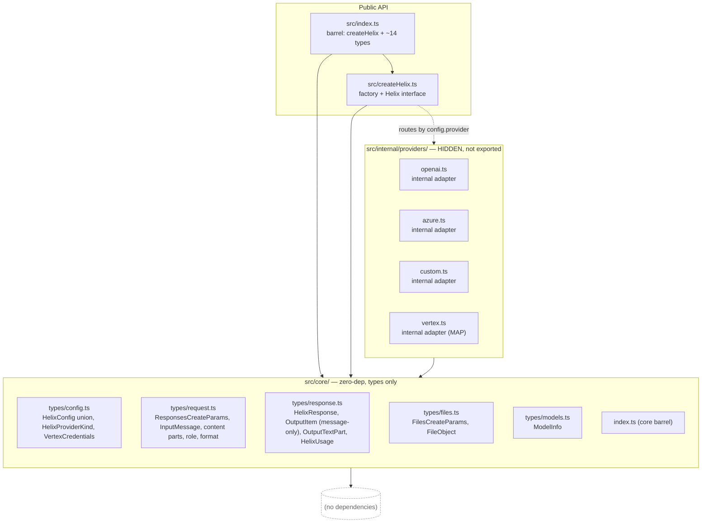
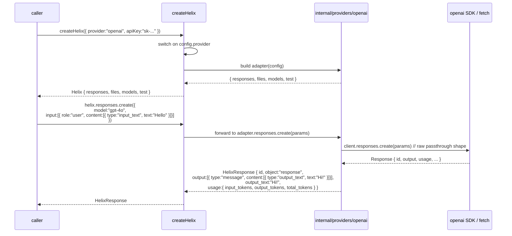
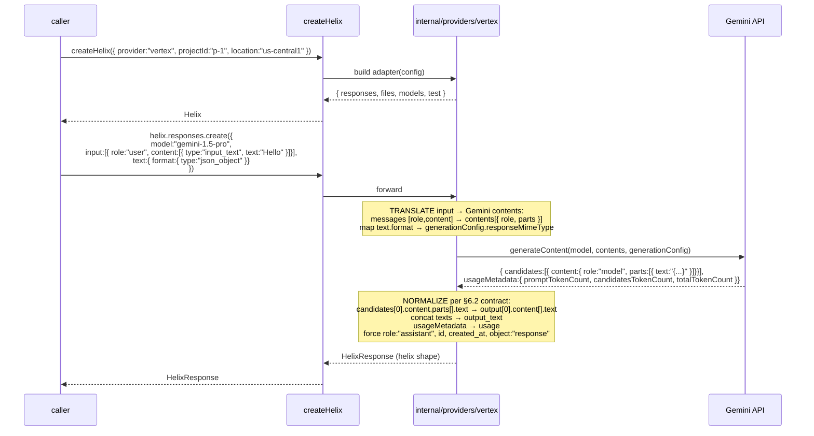
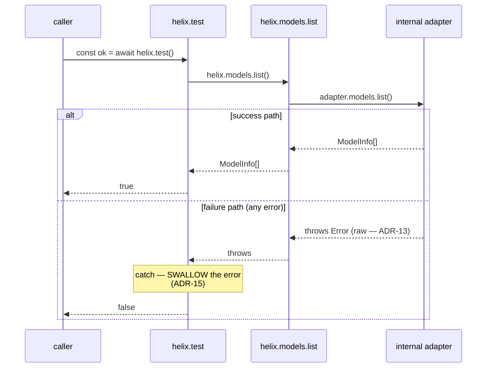

# Design: helix-lib Public API Redesign — SDK-Mirror Surface

**Change**: `helix-public-api-redesign`
**Date**: 2026-04-27
**Status**: ready for sdd-tasks
**Phase**: 1 — interfaces only (no implementations)
**Supersedes**: archived `helix-interface-definition` (2026-04-27)
**Companion**: `proposal.md`, `specs/` (sdd-spec output)

---

## 1. Overview

This design materializes the SDK-mirror redesign described in `proposal.md`. It REPLACES the v1 design end-to-end. The deliverable is **interfaces only** — TypeScript type/interface declarations, a single `createHelix(config)` factory signature, internal adapter module signatures, and barrels — with **zero runtime logic** beyond what the factory contract requires (the factory IS a runtime export, but adapter bodies are stubs in this change). The architectural approach is **Hexagonal / Ports & Adapters with hidden adapters**: a provider-agnostic, zero-dependency `core/` layer defines the public types; a single public entry point (`createHelix`) routes a discriminated `HelixConfig` to one of four INTERNAL adapter modules under `src/internal/providers/`. The adapters are no longer public — `createOpenAI` and friends do not exist on the surface. The public surface is the `Helix` interface with namespaces `responses`, `files`, `models`, and `test`, mirroring the `openai` SDK shape verbatim. Total exported types: ~14, down from 38.

This design's job is to guarantee that the **shape of the interfaces is sufficient, coherent, and forward-compatible** with the deferred work (`helix-error-model`, `helix-tools`, streaming, ephemeral files, capability runtime) so that those future changes ADD without REWRITING.

---

## 2. Architectural Approach

### 2.1 Layered structure



**Dependency direction is enforced**:
- `core/` imports from nothing (not even sibling files outside `core/`).
- `internal/providers/*.ts` import from `core/` only.
- `createHelix.ts` imports from `core/` and from `internal/providers/*`.
- `src/index.ts` re-exports from `core/` and from `createHelix.ts` only — never from `internal/`.

### 2.2 Why the boundary is drawn here

- **Hexagonal preservation** (project rule, ADR-10 inherited). `core/` types are the contracts. Adapters depend on contracts; contracts know nothing about adapters.
- **Adapters are now INTERNAL**. The v1 design exposed `createOpenAI`, `createAzureOpenAI`, etc. as public exports — that surface is GONE (proposal §2 DELETED). The replacement: a single public entry, `createHelix(config)`, dispatches to the matching internal adapter file based on `config.provider`. This both reduces the public surface AND lets us refactor the internals (split a flat file into a folder, add helpers, swap SDK choice) without breaking semver.
- **Single namespace shape** (RD-1). Any developer who knows `openaiClient.responses.create(...)` already knows `helix.responses.create(...)`. Method names, namespace names, and parameter shapes mirror the SDK verbatim. Departures (e.g., `files.list()` returning a flat array) are deliberate and called out as ADRs.
- **Forward-compat for deferred work**. When `helix-error-model` lands, adapters add `try { ... } catch (e) { throw new HelixError(...) }` blocks internally; no public type changes beyond adding `HelixError` itself. When `helix-tools` lands, `OutputItem` gains a `function_call` variant (non-breaking minor bump for consumers that only handle `message`); `responses.create` accepts new optional `tools` / `tool_choice` fields.

---

## 3. Module Layout and Naming Conventions

### 3.1 File tree (created by THIS change)

```
src/
├── core/
│   ├── types/
│   │   ├── config.ts             # HelixConfig union, HelixProviderKind, VertexCredentials
│   │   ├── request.ts            # ResponsesCreateParams, HelixRole, InputMessage,
│   │   │                         # InputContentPart, InputText, InputFile, HelixResponseFormat
│   │   ├── response.ts           # HelixResponse, OutputItem (message-only),
│   │   │                         # OutputMessage, OutputTextPart, HelixUsage
│   │   ├── files.ts              # FilesCreateParams, FileObject
│   │   └── models.ts             # ModelInfo
│   └── index.ts                  # core barrel — types only, no runtime
├── internal/
│   └── providers/
│       ├── openai.ts             # internal adapter (NOT exported)
│       ├── azure.ts              # internal adapter (NOT exported)
│       ├── custom.ts             # internal adapter (NOT exported)
│       └── vertex.ts             # internal adapter (NOT exported)
├── createHelix.ts                # createHelix(config): Helix + Helix interface
└── index.ts                      # public barrel — createHelix + ~14 types
```

### 3.2 File tree (DELETED from v1)

```
src/
├── adapters/                     # WHOLE FOLDER deleted (v1)
│   ├── openai/factory.ts
│   ├── azure/factory.ts
│   ├── custom/factory.ts
│   └── vertex/factory.ts
├── core/
│   ├── ports/                    # WHOLE FOLDER deleted (no public ports anymore)
│   │   ├── provider.port.ts
│   │   └── file-store.port.ts
│   ├── client.ts                 # HelixClient aggregate replaced by Helix interface
│   └── types/
│       ├── error.ts              # deferred to helix-error-model
│       ├── tools.ts              # deferred to helix-tools
│       └── capabilities.ts       # capability runtime dropped (RD-9)
```

### 3.3 Naming conventions

| Pattern | Use |
|---|---|
| `types/*.ts` | Plain type/interface declarations, no runtime exports. One file per concern (`config`, `request`, `response`, `files`, `models`). |
| `internal/providers/<provider>.ts` | One FLAT file per provider adapter. NOT a folder. Folder-per-adapter returns non-breakingly later if a provider grows internal complexity (e.g., `vertex/normalize.ts` + `vertex/client.ts`). |
| `createHelix.ts` | Single public factory + the `Helix` interface. Co-located because the interface is the factory's return type and they evolve together. |
| `index.ts` (barrels) | Re-export only. Two barrels: `src/core/index.ts` (types) and `src/index.ts` (public surface). |
| Type names | `Helix<Concept>` for first-class helix abstractions (`HelixConfig`, `HelixResponse`, `HelixUsage`, `HelixResponseFormat`, `HelixRole`, `HelixProviderKind`). SDK-shape mirrors keep their wire names (`InputMessage`, `OutputMessage`, `FileObject`, `ModelInfo`, `OutputTextPart`). |
| Discriminant fields | `type` for content/output/format unions (wire-shape mirror, ADR-1). `provider` for `HelixConfig` union (helix-original discriminator, camelCase rule). |

**Removed convention**: `*.port.ts`. There are no public ports anymore — namespace methods on the `Helix` interface replace them.

### 3.4 Per-directory rationale

- **`core/types/`** — every type that crosses the public boundary lives here. Splitting by concern keeps each file under ~80 lines and lets the barrel cherry-pick re-exports. Zero runtime, zero third-party dependencies.
- **`internal/providers/`** — flat files, ONE per provider. The v1 folder-per-adapter shape was overkill given the public surface was four factories; here the public surface is a single `createHelix`, and each provider's logic is small enough to fit in one file. Naming uses kebab-case file names matching the `provider` discriminant value (`openai.ts` for `provider: "openai"`, etc.).
- **`createHelix.ts`** — at the root of `src/`, not under `core/` (it imports from `internal/`, which `core/` may not), not under `internal/` (it IS public). It is the seam between the public type surface and the hidden adapter routing.
- **`internal/`** is a CONVENTION. JavaScript users could technically deep-import from it; TypeScript will refuse because we do not emit declarations under `internal/` and `package.json` `exports` restricts subpaths (see §6.3).

---

## 4. Type Relationships

### 4.1 Relationship diagram

```mermaid
classDiagram
    class HelixConfig {
        <<union: provider discriminant>>
    }
    class HelixConfigOpenAI { +"openai" provider; +string apiKey; +string? baseUrl }
    class HelixConfigAzure { +"azure" provider; +string apiKey; +string endpoint; +string apiVersion }
    class HelixConfigCustom { +"custom" provider; +string apiKey; +string baseUrl }
    class HelixConfigVertex { +"vertex" provider; +string projectId; +string location; +VertexCredentials? credentials }

    class VertexCredentials {
        <<union>>
        +clientEmail+privateKey | keyFile
    }

    class createHelix {
        <<function>>
        +createHelix(config HelixConfig) Helix
    }

    class Helix {
        <<interface>>
        +responses ResponsesNamespace
        +files FilesNamespace
        +models ModelsNamespace
        +test() Promise~boolean~
    }

    class ResponsesNamespace {
        +create(params ResponsesCreateParams) Promise~HelixResponse~
    }
    class FilesNamespace {
        +create(params FilesCreateParams) Promise~FileObject~
        +list() Promise~FileObject[]~
        +delete(id string) Promise~DeleteResult~
    }
    class ModelsNamespace {
        +list() Promise~ModelInfo[]~
    }
    class DeleteResult { +string id; +true deleted }

    class ResponsesCreateParams {
        +string model
        +InputMessage[] input
        +string? instructions
        +number? temperature
        +number? max_output_tokens
        +TextOptions? text
    }
    class TextOptions { +HelixResponseFormat? format }
    class InputMessage { +HelixRole role; +InputContentPart[] content }
    class HelixRole { <<"user"|"assistant"|"system"|"developer">> }
    class InputContentPart {
        <<union: type discriminant>>
    }
    class InputText { +"input_text" type; +string text }
    class InputFile { +"input_file" type; +string file_id }
    class HelixResponseFormat {
        <<union: type discriminant>>
    }
    class FormatText { +"text" type }
    class FormatJsonObject { +"json_object" type }
    class FormatJsonSchema { +"json_schema" type; +string name; +object schema; +boolean? strict }

    class HelixResponse {
        +string id
        +"response" object
        +number created_at
        +string model
        +OutputItem[] output
        +string output_text
        +HelixUsage usage
    }
    class OutputItem {
        <<union: type discriminant - message-only in v0>>
    }
    class OutputMessage {
        +"message" type
        +string id
        +"assistant" role
        +OutputTextPart[] content
        +Status? status
    }
    class OutputTextPart { +"output_text" type; +string text }
    class HelixUsage { +number input_tokens; +number output_tokens; +number total_tokens }

    class FilesCreateParams {
        +Uint8Array|ArrayBuffer|Blob file
        +string? purpose
        +ExpiresAfter? expires_after
    }
    class FileObject {
        +string id
        +"file" object
        +number bytes
        +number created_at
        +string? filename
        +string purpose
        +number? expires_at
    }

    class ModelInfo { +string id; +"model" object; +number created; +string? owned_by }

    HelixConfig <|-- HelixConfigOpenAI
    HelixConfig <|-- HelixConfigAzure
    HelixConfig <|-- HelixConfigCustom
    HelixConfig <|-- HelixConfigVertex
    HelixConfigVertex --> VertexCredentials : optional
    createHelix --> HelixConfig : input
    createHelix --> Helix : returns
    Helix --> ResponsesNamespace
    Helix --> FilesNamespace
    Helix --> ModelsNamespace
    ResponsesNamespace --> ResponsesCreateParams
    ResponsesNamespace --> HelixResponse
    FilesNamespace --> FilesCreateParams
    FilesNamespace --> FileObject
    FilesNamespace --> DeleteResult
    ModelsNamespace --> ModelInfo
    ResponsesCreateParams --> InputMessage : 1..*
    ResponsesCreateParams --> TextOptions : optional
    TextOptions --> HelixResponseFormat
    InputMessage --> HelixRole
    InputMessage --> InputContentPart : 1..*
    InputContentPart <|-- InputText
    InputContentPart <|-- InputFile
    HelixResponseFormat <|-- FormatText
    HelixResponseFormat <|-- FormatJsonObject
    HelixResponseFormat <|-- FormatJsonSchema
    HelixResponse --> OutputItem : 1..*
    OutputItem <|-- OutputMessage
    OutputMessage --> OutputTextPart : 1..*
    HelixResponse --> HelixUsage
```



### 4.2 Discriminant field choice

| Union | Discriminant | Values | Rationale |
|---|---|---|---|
| `HelixConfig` | `provider` | `"openai"` \| `"azure"` \| `"custom"` \| `"vertex"` | Helix-original union (no wire shape). camelCase rule (ADR-1). The discriminant doubles as the routing key for `createHelix`. |
| `InputContentPart` | `type` | `"input_text"` \| `"input_file"` | Mirrors OpenAI Responses API (ADR-1). |
| `OutputItem` | `type` | `"message"` (only — v0) | Mirrors API. Future variants (`function_call`, `reasoning`) join non-breakingly (ADR-14). |
| `HelixResponseFormat` | `type` | `"text"` \| `"json_object"` \| `"json_schema"` | Mirrors API. |
| `OutputMessage.content[]` parts | `type` | `"output_text"` | Single variant in v0 (no `refusal` until errors land). |

### 4.3 Helix-owned types — no SDK peer-dep

`core/types/*.ts` defines every type as plain TypeScript interfaces. Field naming follows ADR-1 — snake_case for wire-shape fields (`input_text`, `input_file`, `file_id`, `created_at`, `output_text`, `input_tokens`, `output_tokens`, `total_tokens`, `max_output_tokens`, `expires_after`, `expires_at`); camelCase for helix-original fields (`apiKey`, `baseUrl`, `endpoint`, `apiVersion`, `projectId`, `location`, `clientEmail`, `privateKey`, `keyFile`, `provider`). NO `import type { ... } from "openai"` anywhere in `core/`. ADR-10 inherited.

### 4.4 Counted public exports (~14)

`src/index.ts` exports exactly:

1. `createHelix` (function — runtime export)
2. `Helix` (interface)
3. `HelixConfig` (union)
4. `HelixProviderKind` (string-literal union)
5. `VertexCredentials` (union)
6. `ResponsesCreateParams`
7. `HelixResponse`
8. `HelixUsage`
9. `HelixResponseFormat`
10. `HelixRole`
11. `InputMessage`
12. `InputContentPart`
13. `OutputItem`
14. `FilesCreateParams`
15. `FileObject`
16. `ModelInfo`

Plus convenience re-exports for type-narrowing (`InputText`, `InputFile`, `OutputMessage`, `OutputTextPart`) — these are part of the public surface but counted within their parent unions per the proposal's framing.

---

## 5. Architecture Decisions (ADRs)

### Inherited ADRs (still in force)

#### ADR-1 (inherited) — Mirror OpenAI Responses API field naming verbatim for wire-shape

Wire-shape fields use snake_case verbatim (`input_text`, `input_file`, `file_id`, `output_text`, `created_at`, `input_tokens`, `output_tokens`, `total_tokens`, `max_output_tokens`, `expires_after`, `expires_at`). Helix-original fields use camelCase (`apiKey`, `baseUrl`, `endpoint`, `apiVersion`, `projectId`, `location`, `provider`, `clientEmail`, `privateKey`, `keyFile`). The rule is unchanged from v1; this design extends it to new types (`HelixConfig` discriminant uses camelCase `provider`; `FileObject` keeps `created_at` snake_case).

#### ADR-10 (inherited) — Helix-owned types, zero-dep core

`core/` defines every public type as plain TypeScript with NO peer or runtime dependency on the `openai` SDK or `@google-cloud/vertexai`. Adapters under `internal/providers/` MAY use those SDKs at implementation time; no SDK type leaks to the public surface. Unchanged from v1.

### Revised ADRs

#### ADR-5 (revised) — Single unified `createHelix(config)` factory

**Status**: Accepted (REPLACES v1 ADR-5)

**Context**: v1 shipped `createOpenAI`, `createAzureOpenAI`, `createOpenAICompatible`, `createVertex` — four per-provider factory functions, each with its own config interface. The redesign (RD-2) collapses them into a single entry point.

**Decision**: One public factory `createHelix(config: HelixConfig): Helix`. `HelixConfig` is a discriminated union over the literal `provider` field with four variants (`openai`, `azure`, `custom`, `vertex`). Internal routing dispatches to the matching adapter module under `src/internal/providers/`.

**Consequences**:
- *Easier*: one import, one mental model, one entry point. Provider switch is a config-only change at the call site.
- *Easier*: TypeScript narrowing on `config.provider` gives type-safe per-provider config inside `createHelix`'s body and inside test code.
- *Easier*: adapters become INTERNAL implementation detail (see ADR-12), shrinking the public export surface and freeing internals from semver constraints.
- *Easier*: matches how the `openai` SDK itself structures its `client.responses.create` call shape — one entry, namespaces underneath.
- *Harder*: the v1 ADR-5 framing ("per-instance over global registry") is preserved in spirit — `createHelix` is still per-instance, no global state — but its surface is unified.

**Alternatives considered**:
- *Keep v1 surface (4 factories)* — rejected: more public exports, no benefit, doesn't match the SDK's namespace shape.
- *Class-based `new Helix(config)`* — rejected: factory functions tree-shake better and don't force consumers to know whether the result is a class or a plain object.
- *Builder pattern (`Helix.openai({...}).build()`)* — rejected: ceremony for no gain.

### New ADRs

#### ADR-11 — Namespace methods mirror OpenAI SDK shape

**Status**: Accepted

**Context**: The proposal mandates SDK-shape parity (RD-1). The `openai` npm SDK exposes `client.responses.create(...)`, `client.files.{create,list,delete}(...)`, `client.models.list(...)`. We must decide whether helix mirrors namespace shape (`helix.responses.create`) or flattens to method names (`helix.createResponse`, `helix.uploadFile`).

**Decision**: Namespace shape. `helix.responses.create()`, `helix.files.create()`, `helix.files.list()`, `helix.files.delete(id)`, `helix.models.list()`. Method names match the SDK exactly.

**Consequences**:
- *Easier*: zero learning curve for SDK users. Migration from `client.responses.create({...})` to `helix.responses.create({...})` is an import-rename.
- *Easier*: future-namespace addition is non-breaking — `helix.embeddings`, `helix.batches`, etc. join without churn.
- *Harder*: namespaces are object literals on each `Helix` instance (constructed once per `createHelix` call). Trivial cost; not measurable.

**Alternatives considered**:
- *Flat methods* (`helix.createResponse()`, `helix.uploadFile()`) — rejected: breaks SDK parity; consumers would need a translation table.
- *Pluralized verbs* (`helix.createResponses()`) — rejected: doesn't match SDK and reads worse.

Traceability: RD-1, HX1, HX2, HX8.

#### ADR-12 — Internal adapters, NOT public exports

**Status**: Accepted

**Context**: v1 made each provider factory a public export. This change hides them.

**Decision**: Adapters live under `src/internal/providers/{openai,azure,custom,vertex}.ts` as flat files. They are NOT re-exported from `src/index.ts`. There is no public `import { createOpenAI } from "@fluxaria/helix-lib"` anymore.

**Consequences**:
- *Easier*: encapsulation. Adapter shape can change (split into a folder, add helpers, swap from raw `fetch` to the `openai` SDK and back) without semver impact.
- *Easier*: simpler public surface — one factory, one barrel.
- *Easier*: refactor freedom — moving `internal/providers/vertex.ts` to `internal/providers/vertex/index.ts` requires no consumer change.
- *Harder*: deep-imports under `internal/` are technically reachable in JavaScript (no enforcement at the language level). We mitigate via `package.json` `exports` field and TypeScript declaration emission rules (see §6.3).

**Alternatives considered**:
- *Keep adapters public* — rejected: inflates surface, locks internals.
- *Use the underscore-prefix convention* (`_openai.ts`) — rejected: convention-only, no tooling enforcement; `internal/` is the standard Node.js convention and works with `exports` field restrictions.

Traceability: RD-2 enables this; PR2 (lightest libraries) supports it.

#### ADR-13 — Errors are raw passthrough in v0

**Status**: Accepted

**Context**: v1 shipped a `HelixError` class. The redesign defers error normalization to a future change `helix-error-model` (RD-4). Adapters must still propagate errors somehow.

**Decision**: Adapters do NOT wrap errors. Provider/SDK errors propagate as-is to the caller. There is NO `HelixError` type in this change. Operations that a provider does not support (e.g., `helix.files.create` on Vertex) throw a plain `Error` with a clear message: `helix-lib: '<operation>' not supported by provider '<kind>'`.

**Consequences**:
- *Easier*: ships now without locking the error contract before the per-provider error-code analysis is done.
- *Easier*: consumers do `try / catch` with `error.code`, `error.status`, `error.type`, etc. directly from each SDK. The shape they see IS the SDK's shape.
- *Harder*: when `helix-error-model` lands, this becomes a BREAKING change for callers who wrote provider-specific catch handlers. The proposal flags this loudly (proposal §10 risk 3).
- *Harder*: error shape drift between providers — caller code is not portable across `provider` switches until the error model lands.
- *Accepted*: temporary technical debt is the right call. Shipping a placeholder `HelixError` now would lock contract before it's been validated against real provider error codes.

**Alternatives considered**:
- *Ship a placeholder `HelixError`* — rejected: locks the contract before validation; risks repeated breaking changes as the error model takes shape.
- *Throw stringified errors* — rejected: less debuggable than passthrough; loses stack traces and structured fields.
- *Wrap in a generic `Error` with a `cause`* — rejected: same drawbacks as a placeholder, plus consumers must unwrap to get useful info.

Traceability: RD-4. Forward path: `helix-error-model` will reintroduce `HelixError`, map provider codes to `HelixErrorKind`, and have adapters re-throw.

#### ADR-14 — `OutputItem` reduced to `message`-only variant

**Status**: Accepted

**Context**: The OpenAI Responses API `output[]` array carries multiple item types: `message`, `function_call`, `reasoning`, `refusal`, `file_search_call`, `web_search_call`, `code_interpreter_call`. v1 modeled three of these as a discriminated union. Tools and reasoning are deferred (RD-5, RD-6) so v0 needs only one.

**Decision**: `type OutputItem = OutputMessage`. No `function_call`, `reasoning`, `refusal`, or other variants. The TypeScript type is a single-variant union (effectively a type alias) so that adding variants in `helix-tools` and `helix-error-model` is a non-breaking minor version bump.

**Consequences**:
- *Easier*: simpler shape now. Consumers writing `for (const item of response.output) { if (item.type === "message") ... }` work today and continue to work when more variants land — they will just hit the `message` case unless they add new branches.
- *Easier*: Vertex MAP normalization (proposal §10 risk 2) is simpler — only message output to produce, no tool-call shape to invent.
- *Harder*: a developer expecting the full Responses API output union may be surprised. Mitigated by JSDoc on `OutputItem` saying "v0 supports message output only; tool/refusal/reasoning return in helix-tools and helix-error-model."
- *Future*: when tools land, the union expands to `OutputMessage | FunctionCallOutput`. Consumers that branched only on `"message"` continue to work with a default-skip behavior. Consumers using exhaustive `switch` on `item.type` get a TypeScript error and update intentionally — the desired behavior.

**Alternatives considered**:
- *Empty union (never)* — rejected: no useful response shape.
- *Full v1 union (message + function_call + reasoning)* — rejected: ships shapes that aren't tested by any code path because tools and reasoning are deferred. Premature.
- *`unknown` for output* — rejected: defeats the type system at the most important seam.

Traceability: RD-6.

#### ADR-15 — `helix.test()` returns `Promise<boolean>`

**Status**: Accepted

**Context**: HX7 is a connectivity / credentials sanity check. The contract could be `Promise<boolean>`, `Promise<{ ok: boolean; error?: unknown }>`, or `Promise<void>` (throws on failure).

**Decision**: `Promise<boolean>`. True on success (any successful round trip — typically `models.list()` under the hood). False on any failure. Errors from the underlying call are SWALLOWED and not propagated; `test()` does NOT throw.

**Consequences**:
- *Easier*: simplest possible contract. Caller does `if (await helix.test()) { ... }`.
- *Easier*: portable — works the same across all four providers regardless of which SDK errors they throw.
- *Easier*: forward-compatible with the future `helix-error-model` — when structured errors land, callers who want diagnostic info call `models.list()` directly (or whichever method `test()` uses internally) and inspect the error.
- *Harder*: callers cannot distinguish "auth failed" from "network down" from "wrong endpoint." They must rerun with a different method to diagnose. Documented as deliberate (RD-3).

**Alternatives considered**:
- *`Promise<{ ok; error? }>`* — rejected: extra type, extra schema, and consumers still need to look at `error` to do anything useful with it. Defer the structured shape until `helix-error-model`.
- *`Promise<void>` that throws* — rejected: forces every caller to wrap in `try / catch` for what is supposed to be a health check.
- *`Promise<{ provider; latency; details }>`* — rejected: speculative scope. Diagnostic surface is a separate change.

Traceability: RD-3, HX7.

#### ADR-16 — `files.list()` returns a flat `FileObject[]`, NOT `{ data: FileObject[] }`

**Status**: Accepted

**Context**: The OpenAI SDK's `client.files.list()` returns a `Page` envelope `{ data: FileObject[]; ... }` because the SDK supports pagination. helix-lib does not yet support pagination, and the envelope adds friction.

**Decision**: `helix.files.list(): Promise<FileObject[]>`. The result is a plain array. No `data` wrapper. No pagination metadata.

**Consequences**:
- *Easier*: consumers do `const files = await helix.files.list(); files.forEach(...)` without unwrapping.
- *Easier*: matches what most developers actually want from a "list everything" call in a small-collection context (helix files are not expected to scale to thousands per consumer in v0).
- *Harder*: when pagination becomes necessary, this breaks — the contract has to change to either return an envelope or expose `helix.files.list({ cursor })` with a different return shape. Documented as a known forward-compat risk.
- *Departure from SDK*: this is one of the few places this design DEPARTS from SDK shape. Justified by ergonomic gain.

**Alternatives considered**:
- *Match SDK envelope* (`{ data: FileObject[] }`) — rejected: friction without value at v0 scale.
- *Return an `AsyncIterable`* — rejected: forces consumers to use `for await` for what is conceptually a small collection.
- *Return `Page<FileObject>`* — rejected: ships a pagination type that's never paginated.

Traceability: RD-1 with deliberate carve-out.

#### ADR-17 — `files.delete(id)` returns `{ id: string; deleted: true }`

**Status**: Accepted

**Context**: The OpenAI SDK's `client.files.delete(id)` returns `{ id, object: "file", deleted: true }`. We must decide whether to mirror exactly, simplify, or invent.

**Decision**: `helix.files.delete(id: string): Promise<{ id: string; deleted: true }>`. The literal type `deleted: true` documents that successful return implies deletion was acknowledged. Failures throw (raw error, per ADR-13). The `object` field is dropped — it's redundant given the return-shape context.

**Consequences**:
- *Easier*: SDK parity on the load-bearing fields (`id`, `deleted`).
- *Easier*: literal `deleted: true` is type-level documentation — TypeScript surfaces the contract without needing JSDoc.
- *Harder*: a future "soft delete" semantics where `deleted: false` is meaningful would require a contract change. None on the roadmap.

**Alternatives considered**:
- *Return `Promise<void>`* — rejected: caller cannot verify the API acknowledged the delete; inferior to a named field.
- *Return the SDK shape verbatim* — rejected: `object: "file"` adds nothing.
- *Return `Promise<boolean>`* — rejected: ambiguous — does `false` mean failure or not-found-but-no-error?

Traceability: HX2.

---

## 6. Cross-cutting Contracts

### 6.1 Discriminated config narrowing

`HelixConfig` discriminates on the literal `provider` field. TypeScript narrows automatically inside `createHelix` and at consumer call sites:

```ts
function build(config: HelixConfig) {
  if (config.provider === "azure") {
    config.endpoint;     // OK — narrowed to the azure variant
    config.apiVersion;   // OK
    // config.baseUrl;   // ERROR — not on the azure variant
  } else if (config.provider === "vertex") {
    config.projectId;    // OK
    config.location;     // OK
    config.credentials?.; // OK — VertexCredentials | undefined
  }
}
```

Consumers passing a literal config get full narrowing without `as const`:

```ts
const helix = createHelix({
  provider: "openai",   // literal "openai" inferred — narrows the rest
  apiKey: process.env.OPENAI_API_KEY!,
});
// `helix` is `Helix` — provider is hidden from this point on
```

The discriminant is the field NAME (`provider`), so TypeScript narrows on string literals automatically. Consumers who store a config in a variable of type `HelixConfig` retain narrowing inside any `if (config.provider === "...")` branch.

### 6.2 Vertex `responses.create` normalization contract

This is the most complex adapter and the only one marked `MAP` in the proposal §8 capability matrix for `responses.create`. The internal Vertex adapter MUST translate Gemini's response shape into helix's `HelixResponse` shape. The contract:

| Gemini field (raw) | Helix field (mapped) | Rule |
|---|---|---|
| `candidates[0].content.role` | `output[0].role` | Always `"assistant"` (force, ignore Gemini's value). |
| `candidates[0].content.parts[].text` | `output[0].content[].text` | Each text part becomes one `OutputTextPart` with `type: "output_text"`. |
| `candidates[0].content.parts[]` (non-text) | (dropped in v0) | v0 supports text-only output. Non-text parts are ignored; flag with TODO for `helix-tools` / multi-modal. |
| `usageMetadata.promptTokenCount` | `usage.input_tokens` | Direct map. |
| `usageMetadata.candidatesTokenCount` | `usage.output_tokens` | Direct map. |
| `usageMetadata.totalTokenCount` | `usage.total_tokens` | Direct map (or computed if absent). |
| `responseId` (or generated UUID) | `id` | Use Gemini's `responseId` if present; otherwise generate a UUID prefixed `resp_`. |
| Wall-clock at call time | `created_at` | Adapter records `Math.floor(Date.now() / 1000)`. |
| `model` (from request) | `model` | Echo the requested model. |
| (computed) | `output_text` | Concatenate all `output_text` part texts in order, no separator. Empty string if no text parts. |
| (literal) | `object` | `"response"`. |

**Single-candidate forced**: even if Gemini returns multiple candidates (`n > 1`), helix v0 only surfaces `candidates[0]`. Multi-candidate is explicitly out of scope (proposal §3 OUT).

**Output array length**: always exactly 1 in v0 (single message). Future tool-call output adds entries non-breakingly when `helix-tools` lands.

**Why design this now with all other features deferred**: Vertex normalization is the load-bearing risk for the redesign (proposal §10 risk 2). With tools, reasoning, refusal, and streaming OUT of scope, the MAP rule above fits in roughly 30 lines of adapter code — leaving headspace for the per-provider error mapping that `helix-error-model` will demand.

### 6.3 Internal-only `internal/` directory contract

Three layers of enforcement keep `internal/` private:

1. **Barrel discipline**. `src/index.ts` re-exports ONLY from `./createHelix` and `./core`. Never from `./internal/...`. Reviewers MUST reject any `export ... from "./internal/..."` line in `src/index.ts`.
2. **TypeScript declarations**. The build (`tsup.config.ts`, set in the inherited Phase 0 bootstrap) emits `.d.ts` files for `src/index.ts` and its transitive type imports only. `src/internal/**` either does not get a `.d.ts` or, if emitted, is not referenced by the package's entry. Consumers attempting `import { something } from "@fluxaria/helix-lib/internal/providers/openai"` get a "module not found" or "no declaration" error.
3. **`package.json` `exports` field**. The infra-bootstrap change configures `exports` so only `"."` (and possibly `"./package.json"`) are exposed:

   ```json
   "exports": {
     ".": { "import": "./dist/index.js", "types": "./dist/index.d.ts" }
   }
   ```

   No subpath patterns are exposed. With Node's `exports` enforced, `import "@fluxaria/helix-lib/internal/..."` fails at module resolution time even if the file exists on disk. A defensive belt-and-suspenders layer can additionally use `"./internal/*": null`.

These layers are "convention plus tooling." A determined consumer CAN reach into `internal/` via a deep relative import IF they vendor the source — that is intentionally unavoidable in JavaScript. The contract is: anyone who reaches in is opting out of semver protection. We will not consider deep-internal imports a breaking change to fix in subsequent versions.

---

## 7. Sequence Diagrams

### Diagram A: OpenAI happy path — `createHelix` → `responses.create` → response



**Key observations**:
- The `Helix` object is constructed ONCE per `createHelix` call. Namespaces (`responses`, `files`, `models`) are object literals on that instance, populated by the routed internal adapter.
- The adapter's shape on the OpenAI path is near-identity: helix's `ResponsesCreateParams` ≈ SDK params (snake_case wire fields preserved, ADR-1). Minimal translation work.
- Errors thrown by the SDK propagate raw (ADR-13). No wrapping.

### Diagram B: Vertex MAP path — normalization in action



**Key observations**:
- The MAP step is contained inside `internal/providers/vertex.ts`. Consumers see only the helix shape; nothing about `candidates` or `usageMetadata` leaks.
- The `text.format` translation is part of the same MAP. `json_object` → Gemini's `generationConfig.responseMimeType: "application/json"`. `json_schema` → `responseMimeType: "application/json"` plus `responseSchema`. `text` → no `responseMimeType` (default).
- v0 is forced single-candidate (proposal §3 OUT-of-scope multi-candidate).

### Diagram C: `helix.test()` — success and failure paths



**Key observations**:
- `test()` is implemented as a thin wrapper around `models.list()` for every provider (per proposal §8 capability matrix — `test` is `OK` for all four).
- The `try / catch` lives in `createHelix.ts` (or its routed adapter), not in user code. Consumers see only `Promise<boolean>`.
- Diagnostic info is intentionally inaccessible from `test()`. Consumers who need it call `models.list()` directly and inspect the raw error themselves.

---

## 8. Forward Path

This change is the SCAFFOLDING. Two follow-on changes consume it without rewriting it.

### 8.1 What `helix-error-model` will need

- Reintroduce `HelixError` class (likely `core/types/error.ts`, mirroring v1's shape but reduced to a vetted union).
- Define `HelixErrorKind` union from per-provider error-code research: at minimum `RateLimit`, `InvalidApiKey`, `PermissionDenied`, `InvalidRequest`, `NotFound`, `Internal`, `Network`, `Timeout`, `UnsupportedFeature`, `ContentFiltered`. Final list pending research.
- Map each provider's error codes to `HelixErrorKind` in a table per adapter.
- Each adapter wraps internal SDK calls in `try { ... } catch (e) { throw normalizeError(e, providerKind) }`.
- BREAKING for consumers who wrote `catch (e) { if (e.code === "rate_limit_exceeded") ... }` — those lines must change to `catch (e) { if (HelixError.is(e) && e.kind === "RateLimit") ... }`.
- `helix.files.create` on Vertex / `custom` switches from a plain `Error` (this change, ADR-13) to `HelixError({ kind: "UnsupportedFeature" })`. Also breaking.

The proposal flags this loudly (proposal §10 risk 3). The SemVer signal will be a major version bump (v0.x → v1.0 or similar) at the time the error model lands.

### 8.2 What `helix-tools` will need

- Reintroduce `NativeTool`, `FunctionTool`, `ToolChoice` types (likely `core/types/tools.ts`).
- Reintroduce `NativeToolName` literal union (web_search, file_search, code_interpreter, google_search, ...).
- Expand `OutputItem` union: `OutputMessage | FunctionCallOutput`. ADR-14 states this is non-breaking for consumers branching only on `"message"`; consumers using exhaustive `switch` on `item.type` must add a branch.
- `ResponsesCreateParams` accepts new optional fields: `tools?: Tool[]`, `tool_choice?: ToolChoice`. Adding optional fields is non-breaking for callers that don't pass them.
- Each adapter implements tool dispatch:
  - OpenAI / Azure / custom: pass through as-is.
  - Vertex MAP: translate function tools to Gemini `functionDeclarations`, native tools to Gemini grounding (`google_search`).
- Vertex MAP for `function_call` output: `candidates[0].content.parts[].functionCall` → `OutputItem` of type `function_call` with `arguments: JSON.stringify(args)` (the v1 design's risk 5 returns).

### 8.3 Other deferred work and their hooks

- **Streaming**: future `helix-streaming` change adds `helix.responses.stream(params): AsyncIterable<StreamDelta>`. New method, new return type — no existing surface breaks.
- **Ephemeral inline files**: future change adds `InputFileEphemeral` variant to `InputContentPart`. Adding a union variant is non-breaking minor bump.
- **Capability runtime**: future change adds `helix.capabilities()` (synchronous, returns a static descriptor). New method on `Helix` interface — non-breaking minor bump.
- **Extended generation params**: `top_p`, `top_k`, `seed`, `frequency_penalty`, `presence_penalty`, `stop_sequences` join `ResponsesCreateParams` as optional fields.
- **Tool loop helper**: `runToolLoop(helix, params)` lands as `src/helpers/run-tool-loop.ts` — outside `core/`, exported from the public barrel.

---

## 9. Risks and Open Architectural Questions

### 9.1 Risks pulled from proposal §10

| # | Risk | Mitigation in this design | Carry-over |
|---|------|----------------------------|-----------|
| 1 | Discriminated union DX — narrowing on `provider` may surprise consumers using non-literal config | §6.1 documents the pattern; literal-providing examples in the spec; later README in infra-bootstrap | Spec phase pins example invocations |
| 2 | Vertex `responses.create` MAP complexity | §6.2 enumerates the MAP rules as a table; deferred features keep the MAP small | Spec phase translates §6.2 into Given/When/Then; implementation ships unit tests per row |
| 3 | Errors raw passthrough → breaking when error model lands | ADR-13 documents this explicitly; proposal flags it; future bump signals | Consumers warned via README and CHANGELOG entry |
| 4 | Scope creep ("just add streaming / tools / topP") | Design lists deferred work in §8 and stops there | Defer politely; require new proposal |
| 5 | `helix.test()` boolean swallows diagnostic info | ADR-15 documents this; caller diagnoses via direct method call | None — accepted forever or until someone proposes a different shape |
| 6 | Flat-file adapter shape may surprise contributors | §3.2 documents convention; folder-per-adapter return is non-breaking | None |
| 7 | `OutputItem` reduced to message-only may surprise developers expecting full union | ADR-14 + JSDoc on `OutputItem` | Spec phase pins assertions |

### 9.2 Risks predicted from the spec phase (categories)

The spec phase will likely surface (and must pin) the following:

- **`output_text` derivation rule** when `output[]` has zero or multiple message items — concatenate? Empty string? Spec MUST pin.
- **`instructions` vs `input[].role: "system"` interaction** — both can carry system content. Adapter merges? Mutually exclusive? Both providers accept? Spec MUST pin per provider.
- **`text.format` on Custom** — proposal §8 leaves this for the spec phase (silent drop vs throw). Spec MUST decide.
- **`max_output_tokens` ceiling per provider** — Vertex caps at provider-specific limits. Helix may pass through; spec must decide if it validates client-side.
- **Empty `output[]` array** — is it valid? What does `output_text` evaluate to? Likely empty string and valid; spec MUST pin.
- **`HelixUsage` when missing** — some providers (custom endpoints) may not return usage. Spec MUST decide: zero values, undefined, or throw.
- **`FilesCreateParams.expires_after` on Azure** — Azure file CRUD has its own TTL semantics. Spec MUST pin.
- **`helix.test()` actual implementation choice per provider** — does it call `models.list()` exactly, or could it choose a cheaper endpoint? Spec MUST pin to avoid drift.

### 9.3 Open architectural items the implementation change must resolve

1. SDK choice per adapter: `openai` SDK (with its `AzureOpenAI`/`OpenAI`/`OpenAICompatible` variants) vs raw `fetch`. Likely `openai` SDK to avoid re-implementing auth, pagination, retries. Vertex: `@google-cloud/vertexai` vs raw `fetch` + `google-auth-library`. Implementation phase decides.
2. Auth flow for Vertex: ADC vs service-account JSON. The `VertexCredentials` union (proposal §5.1) covers both shapes; the adapter must implement the token-acquisition step.
3. File-upload streaming vs buffering. `Uint8Array | ArrayBuffer | Blob` is the input type; the adapter chooses how to send it.
4. Whether `helix.test()` swallowing extends to `unhandledrejection` — i.e., is `test()` allowed to log internally even when returning false? Implementation decides; spec is silent.
5. Whether the `HelixConfig` runtime check (`if (config.provider === "..."`) inside `createHelix` should also validate fields (e.g., throw if `apiKey` is empty for OpenAI). Likely no runtime validation in v0 (TypeScript is the contract); spec may pin.
6. Whether `internal/providers/*.ts` adapters take `config` and produce a `Helix`-shaped object directly, or produce a smaller "core" object that `createHelix.ts` wraps with the namespace literals. Implementation choice; design accepts either.

### 9.4 Architectural questions deliberately deferred

- **`runToolLoop` helper**: Phase 2 / `helix-tools`. Lives at `src/helpers/run-tool-loop.ts`.
- **Streaming**: deferred until a real consumer needs it. Will likely be `helix.responses.stream(params): AsyncIterable<StreamDelta>` or `for await (const delta of helix.responses.stream(...))`.
- **Multi-modal output** (images, audio in `OutputItem`): non-breaking union extension when a real consumer asks.
- **Construction-time defaults** (e.g., default temperature, default model): speculative until asked.
- **Capability runtime API**: dropped from v0 (RD-9). Re-introduce as `helix.capabilities()` in a future change if needed.

---

## 10. Traceability

| PR / RD / HX | Where it lives in this design |
|---|---|
| PR1 (Responses API wire shape) | `HelixResponse` type, ADR-1 inherited, §6.2 Vertex normalization rule |
| PR2 (lightest libraries) | `core/` zero-dep, ADR-12 hidden adapters allow internal SDK flexibility |
| PR3 (mandatory tests) | OUT of scope this change; flagged for tasks/implementation phases |
| PR4 (Phase 1 providers: openai/azure/custom/vertex without Vertex files) | Capability matrix in proposal §8; adapters under `internal/providers/` |
| PR5 (OpenAI Responses for requests) | `ResponsesCreateParams` type, ADR-1 |
| PR6 (unified error model) | DEFERRED — ADR-13; forward path in §8.1 |
| RD-1 (SDK-mirror surface) | ADR-11 namespace shape |
| RD-2 (single `createHelix`) | ADR-5 revised |
| RD-3 (`test()` returns boolean) | ADR-15 |
| RD-4 (raw error passthrough) | ADR-13 |
| RD-5 (tools deferred) | ADR-14 reduced `OutputItem`; §8.2 forward path |
| RD-6 (`OutputItem` message-only) | ADR-14 |
| RD-7 (`temperature` + `max_output_tokens` + `text.format` only) | `ResponsesCreateParams` shape, §6.2 mapping |
| RD-8 (no ephemeral files) | `InputContentPart` union has only `InputText` and `InputFile` (file_id reference) |
| RD-9 (no capability runtime) | Capability info is documentation only; §8.3 forward hook |
| RD-10 (lean per-provider configs) | `HelixConfig` discriminated union shape |
| RD-11 (~14 public types) | §4.4 counted exports |
| HX1 (text request) | `helix.responses.create`; Diagrams A and B |
| HX2 (file CRUD) | `helix.files.create / list / delete`; ADR-16, ADR-17 |
| HX7 (sanity check) | `helix.test()`; Diagram C; ADR-15 |
| HX8 (model list) | `helix.models.list()` |

---

**End of design.**
